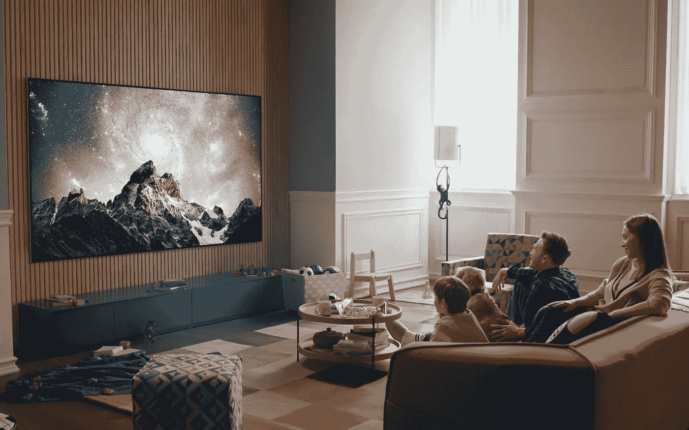

# 欧盟即将扼杀电视机的未来

> 原文：<https://medium.com/geekculture/the-european-union-is-about-to-kill-the-future-of-tv-sets-5689b8de0a67?source=collection_archive---------4----------------------->

## 欧盟修改后的电视功耗限制可能会在未来几年阻碍 8K、HDR 和 MicroLED 的发展。原因如下。

TV manufacturers loved to release press images such as this in the past but, come March, if the EU has its way such a TV won’t be available to millions of consumers in 27 different countries. (Image: LG)

好像全世界的公民还没有痛苦地意识到这样一个事实:道德有问题的政客、价值有问题的官僚和技术官僚…