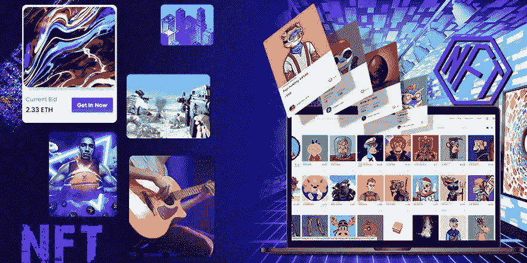

# NFT 市场的不断发展:在隐秘的冬天里 NFT 市场的发展

> 原文：<https://medium.com/geekculture/the-ever-evolving-state-of-nft-marketplaces-spike-in-nft-marketplace-development-amidst-the-crypto-655fa28e5e93?source=collection_archive---------14----------------------->

追溯到 2012 年不可替代代币这一概念的诞生，NFT 市场尚未发展。他们已经迅速成为密码领域的顶级企业，使得一个相当新的术语“NFT”变得很普遍。开发商建造了一个 NFT 市场，在这里，从铸造到交易，所有的 NFT 需求都得到满足。它们也基于它们在区块链上执行和交互所依据的法规来实现。

密码市场在 2022 年经历了一次低谷；NFT 设法保持了他们在 NFT 爱好者中的重要性。最近得出的数据显示，仅 Q2 的比特币生态系统就剩下约 40%。

# **什么是 NFT 市场？**

NFT 市场是一把巨大的伞，为区块链技术的创新铺平了道路，从时尚到新的虚拟世界元宇宙。它将变得越来越大，因为天空是极限！

当你计划不得不 [**建立一个 NFT 市场**](https://www.appdupe.com/nft-marketplace-development) 时，注意这三种类型的 NFT 市场:社区市场、跨链市场和游戏内市场。

## **社区市场**

社区市场是社区成员和项目爱好者交易和浏览其生态系统内 NFT 市场的安全场所。他们有他们的优势。

*   与直接来源进行更安全的交易是分散的。
*   交易费转入社区的道钱包。
*   市场是品牌化的，因此也是个性化的。
*   成为社区成员是俱乐部中与 NFT 有类似兴趣的人的专属权利。

这种市场的一些例子是超级天使、流浪者、V1 等。

## **跨连锁商场**

它们属于第一代 NFT 市场，对不同链的资产交易有限制，因此是跨链的。跨链市场允许用户在来自不同区块链的各种其他市场之间交易 NFT，从而打破了筒仓。

## **游戏内市场**

他们遵循任何 NFT 市场发展的相同原则和协议。然而，游戏内市场可以创造一个缩影。这个微观世界是在游戏中让玩家 [**出售和交易他们游戏中的 NFT**](https://medium.datadriveninvestor.com/creating-nft-marketplace-to-buy-nfts-in-game-what-game-developers-should-know-to-launch-nft-game-5ea1a1faa756?gi=1dd47d4a655d)。例如，Axie Infinity 市场是未来项目中最负盛名的项目之一。

# **黑暗中的一线希望——NFT 股市飙升，尽管市场活动减少**

加密货币的重要性非常明显。同样，NFT 市场上的 NFT 数量在 2022 年的市场中表现出了非凡的承受能力。NFT 的未来将继续看到在加密宇宙的所有暗淡时期的好日子。根据许多金融专家的观点，全球市场对经济政策、监管调整，尤其是涉及投资回报率(通货膨胀率)的资金总成本有反应。

通过认识到收集的数据在现实世界中也是相关的，我们可以通过这些分析了解市场的可信度。因此，数字市场有很大的潜力带着它的价值重新出现，就像许多现实世界的企业一样。据我们所知，非功能性测试仍处于萌芽阶段。例如，把这个数字时代的 NFTs 看作是需求的集合者。然后，这些聚集的需求将自己的责任交给进行交易的市场。

# **NFT 市场是如何出现的——当前场景**

我们都知道亚马逊是如何运作的。想想 NFT 市场，一个用户体验便捷无缝的电子商务平台。像这样的市场由研究用户搜索过程的算法指导，并根据他们的偏好给出建议。例如，当你浏览 Instagram 上专门用于宠物的页面时，你可能会体验到算法保存了味道。当你登录时，他们会在另一个平台上显示他们对宠物相关发现的建议。这就是每当用户的行为模式发生变化时，互联网如何用新的信息直观地个性化你的市场空间。

身临其境的社交媒体应用程序会让你忘记自己是在一个市场中。产品和他们的交易是以一种让你保持参与的方式进行的，并且他们保持了他们最初的最终用户体验的交互式讲故事的方式。这种模式适用于 NFT 市场，因为更多的产品意味着更多的用例，因此对虚拟资产的需求也更多。 [**创建一个 NFT 市场**](https://www.appdupe.com/nft-marketplace-development) 将是一个你可以互动的空间，并建立一个社区来讲述你的故事，并很快参与其中。

# **NFT 市场将会如何出现？—走向未来**

秘密宇宙是一个深渊！因其稀有和独特而闻名。尽管缺乏了解，但建立在区块链上的虚拟资产更为人们所熟悉。NFT 通常会遇到针对基于情感的欲望的绘画和雕塑。现在，随着名人的积极响应，投资者对这些资产的兴趣超出了他们的计划。值得一提的是，NFT 大约有 200 个市场。我们可以高兴地说，对非功能性测试的投资甚至在未来也会受到欢迎，甚至更多。

# **元宇宙**

你知道在区块链市场上超过 250 万个加密钱包属于交易 NFT 的人吗？大约 54 亿美元的利润是通过 NFTs 获得的？

在 NFT 市场上铸造和上市的许多 NFT 中，最受关注的是 NFT 收藏品。据判定，销售额为 84 亿美元，Axie Infinity 等 NFT 游戏平台紧随收藏品之后，销售额为 52 亿美元。现在，该公司已将注意力转移到最新版本的数字世界——元宇宙。他们记录了 5.14 亿美元的数字土地销售和元宇宙空间的其他项目。这是因为它在互联网上提出了有趣的共享空间，这些共享空间将与虚拟对象以及虚拟对象之间进行交流。比如耐克的更名等等。

## **结论——下一步是什么？**

据报道，在接下来的两年里，NFT 在 NFT 市场的发展将超过 8000 亿美元。这是基于数据计算的，约 35.8 %的投资者非常热衷于与赚取游戏和游戏空间的未来元宇宙相关的数字资产。据信，NFT 市场的大部分 NFT 份额将属于著名的收藏，如 BAYC 和 CryptoPunks。

NFT 已经走过了漫长的道路！在市场下跌趋势中的出色销售，通过其在跌宕起伏和争斗之后的蒸发流动，证明了它的维持力。鉴于您受到这些独特投资的启发，usher 向提供白标解决方案的最佳开发公司之一介绍，毫不费力地用您选择的系列建立一个 NFT 市场。