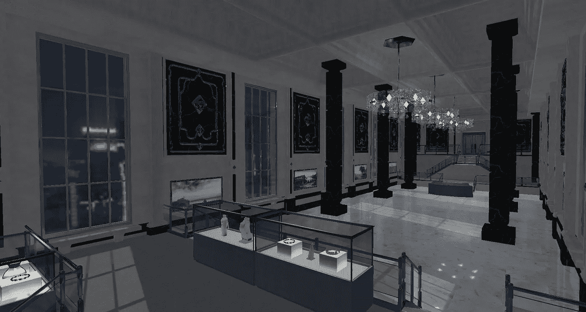
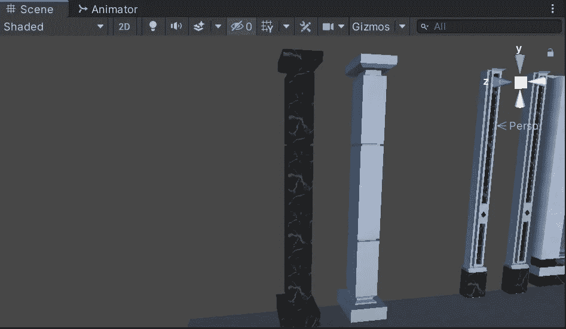
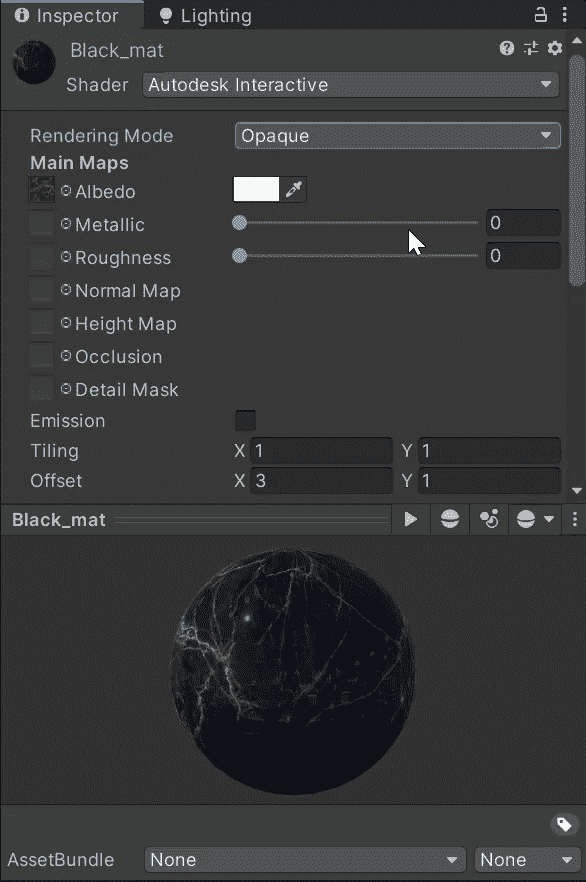
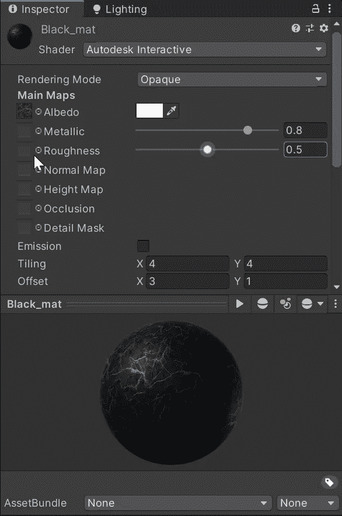
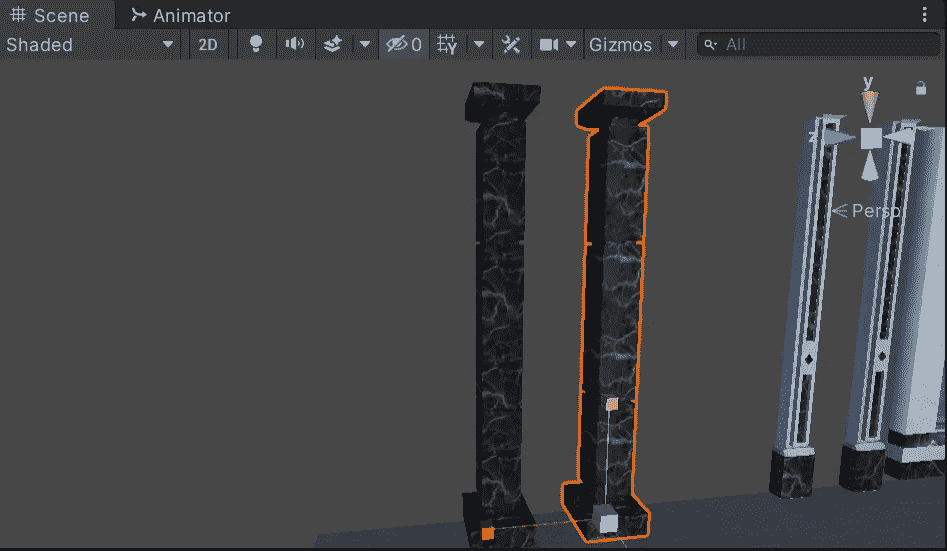

# 令人兴奋的 3D 环境和照明世界！

> 原文：<https://medium.com/geekculture/the-exciting-world-of-3d-environments-and-lighting-67e5f569b245?source=collection_archive---------56----------------------->

我的下一个项目是在一个名为**大羊毛**的小演示中观察**隐形力学**和**电影摄影**。在潜入之前，我们需要设置一个环境来设置关卡。

我并不自称是最令人惊叹的灯光和视觉专家，但在我的工作中，我已经涉足操作基本的音乐会灯光设备。因此，我对自己想要达到的目标以及如何达到目标有一个想法。幸运的是，Unity 有一些很棒的工具，可以快速轻松地创建漂亮的**材质**和**灯光**。

在接下来的一周，我打算给出一个使用提供的资源设置游戏场景的基本概述。这款游戏的资源可以在 **Filebase、**和 **GameDevHQ** 的美工在各种材料上做了出色的工作！

首先，我们来看一下基础。操纵材料。

下面，我们有两个相同的物体。一个是黑色大理石纹理，另一个是普通的。

Unity 中的每个对象都需要一个**网格渲染器**才可见。在此范围内，我们可以更改**材料**。为了创建一个类似左边柱子的材质，我们可以使用 **Unity 的**内置**着色器系统**来操作**主贴图。将艺术家的黑色大理石材质添加到反照率贴图中给我们提供了一个很好的起点。**

你可能会注意到奇怪的边缘，特别是当应用到一个对象时，为了改变这一点，我们可以操作**平铺**值。

此外，我们可以改变的两个最常见的值是**金属**和**粗糙度**贴图。这样做，让我们操纵纹理如何出现，在这种情况下，允许我们创建一个粗糙但有点光泽的大理石材料。

材质查看器可能很难看到细微的变化，幸运的是， **Unity** 将动态更新**场景视图**，我们需要做的就是将对象的**网格渲染器**设置为我们创建的**材质**来进行比较。

正如你所看到的，只需几分钟的工作，我们就建立了一个与艺术家的例子非常相似的外观。当然，还有更多的细节可以挖掘，但是作为一名程序员，能够创建和使用自己的高质量视觉效果是多么的棒啊！