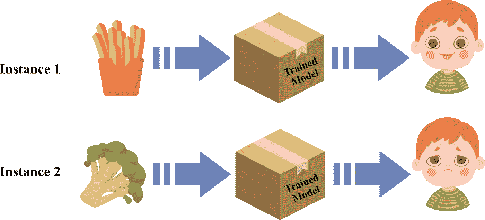

# 可解释性-可解释性范式:为什么和为什么不

> 原文：<https://medium.com/geekculture/the-explainability-interpretability-paradigm-the-whys-and-the-why-nots-f71f3587d2b0?source=collection_archive---------22----------------------->

不，它们是不可互换的

Photo by [Sharon McCutcheon](https://www.pexels.com/@mccutcheon?utm_content=attributionCopyText&utm_medium=referral&utm_source=pexels) from [Pexels](https://www.pexels.com/photo/multicolored-broken-mirror-decor-1407278/?utm_content=attributionCopyText&utm_medium=referral&utm_source=pexels)

没有事实，只有解释——弗里德里希·尼采

可解释的人工智能(XAI)和可解释的机器学习(IML)是令人兴奋的新领域，正在推动人工智能的发展走向更透明的建模。他们把责任和透明度带到一个虚拟的黑盒子里，也就是一个为你工作的训练有素的模型。该模型可能位于一个时髦的用户界面、一个文档之后，或者它可能是一个经过训练的模型，作为一名数据科学家，您现在想要增强它。可解释性和可解释性不仅告诉你更多关于模型如何看待属性对决策的重要性，还提供了信任的前提。毕竟，人工智能正被用于做出关键决策，信任已成为使用这些决策的主要要求。

> 但这并不意味着可解释性和可解释性是可以互换的术语。

虽然系统的可解释性是关于可以观察到的因果行为的程度，但可解释性旨在给出系统内部工作的人类可理解的版本。让我们假设一个人工智能模型，模拟一个六岁儿童的食物偏好。该模型接受具有属性的食物项目:基本蔬菜、烹饪方法、辣味，并预测典型的六岁儿童的情绪(一些孩子可能喜欢花椰菜，但我们不要去那里)。

Image source: the author. Icons sources: [Freepik](https://www.freepik.com) & [Flaticons](https://www.flaticon.com/authors/good-ware)

训练模型的分类行为可以表示为:

比如 1，输入设定*X1 = {土豆，油炸，低辣度}* ，输出情感是*开心*。

例如 2，输入设定*X2 = {西兰花，清蒸，低辣度}* ，输出情感*悲伤*。

可解释性可以告诉你，对于实例 3，模型会将输出标记为输入集 *X3={西兰花，油炸，低辣度}* 的*快乐*情绪。

它是基于这样的假设，即该模型已经被训练为给予属性烹饪方法比基础蔬菜更高的权重，但是它不会告诉你这样的情况。它会简单地告诉你，如果你改变某个属性，预测也会改变。**可解释性是针对输入或算法参数的变化预测输出的能力，但它不会告诉你原因。**

另一方面，可解释性试图给出人类可以理解的系统本质。如果以文本形式给出，它可能看起来像这样:*[人类儿童将拒绝该食物，因为]它是绿色的，有开花的头，质地不脆，辣味低"*或*[人类儿童将喜欢该食物，因为]它是金色的，具有长的形状，质地脆，辣味低"*。括号中的部分是输出，剩余的文本是解释，其中视觉细节来自食物图像，纹理是基于输入属性烹饪方法的工程特征。

我已经谈了很多关于[可解释性](/geekculture/explaining-a-trained-model-d750c70b60a8)、[它与你的相关性](/geekculture/why-ai-systems-owe-you-an-explanation-16496ae52efb)，以及驱动它的[哲学](/geekculture/the-philosophy-behind-ai-explainability-a774d084bbc3)。在这个故事中，让我们来谈谈它杰出的表亲，可解释性。

既然您已经对可解释性有了一个合理的想法，那么您需要弄清楚在建模生命周期中的什么时候和什么地方您需要它？

*   **在预建模阶段**:该阶段与模型输入的可解释性有关。如何更好地理解数据？通过你的探索性数据分析和可视化。您需要了解不同属性的统计特性及其对输出的意义。此外，探索现有工程特征的可能性，如上面使用的“纹理”。应该记住的是，通过 t-sne、随机投影等获得的高度工程化的特征可能会产生性能更好但可解释性更差的模型。
*   **在建模阶段:**模型可以是简单且可解释的(白盒)，也可以是复杂且不透明的(黑盒)。决策树和回归算法是使用可解释转换的白盒模型的常见示例。只要包含特征的数量和模型深度，就可以很容易地解释它们的机制。另一方面，神经网络和梯度增强模型可以称为黑盒模型。这种系统给出了更好的准确性，但是使用了预测器和复杂的变换。正是为了这些模型，人们正在进行研究，通过产生解释来使它们更加透明。
*   **在后建模阶段，也称为特设阶段:**此阶段的可解释性旨在理解输入特征和输出预测之间的动态关系。这将有助于理解特征对模型灵敏度和预测的贡献。还记得如果我们把烹饪方法改成炒西兰花，输出情绪是如何被预测为快乐的吗？这种可解释性假设烹饪方法对味道的接受有更大的影响，而不是基础蔬菜。

当评估机器学习和决策系统时，通常会通过基于某些假设的可解释性形式来测试它们。例如，一个不太复杂的模型会被认为更容易解释，因此可以产生一个更好的解释。由于 XAI 对人类理解的追求，它被认为是判断模型可解释性的金标准。但必须记住，可解释性本身可能会呈现出不同的形式，受数据属性、不同的潜在概念和相关人类主体的影响。我将在接下来的故事中涉及这一方面。

*   [机器学习的可解释性与可解释性:这两个概念有助于恢复对人工智能的信任](https://www.kdnuggets.com/2018/12/machine-learning-explainability-interpretability-ai.html)
*   [可解释性对于信任人工智能和机器学习至关重要](https://www.kdnuggets.com/2018/11/interpretability-trust-ai-machine-learning.html)
*   [挑战特征属性解释中常见的可解释性假设](https://arxiv.org/abs/2012.02748)