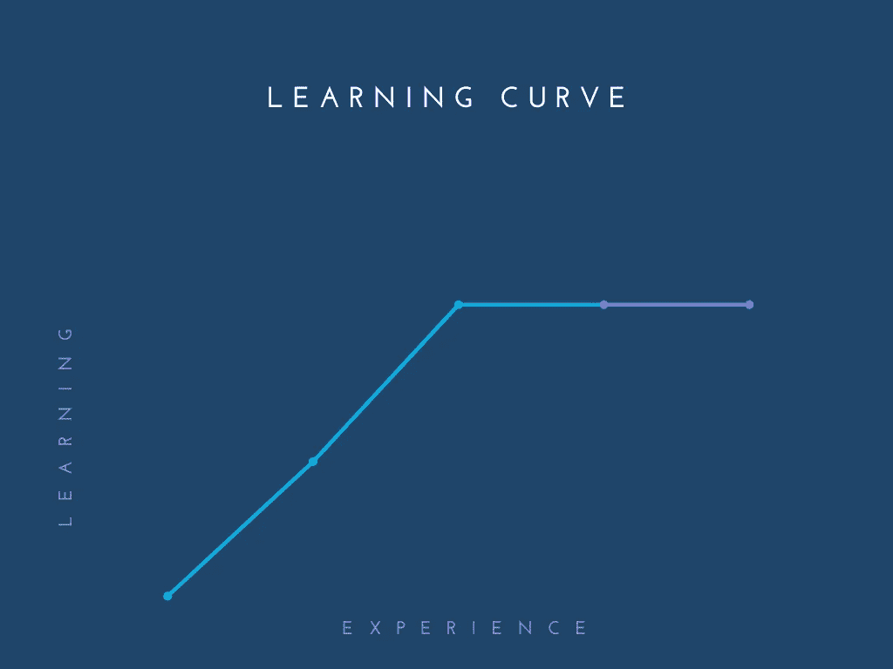
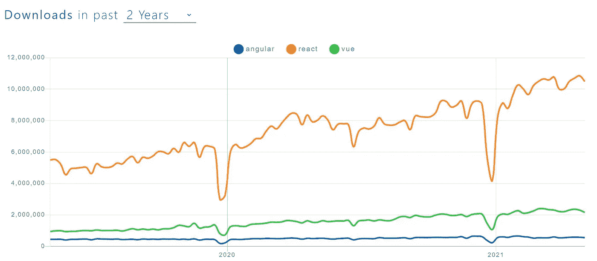
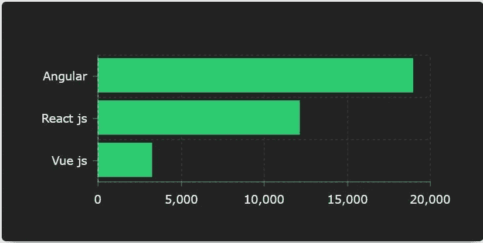
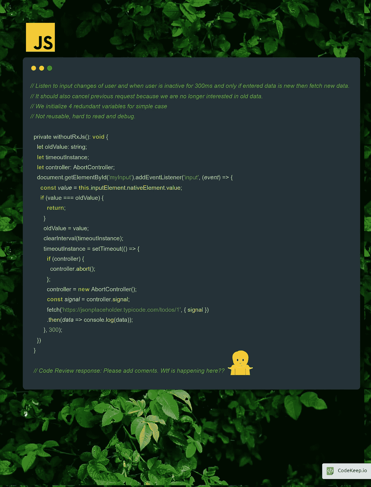
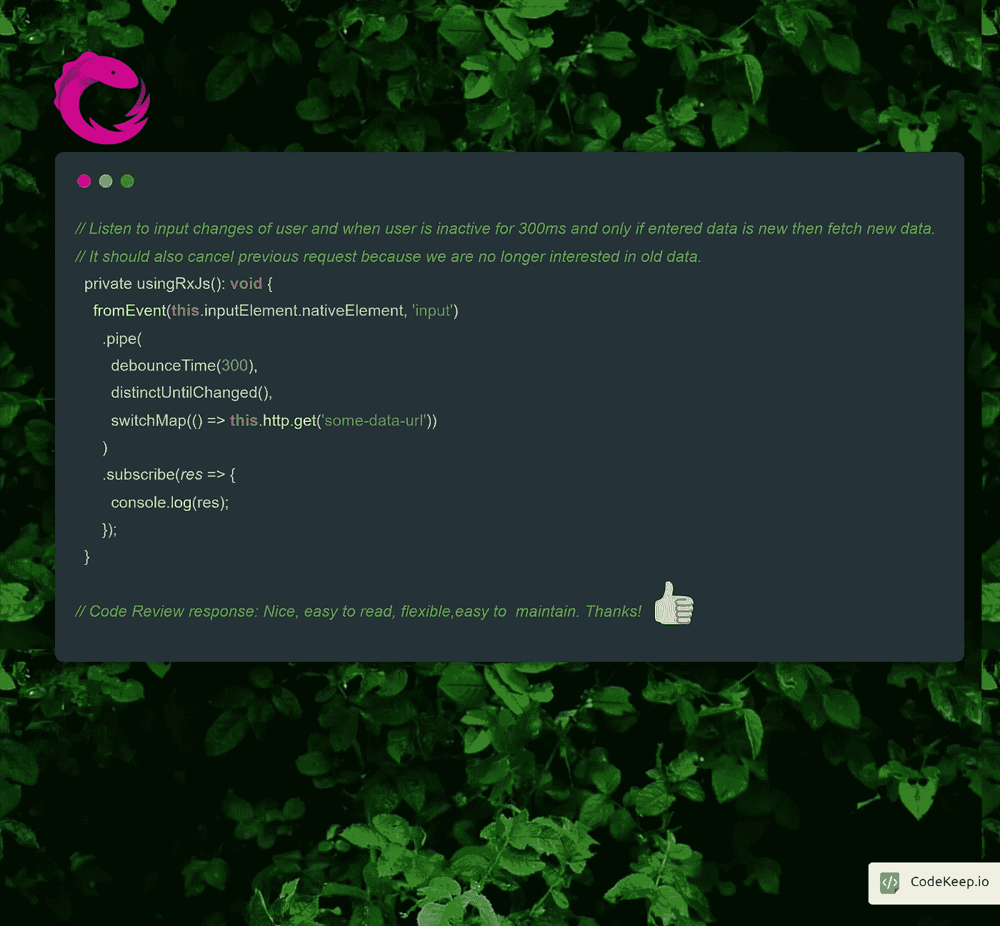

# Angular 中著名的误解

> 原文：<https://medium.com/geekculture/the-famous-misconceptions-in-angular-d078127ee4b0?source=collection_archive---------2----------------------->

作为曾在世界 500 强公司工作过的前端开发人员，比如 Raymond James 金融咨询公司和 SwissRe 领先的保险经纪公司，在这篇博客中，我们将讨论一些非 Angular 开发人员中著名的误解。这个博客应该不带偏见，只关注事实。

**误区 1:角度和旋转角度的学习曲线陡峭**

我们在人们中观察到的一个著名的误导性观点是“Angular 有一个陡峭的学习曲线”，特别是在 Twitter 和 youtube 的权威人士中。简短的回答是肯定的，Angular 有一条不小的学习和掌握之路。但是我们先来分析一下这个概念的定义。陡峭的学习曲线是指:*‘需要学习的时间量大’*。有意思，但是是什么让它变大的呢？首先，让我们指出 Angular 是一个全功能的框架。它有内置的路由、强大的表单、依赖注入和内置的类型脚本。此外，在学习 Angular 的时候，你也学习了软件开发原则和模式，这些在其他 web 框架中是不需要的。这些知识也应用并转移到其他编程语言(从 PHP 到。网)。我经常把它与 R.O.I 联系起来，R . o . I 代表股票市场的投资回报。当你在某件事情上投资，并且看到了我们案例中的好处(以后开发的简单性)，那么它就是值得的。那么你认为表单很容易管理吗？请尝试复杂的项目。见[本博客](https://betterprogramming.pub/i-almost-got-fired-for-choosing-react-in-our-enterprise-app-846ea840841c)。让我们将它与一个易于学习并且没有任何内置特性的库或框架进行比较。现在，我们能想象在没有这些特性的情况下构建一个真实的企业应用程序吗？嗯，不是的。**网络应用并不是你在 bootcamps** 中看到的承诺的 TODO 应用。它更有挑战性，也更有趣。现在对于企业项目，除了 UI 渲染，计算学习那些缺失的第三方包的时间量，并将其与选择最适合公司的所需时间相加。现在再用 Typescript 总结一下，这个工具非常有名，不管你用哪个工具，大多数企业都在用。我们得出结论，学习曲线差不多。

>为 Angular 投资时间

最后，我们引用下面的话来打破这个神话:

> 简单易学并不意味着容易建立一个真正的应用程序。

**误区二:棱角分明就是臃肿。**

大多数时候，我在媒体上看到的博客都有相同的错误观点。他们提到 angular 很臃肿，因为你需要安装 Angular 表单、路由等等。Angular 不需要这些包，如果你构建一个不需要表单的应用程序，那么你就不需要导入这些包，因此它们不包含在包中。如果您愿意，您也可以自由选择使用其他第三个软件包。

**谣言 3: NPM 统计显示 Angular 落后于 React 或 VueJs**

在博客中可以观察到的另一个流行观点是 Angular 不受欢迎，因为它在 npm 统计中落后。

分析之前先从这个概念的定义说起:

> NPM 统计说明了在给定时间内包的下载次数。

所以你可能会奇怪为什么 Angular 的下载量在这里不领先。好吧，让我们首先记住 Angular 主要在大型和非常大的企业项目中流行。在那些拥有成千上万开发人员的大公司里，人们不会简单地从 NPM 默认注册表中安装包。相反，公司基础设施有自己的虚拟注册表，其中有缓存和自定义安全设置。这意味着软件包的实际下载次数(在这种情况下是 Angular)没有反映在 npm 统计中。我们可以通过比较 javascript 前端世界中的可用工作数量来确认这一点。现在是波兰时间 2021 年 5 月 9 日 00:37，我正在写这篇文章。我正在通过 indeed.com 全球比较就业统计。从结果中我们可以看到 Angular 有[18929](https://www.indeed.com/q-angular-jobs.html)个作业，React 有[12096](https://www.indeed.com/jobs?q=react+js&l=&radius=25)个作业，Vuejs 有[3204](https://www.indeed.com/jobs?q=vue+js&l=)个作业。所以这再次证明了那些 npm 统计数据并没有反映现实。

Indeed stats May 9 2021

**误区 4: Angular 在每个版本都在变。**

我们可以观察到另一个有趣的观点，一些不熟悉 Angular 的开发者认为它是每个新版本的新框架，有很多突破性的变化。但这与现实相去甚远。Angular 专注于渐进式改进和最小的突破性变化。此外，这些突破性的变化大多是由强大的 ng 更新来处理的(感谢 angular/cli 团队)。

例如:最近，我们已经将我们的项目从 v10 升级到 v11，该项目是一家领先的保险经纪公司的一部分。所以我们花了不到一个小时。有一个小的路由相关的突破性变化，它是由 *ng 更新处理的。*另一个例子是我的定制库，但它要小得多。从 v6 升级到 v10 大约花了 1 个小时。有一些小的突破性更改，已由 ng update 迁移。

最后，我们得出了博客的结论。这篇文章不是关于欺负 Angular，而是侧重于神话和事实。我和 Angular，React，VueJs 一起工作过。在我看来，它们都有各自的优势和光明的未来。就这些了，希望你喜欢。另外，请不要犹豫，通过文章回复或我的 [Twitter](https://twitter.com/Vugar005) 联系我！干杯！

**更新:**关于 RxJs 是矫枉过正的反应。下面我们来分析一下
使用和不使用 RxJs 的截图。我们看到顶部使用纯 RxJs，底部没有 RxJs。在底部，我们为一个简单的东西声明了 4 个新变量。每个变量都伴随着维护成本，尤其是在复杂的项目中。最糟糕的是，它甚至不能重复使用。这只是我们经常开发的一个简单的 TODO 任务。这与我上面提到的 R.O.I .有关。

Without RxJS

With RxJS

查看我的其他帖子:

 [## 模块联盟系列第 1 部分:稍微深入一点

### 当你研究构建微前端的方法时，你会经常看到一个新的模块联盟…

vugar-005.medium.com](https://vugar-005.medium.com/module-federation-series-part-1-a-little-in-depth-258f331bc11e)  [## 你应该知道的基本角形 API

### Angular reactive forms 是一个强大的模块，用于管理 web 应用程序中的表单，但有时也用于解决…

medium.com](/geekculture/essential-angular-form-apis-you-should-know-5b0c12be0569)  [## 不改变本地代码或 Repo 的角度定制环境。

### 在这篇文章中，我们将讨论一个场景，当我们想设置我们的自定义环境，既不改变本地…

medium.com](/geekculture/angular-custom-environments-without-changing-the-local-code-or-repo-effa69457edb)