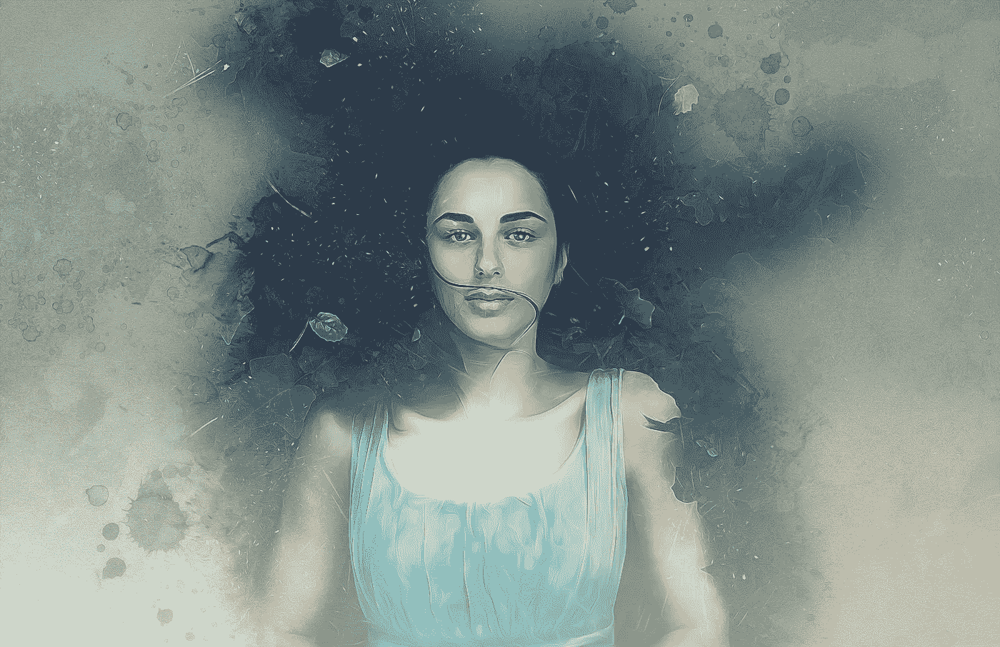

# "梦的迷人历史:从古代信仰到现代科学理论第一部分"

> 原文：<https://medium.com/geekculture/the-fascinating-history-of-dreams-from-ancient-beliefs-to-modern-scientific-theories-part-1-573a93225236?source=collection_archive---------16----------------------->

几个世纪以来，梦一直吸引着人类的想象力，它们的历史既迷人又多样。从古代的信仰到现代的科学理论，梦的研究经历了许多曲折。

Image by [Enrique Meseguer](https://pixabay.com/users/darksouls1-2189876/?utm_source=link-attribution&utm_medium=referral&utm_campaign=image&utm_content=2212358) from [Pixabay](https://pixabay.com//?utm_source=link-attribution&utm_medium=referral&utm_campaign=image&utm_content=2212358)

在古代文明中，梦通常被视为与神交流和洞察未来的一种方式。许多文化认为梦是从精神世界接收信息的一种方式，也是预言和指引的来源。

例如，在古埃及，梦被视为与神交流和接受神的指引的一种方式。法老经常会咨询解梦者，他们被认为有能力解读梦的含义。

在古希腊，梦被视为一种进入潜意识并洞察一个人内心最深处的想法和欲望的方式。著名的哲学家亚里士多德认为，梦是处理和理解一天中的事件和情感的一种方式。

在中世纪，梦通常被视为与魔鬼交流的一种方式，并且经常与巫术和魔法联系在一起。许多人认为梦是进入精神世界的一种方式，也是邪恶和诱惑的来源。

随着科学方法在文艺复兴时期的发展，对梦的研究采取了更加科学的方法。著名科学家和哲学家勒内·笛卡尔认为，梦是大脑活动的结果，而不是精神指引或交流的来源。

在 20 世纪，随着弗洛伊德理论的发展，对梦的研究采取了一种更加心理学的方法。西格蒙德·弗洛伊德认为，梦是进入潜意识的一种方式，是我们内心深处的想法、欲望和冲突的反映。

今天，梦的研究是一个多学科领域，来自心理学、神经科学和生物学等领域的研究人员都在研究梦的科学。虽然我们对梦的本质还有很多要了解，但现代科学已经让我们对梦的功能和目的有了更深的理解。

因此，当我们在梦的迷人历史中旅行时，我们可以看到我们对梦的理解是如何随着时间的推移而演变的。从古代的信仰到现代的科学理论，对梦的研究带领我们踏上了探索之旅，让我们对人类思维和意识的本质有了更深入的了解。所以，让我们继续探索迷人的梦的世界，看看它会把我们带向何方。