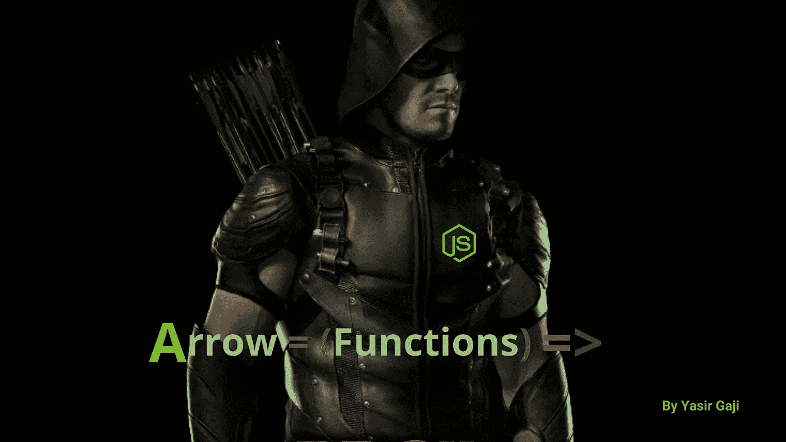
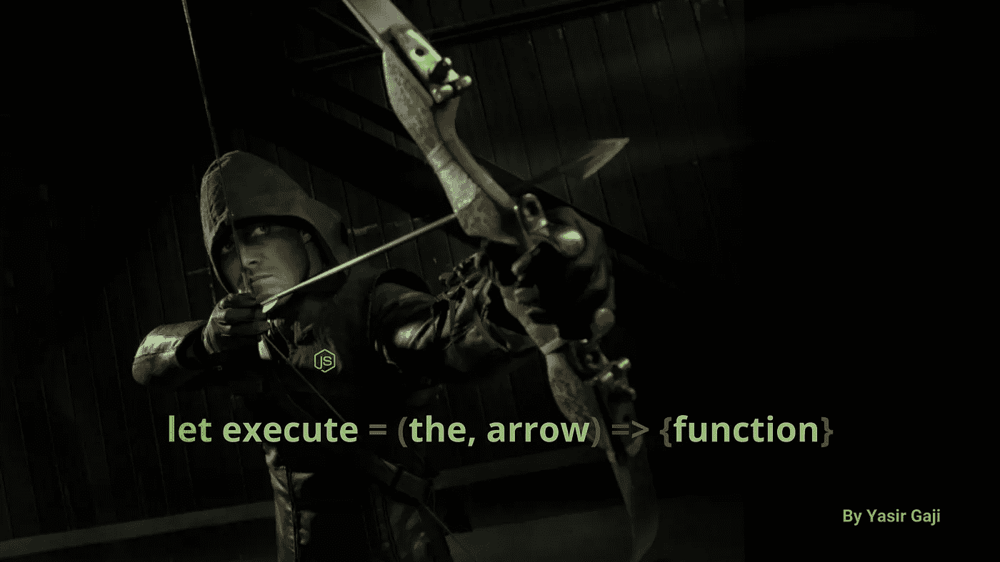

# Fat = (Arrow) => {Functions}

> 原文：<https://medium.com/geekculture/the-fat-arrow-functions-e6b6df8d25b5?source=collection_archive---------12----------------------->

**ES6+语法**最重要的方面之一

Arrow Functions Image By [**Yasir Gaji**](https://yasirgaji.com/)

引入了替代传统 [**函数表达式**](https://developer.mozilla.org/en-US/docs/Web/JavaScript/Reference/Operators/function) 的紧凑表达式语法，以改善干净的代码文化，并节省代码行，但结果证明不如传统的**函数表达式功能强大，**它没有`new.target`关键字，不能用作构造函数，没有自己与`this`关键字的绑定，并且它不适合于一般依赖于建立范围的`call`、`apply`和`bind`方法。

尽管如此，当没有`body` 块时，arrow 函数允许隐式返回，在大多数情况下导致代码更短更简单，并且它自动将`this`关键字绑定到周围代码的上下文，这使它非常灵活和令人敬畏。

# 射箭

Executing the arrow function image By [**Yasir Gaji**](https://yasirgaji.com/)

## 第一枪= ( ) = >比较；

这里，我们首先将 arrow 函数表达式与传统函数表达式进行比较。请参见下面的代码表示:

The base comparison script between regular function and arrow function by [**Yasir Gaji**](https://yasirgaji.com/)

正如您现在所知道的，这两个代码块都将它们各自的字符串记录在控制台中，您可能想知道这两个代码块是否没有太大的区别，它们或多或少包含相同的一组行，箭头函数的灵活性允许它省略一行函数的花括号和`return()`语句。请参见下面的代码表示:

Code representation of a one-line function with arrow function by [**Yasir Gaji**](https://yasirgaji.com/)

太棒了，现在我们把**参数**引入箭头函数怎么样。**是的，你猜对了！对于单参数函数，我们也可以去掉括号。请参见下面的代码表示:**

Code representation of the single parameter declaration in arrow function by [**Yasir Gaji**](https://yasirgaji.com/)

但是多个参数需要括号，否则函数会抛出错误。请参见下面的代码表示:

Code representation of multiple parameters declaration in an arrow function by [**Yasir Gaji**](https://yasirgaji.com/)

箭头函数也可以用于回调，这确实使它变得简洁。请参见下面的代码表示:

Code representation of callback functions in arrow function by [**Yasir Gaji**](https://yasirgaji.com/)

## 秒拍=()= >({瑕疵:'替代品' })；

正如我前面提到的，尽管 arrow 函数看起来很有优势，但它也有自己的缺陷，比如它不能识别对象文字并返回 undefined。但这可以通过用括号`()`将函数括起来很容易地解决。请参见下面的代码表示:

Code representation on how to successfully return object literals using arrow functions by [**Yasir Gaji**](https://yasirgaji.com/)

# 结论

除了在`object.function`语法期间(因为 arrow 函数不接受参数对象), arrow `=>`函数是最好的。

建议不要像`methods`那样使用箭头功能。

一定要问问题来澄清，并提出纠正和建议，我希望他们这样做。