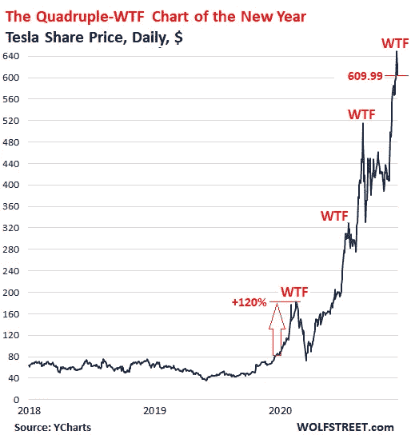
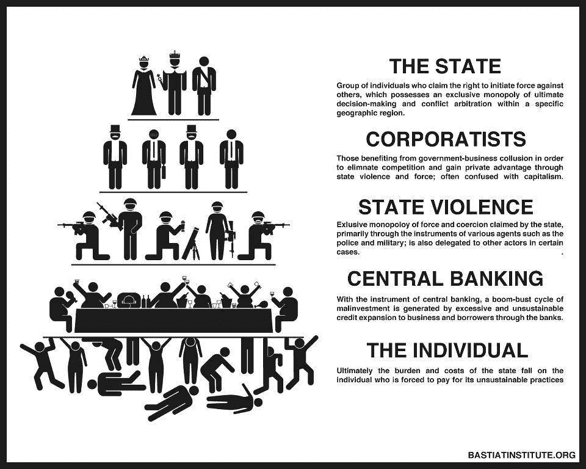

# 数字革命之后的金融重置

> 原文：<https://medium.com/geekculture/the-financial-reset-that-will-follow-the-digital-revolution-8d0f263585ce?source=collection_archive---------22----------------------->

随着数字世界的发展成为头版头条，世界即将迎来第四次工业革命的奇迹。

数字革命已经在改变我们的生活条件，并将最终带来世界的繁荣、冲突的减少、更好的沟通和更好的资产管理。

金融革命可以立即开始，重新设定金融事务的处理方式，减少政府干预，增强金融自由。

然而，一些不正常现象需要纠正，首先是股票市场的现状。现代财务规划并不像有些人想的那样是关于财富的再分配。这是关于减少难以承受的税收成本和过去几十年积累的沉重国债。

# 股票市场应该反映实体经济

*Tesla stock —* [*Source*](https://finance.yahoo.com/news/tesla-skeptic-says-ev-maker-055313168.html)

自疫情开始以来，资金不断涌入股市，试图解决经济衰退和 covid 停产带来的问题。

股票被极度高估，除非有一个 20 年的计划，用纳税人的钱来维持不盈利的企业集团，否则这些股票中的大多数应该会崩溃。否则，纳税人将永远为首席执行官们的错误和无能买单。

这并不是因为任何人都希望看到特斯拉或其他不盈利和政府援助的公司崩溃。它们理应崩溃，因为它们已经亏损多年，而且没有生产出它们所宣称的东西。

自疫情开始以来，股票价格与经济脱钩。股票市场过去常常反映实体经济，但在 2020 年 3 月的大崩盘后，美联储和欧洲央行印刷的数万亿美元直接用于支持股票和大型企业。

最终，由于这些公司中的大多数没有将这笔钱用于 R&D，而是投机以抛物线方式提高其股价，这将反映在他们的资产负债表上，在不同的条件下，他们将再次表现不佳。

# 企业社会主义的减少

*Image* [*Source*](https://www.blogs.hss.ed.ac.uk/crag/2016/03/31/corporate-socialism-future-humanity/)

我们需要继续为这个星球上最富有的人当中的高管们的失败纳税吗？每个人都会犯错，但对有些人来说，这似乎根本不算什么。

只要纳税人还在为失败的公司买单，这些公司就只会继续失败下去。在一个经济体中，几乎没有任何领域或行业是自由市场，但也有后果。当一个企业高管失败时，公众不应该平等地分担后果。

这只会增加税收，只是为了让企业在没有被要求或没有兑现任何承诺的情况下保持活跃。

当投资任何股票时，我希望看到强劲的生产、降低的运营成本，而不是让员工遭受减薪，而是开发解决方案和更好的业务运营模式。

我期望看到超额利润用于研发，这是运营进步的根本因素。几十年来，微软没有向股票所有者支付股息。我也不在乎分红，因为这是短期利润。我更愿意投资于进步，支持能提高数百万人生活水平的产品开发。这就是投资存在的原因。投资者甚至没有考虑到短期风险。

我支持和投资比特币现金的一个主要原因就是这个。发展势头强劲，网络先进。

此外，我避免在 BTC 投资的主要原因是，开发将密码转化为政府控制的法令的方法，并产生可怕的结果。

数字革命即将来临。年轻一代拥有一个充满机会的世界，他们应该抓住这个机会，为所有人创造一个更美好的未来。

# 结论

*Image from:* [*Unsplash*](https://unsplash.com/photos/LqKhnDzSF-8)

我们每个人都有责任保护自己的财务自由和隐私等基本人权。同样重要的是保护我们自己免受实业家将其损失社会化的影响。

随着政府将开始弱化，去中心化的数字环境将更好地执行大多数政府任务，我预计严格的监管和进步停滞将成为职业政治家的首要任务。

在这一点上，我们都应该准备好采取行动，并澄清我们不会容忍支付过时的政府官员不需要的工作。

在治理、不可改变和抵制审查方面，分散的金融和智能合约将为当前失败的经济实验带来正义。

它将采取措施减少西方的庞大政府，这些政府目前正在达到共产主义经济体的规模。虽然，现在，我们已经有了工具。

**关注我:**

)(...)(...)(...)(...)(...)(...)(...)(...)(...)(...)(...)(...)(...)(...)(...)(...)(...)(...)(...)(...)(...)(...)(...)(...)(...)(...)(...)(...)(...)(...)(...)(...)(...)(...)(...)(...)(...)(...)(...)(...)(...)(...)(...)(...)(...)(...)(...)(...)(...)(...)(...)(...)(...)(...)(...)(...)(...)(...)(...)(...)(...)(...)(...)(...)(...)(...)(...)(...)(...)(...)(......(...)(...)(...)(......(...)(...)(...)(...)(......(...)(...)(......(...)(...)(...)(...)(......(...)(...)(...)(......(...)(...)(...)(...)(......(...)(...)(

)(我)(们)(都)(没)(想)(到)(这)(样)(,)(我)(们)(还)(没)(想)(到)(这)(样)(,)(我)(们)(就)(没)(想)(到)(这)(样)(了)(,)(我)(们)(就)(没)(想)(到)(这)(样)(。

*最初发表于* [*https://read.cash*](https://read.cash/@Pantera/the-financial-reset-that-will-follow-the-digital-revolution-c5d382e7) *(T99)*