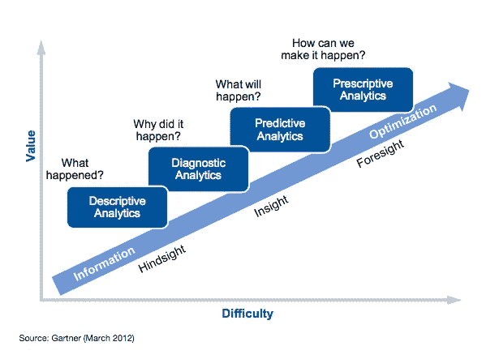
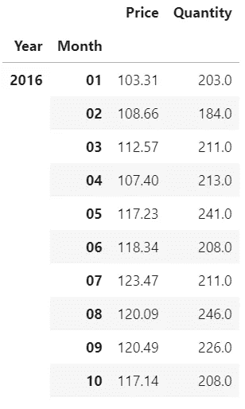
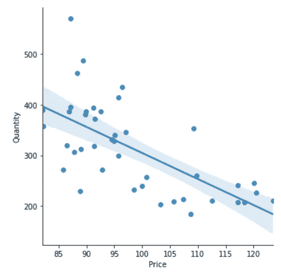
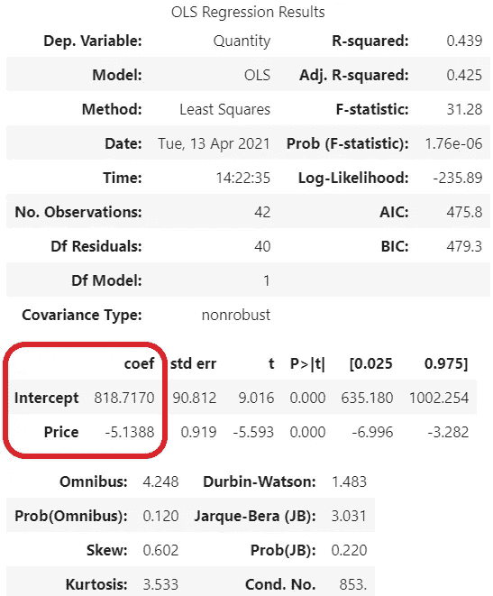
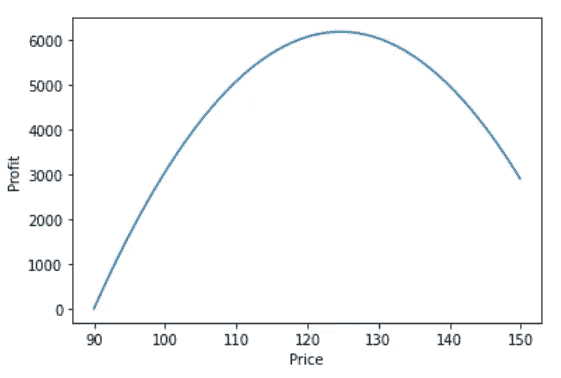
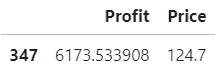
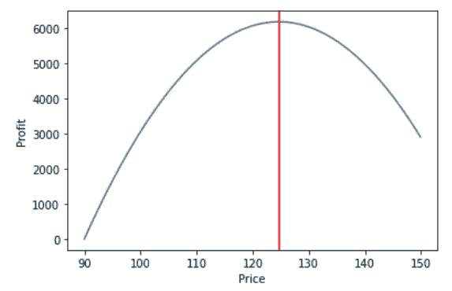

# 预测性分析和规范性分析之间的细微差别(举例)

> 原文：<https://medium.com/geekculture/the-fine-line-between-predictive-and-prescriptive-analytics-with-examples-98bcf9c97181?source=collection_archive---------4----------------------->

## 以及如何爬上通往最先进的分析技术的楼梯

Photo by [Jukan Tateisi](https://unsplash.com/@tateisimikito?utm_source=medium&utm_medium=referral) on [Unsplash](https://unsplash.com?utm_source=medium&utm_medium=referral)

自 2012 年以来，我们听到了 Gartner 的一句名言:一般来说，在达到最先进水平之前，分析需要经过四个阶段。尽管这篇文章是在 9 年前发表的，但它很好地(甚至过分地)代表了大多数公司的现实。

四个步骤或四种主要的分析方法可以定义为:

描述性—发生了什么？

诊断——为什么会这样？

预测—会发生什么？

规定性——我们如何让它发生？

The famous Gartner ascendancy model

# 描述性分析

我们可以很容易地理解前两个，因为它的想法已经在公司中传播开来。我们可以说**描述性**分析来自**第一代 BI**并使 Excel 电子表格闻名遐迩。主要思想是我们我们可以描述(最明显的意思)我们组织的数字:

> **什么****是月收入？**
> 
> **我们在某些费用上花了多少钱？**
> 
> ****库存水平如何？****

**这是理解我们数据的第一步，处理从**到**的信息。**

# **诊断分析**

**一旦我们知道过去发生了什么，第二步就是**诊断**分析**，**询问为什么会发生。这可以通过使用**第二代 BI**来解决，我们可以关联来自不同来源的不同数据。一些示例问题包括:**

> **为什么我们的收入在年底总是比较高？**
> 
> **为什么我们在汽车上花费这么多？**
> 
> **为什么我们的库存减少得这么快？**

**这个下一个级别需要用户的一点好奇心，以及解决问题的意愿。在这里，我们重点关注**实际的**问题以及**它们为什么会发生。****

**如果我们仔细观察，我们可以说描述性分析回顾了过去的**而诊断倾向于观察现在的**。按照这个逻辑，你会认为下一关应该是展望**未来**。你猜怎么着，你是对的！大多数人误解的是**只有**预测分析观察未来，而不是规定性的。******

**然后，在所有这些分析成熟度 101 之后，我们回到本文的要点。**

# ****预测性分析和规范性分析有什么区别？****

**数据科学和机器学习的出现使第三和第四个层次都变得很有名。不要因为“预见”未来而误解这些术语，即使以我们现在的技术，这仍然是不可能的。我们数据科学家所做的是**根据历史数据**推断(或预测)最有可能的场景**。所以，真正的问题是**而不是**比如:****

> **我未来 6 个月的收入是多少？**
> 
> **下个月我们将在汽车费用上花费多少？**
> 
> **我们应该有多少库存才能在接下来的几周不积压？**

**而是:**

> **根据过去两年的，我未来 6 个月的收入**是多少？****
> 
> **根据我们车队的历史使用情况、车辆品牌和未结交付订单的数量，我们下个月将在汽车费用上花费多少**？****
> 
> **根据 RFM 和上个月的活动数量，我们应该有多少库存才能在接下来的几周**不积压？****

**机器学习总是基于历史数据，我们不能凭空推断出一些东西。此外，我们使用诊断阶段回答的问题作为模型开发的初始阶段。**

**需要注意的是预测分析的结果:**

> **根据过去两年的，我未来 6 个月的收入**会是多少？****
> 
> **答:14，242，924.52 美元**
> 
> **根据我们车队的历史使用情况、车辆品牌和未结交付订单的数量，我们下个月将在汽车费用上花费多少**？****
> 
> **答:241，242.08 美元**
> 
> **根据 RFM 和上个月的活动数量，我们应该有多少库存才能在接下来的几周**没有积压？****
> 
> **答复:6 236 项**

**我们还得到了一个模型，它可以是一个数学方程，我们用它来生成这些数字，例如:**

> **收入= 1152.94 + 32.98 * **<售出产品数量>** + 790 * **<制造活动数量>****

**例如，我们销售了 35，743 件产品，开展了 15 次活动。我们得到:**

> **收入= 1152.94+32.98 ***35743**+790 ***15****
> 
> **收入= 1，191，807.08 美元**

**当然，我们使用更先进的技术来创建模型，但这是机器学习的主要思想:基于历史数据创建一个“方程”来预测最有可能的未来场景。重点是那个词，**或然**。**

**那么规定性分析呢，我们浪费了我们的时间线:过去、现在和未来。还剩下什么？**

**在规定性分析中，我们关注的是**达到**这些可能的数字。现在的问题是:**

> ****我们如何实现 14，242，924.52 美元的收入？****
> 
> ****我们如何将汽车费用预算为 241，242.08 美元？****
> 
> **我们如何保证某些商品不会积压？**

**一些答案可能是:**

> ****我们如何实现 14，242，924.52 美元的收入？****
> 
> **回答:利润减少 3%，销售额增加 10%**
> 
> ****我们如何将汽车费用预算为 241，242.08 美元？****
> 
> **答:1 号车使用这条路线，2 号车使用这条路线…**
> 
> ****我们如何保证某些商品不会积压？****
> 
> **答:使用 6，236 个项目作为基线，再增加 10%作为安全余量。另外，向这些供应商购买这些物品:**

**总之，规定性分析集中在**决策**和/或**行动**上。**

**预测分析和规范分析的主要区别在于，在预测分析中，我们有一台机器**帮助我们做出决策**，而在规范分析中，我们将有一台机器**告诉我们做什么**来实现我们在预测分析中获得的数字。我们是否使用机器推荐将是人类的决定。**

**但是为什么我们需要一个预测模型来建立一个规范模型呢？**

# **是时候动手了**

**让我们举个例子。**定价**是一种零售惯例，即定义一个价格来优化**利润**(非收入)。在这个例子中，我们将使用一个私有数据库，我们将不会关注代码，而是关注业务案例。**

**我们已经从学院的基本管理课程中了解到:**

> **利润=收入-成本**
> 
> **收入=数量*价格**

**所以，**

> **利润=数量*价格-成本**

**我们可以估计一个简单的需求模型，其中我们只根据**价格**来确定**数量**。而且我们知道价格越高，卖的产品越少。**

**让我们使用一些关于零售中某种产品的数据:**

****

**Monthly sales of a single random product**

**如果我们绘制这些数据，我们可以看到一个下降的模式。正如我们所预料的，我们越是提高价格，销售的产品就越少。**

****

**Linear Model for Price x Quantity (made with Seaborn)**

**根据需求理论，我们应该期望线方程(y = ax + b)如下:**

> **数量= **-a** *价格+ **b****

**其中系数 a 和 b 将由统计模型定义。 **a** 中的减号反映了下降趋势。**

**我们将使用最简单的模型，线性回归(使用普通最小二乘法或 OLS)。一旦我们创建了模型，我们会得到以下结果:**

****

**Model created with python lib statsmodels**

**尽管这里有很多信息，但我们将把重点放在 **coef** 列，在这里我们获得截距和价格的信息。其余的信息告诉我们关于模型性能的信息，我们不会在这里讨论。**

**我们的数量 x 价格模型现在变成了:**

> **数量= 818.72 - 5.14 *价格**

**当然，我们有一个与这个等式相关的误差，我们可以注意到在数量 x 价格散点图上一个较浅的蓝色区域，那就是误差。我们工作的很大一部分就是尽可能地减少这种误差，这样我们就能得到更准确的结果。**

**不管怎样，我们得到的最终方程是代表最有可能发生的**(这里又是那个重要的词)场景的方程。****

****一旦我们有了这个(预测)模型，我们就可以在利润等式中代入:****

> ****利润=数量*价格-成本= (818.72 - 5.14 *价格)*价格-成本****

****我们注意到价格是平方的，再次回到我们的大学课堂，我们知道这些系数为 2 的方程(或二阶方程)有一条曲线，我们可以估计出代表我们可以从某种产品中获得的最大利润的**最大点**。****

****对于成本，我们将假设一个固定值，但是您可能已经注意到，我们也可以创建一个基于需求的成本模型。但让我们保持简单，我们将假设成本是每件产品 90.00 美元。绘制这个方程，我们将得到下面的图表:****

********

****Profit curve****

****通过将价格定在 124.70 美元，我们可以轻松获得最大利润，至此，我们的**说明性**分析结束。****

****************

****Maximum value chart and value****

****在一天结束的时候，我们将会有一个机器人为你的公司推荐你出售的每一件产品的价格。****

# ****总结****

****我希望你喜欢阅读我写的这篇文章，我希望它能帮助你理解你在哪里，以及在你的分析之旅中你想去哪里。请注意，每一个分析级别都是下一个级别的一个步骤，所以不要急于到达最后一个阶段而不跨越前面的级别。每一种主要的分析都会给你提升到下一个阶段所需的正确信息。****