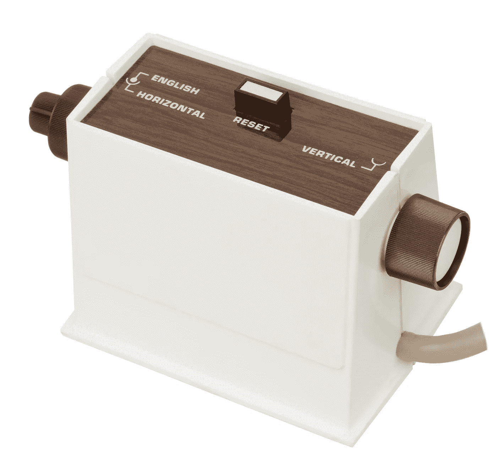

# 第一台家用视频游戏机

> 原文：<https://medium.com/geekculture/the-first-home-video-game-console-ffae3872bf00?source=collection_archive---------23----------------------->

现在，虽然我可能喜欢像索尼和任天堂这样的现代视频游戏公司，但他们并没有为第一台视频游戏机负责。任天堂创造了一个能够赢得第一代家庭视频游戏机的主机，但那个主机不是第一代。第一个商用的家庭视频游戏控制台是一个被称为 Magnavox Odyssey 的设备，它对电子游戏和…