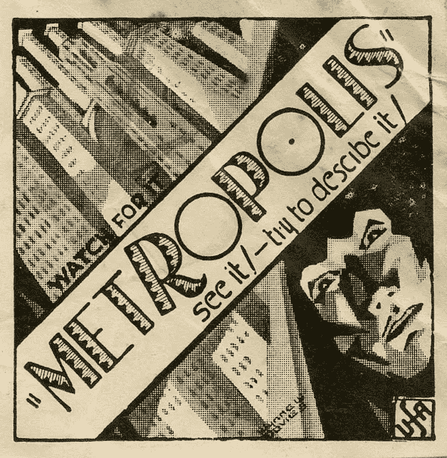

# 第一部基于人工智能的电影——大都会(1927)

> 原文：<https://medium.com/geekculture/the-first-movie-based-on-artificial-intelligence-metropolis-1927-1fb756c79bcd?source=collection_archive---------10----------------------->

Movie poster of Metropolis. Credit: [https://flickr.com](https://flickr.com/photos/35759981@N08/15418159339)

当谈到受人工智能启发的电影时，我们脑海中很少有名字。其中一些是终结者系列和黑客帝国系列。自从一部新的《黑客帝国:复活》上映后，我想到回头看看电影院，看看人工智能这个概念是在哪里首次出现的。