# 第一步:在 Oracle 数据库 19c 和 OBIEE 12c 之间创建连接

> 原文：<https://medium.com/geekculture/the-first-steps-creating-a-connection-between-oracle-database-19c-and-obiee-12c-bbc984100805?source=collection_archive---------8----------------------->

因此，您*终于*在您的本地服务器上安装了 OBIEE 和 Oracle Database 19c 就在您准备开香槟庆祝时，您意识到了一个*重大问题*:尽管您需要启动并运行 Oracle 数据库来正确安装 OBIEE，但出于某种原因，两者之间似乎仍然没有通信。换句话说，您的 Oracle 数据库中的数据在 OBIEE 中是不可见的。你所能看到的只是简单销售和简单目标主题区域，没有数据文件和连接…这是一个主要问题。我们会解决这个问题的。

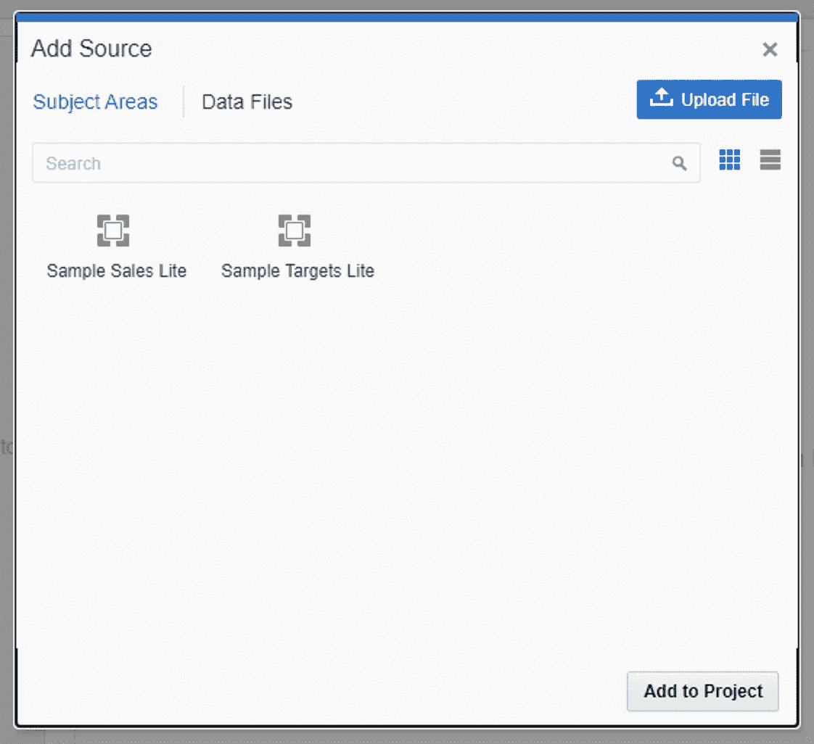

在我继续之前，这篇博文假设您已经在 Windows 服务器上启动并运行了 Oracle Database 19c，并且已经解锁了 HR 数据集。如果您还没有这样做，您可以查看我的博客文章，了解如何在 Windows [上安装和配置 Oracle Database 19c。这篇博文还假设您的 Windows 服务器上已经安装并运行了 OBIEE 12c。如果你还没有这样做，你可以在这里查看我关于如何安装和配置 OBIEE 12c](/geekculture/oracle-database-19c-installation-on-windows-5a0561843fbc) [的博文。让我们开始吧。](/geekculture/install-and-configure-obiee-12c-on-windows-vm-1c5487ddbaeb)

# 设置 TNS_ADMIN 环境变量

我们首先需要设置 TNS_ADMIN 环境变量。这个变量本质上定义了 tnsnames.ora 文件的存储目录。首先，点击屏幕左下角的开始菜单。然后，点击用红色圈出的齿轮图标，打开你的设置应用程序。


您的屏幕现在应该看起来像这样。点击“系统”

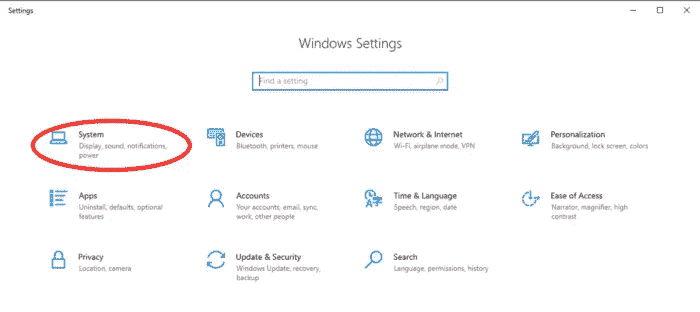

您的屏幕现在应该看起来像这样。

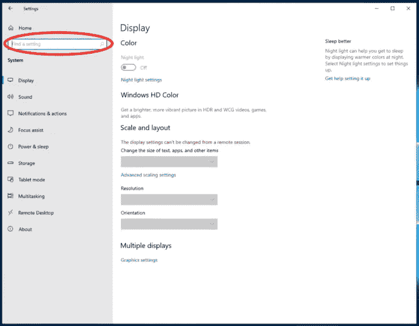

在“查找设置”搜索栏中，搜索以下内容。

```
Edit the system environment variables
```

选择下面的*选项。*


应该会弹出一个新窗口，看起来像这样。点击“环境变量”，我在下面用红笔圈了出来。


我们现在要定义环境变量 TNS_ADMIN。在您的环境变量屏幕中，单击下面用红色圈出的“新建”按钮。


应该会弹出一个新窗口，如下所示。


如下设置“变量名”。

```
TNS_ADMIN
```

将“变量值”设置为数据库的 tnsnames.ora 文件所在的目录。在我的例子中，情况如下。

```
C:\App\db_home\network\admin
```

窗口现在应该看起来像这样。单击“确定”

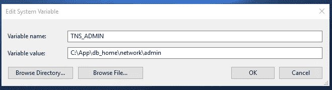

# 在 OBIEE 和数据库之间创建连接

我们现在将在 OBIEE 管理工具中访问 OBIEE 中的 HR 数据集。在 Windows 文件资源管理器中，导航到以下目录。

```
C:\Oracle\Middleware\Oracle_Home\user_projects\domains\bi\bitools\bin
```

您的 Windows 文件资源管理器应该如下所示。右键单击 admintool 应用程序，我在下面用红色圈出了它。

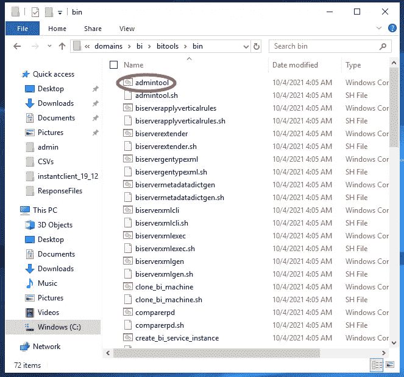

在右键菜单中，单击“创建快捷方式”,然后将该快捷方式拖到桌面上。这将使应用程序更易于将来使用。现在，双击快捷方式打开应用程序。应该会弹出一个如下所示的窗口。


在键盘上，同时按下“Ctrl”+“N”按钮来创建一个新的存储库。应该会弹出一个类似向导的新窗口。让我们浏览一遍。

## 步骤 1:存储库信息

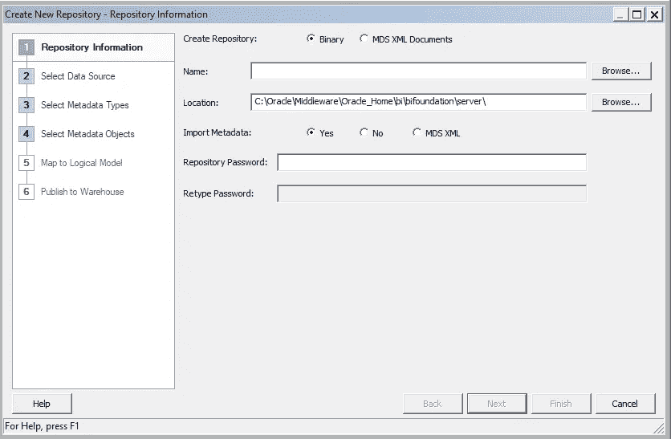

在窗口中输入以下内容:

*   **姓名:** HR-OBIEE
*   **地点:**保持原样
*   **导入元数据:**勾选**“**是”气泡
*   **仓库密码:** *【输入 _ 任意 _ 密码】*

你的窗口现在应该看起来像这样。点击“下一步”

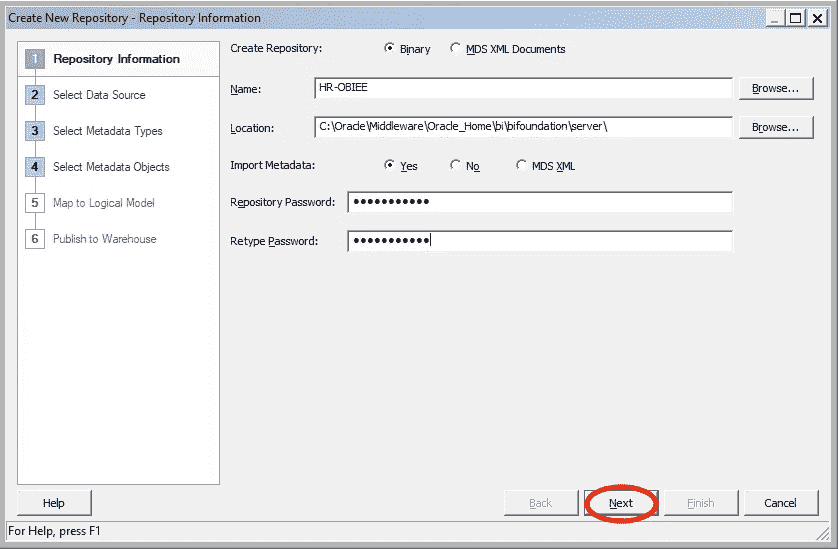

Click “Next”

## 步骤 2:选择数据源

你的窗口现在应该看起来像这样

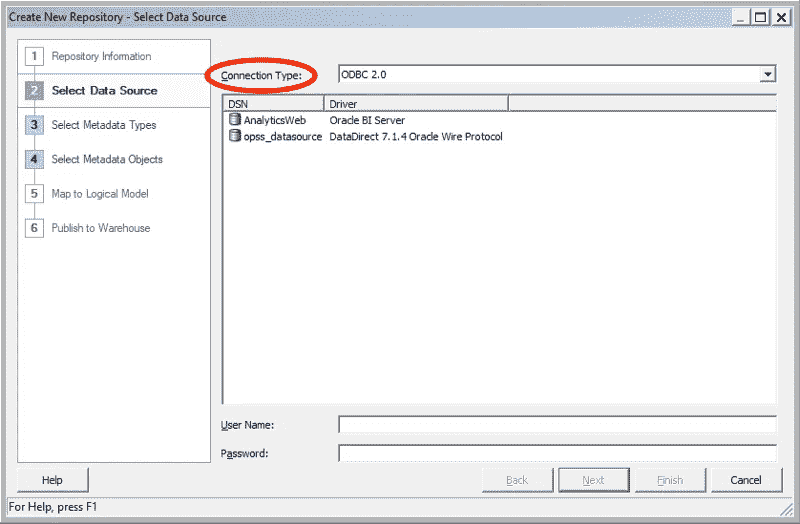

Change the Connection Type

将“连接类型”设置为“OCI 10g/11g”你的窗口现在应该看起来像这样。

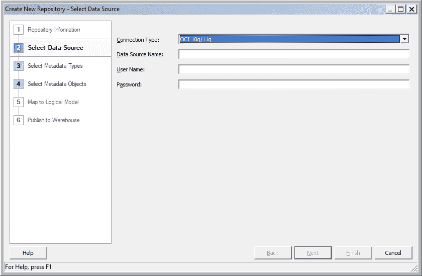

对于“数据源名称”，您需要使用 easy connect 语法来定义数据源，如下所示。

```
//database_host[:port]/service_name
```

在我的实例中，我的字符串看起来像这样。

```
//localhost:1521/orclpdb
```

对于用户名，输入 *hr* ，对于密码，也输入 *hr* 。你的窗口现在应该看起来像这样。点击“下一步”

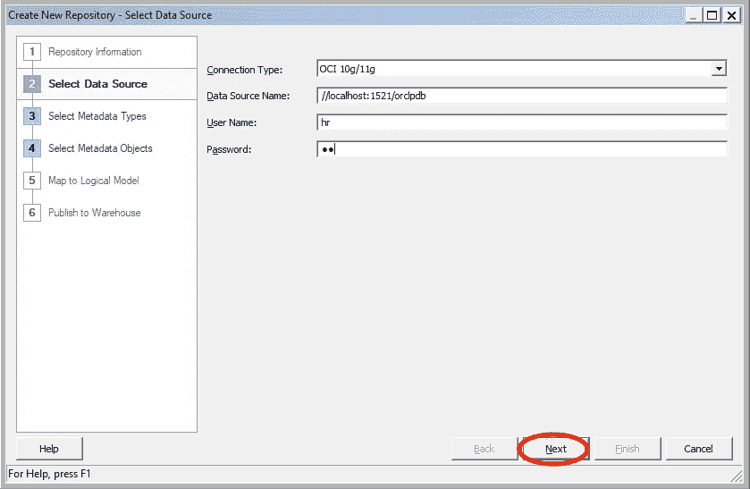

Click “Next”

## 步骤 3:选择元数据类型

你的窗口现在应该看起来像这样。保持一切“原样”点击“下一步”

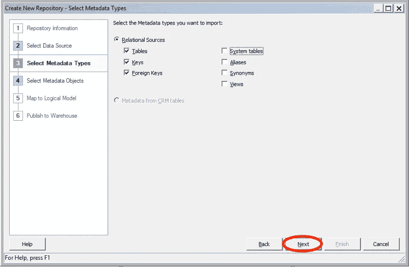

Click “Next”

## **第四步:选择元数据对象**

你的窗口现在应该看起来像这样。首先，在“数据源视图”窗口下选择 HR 模式，下面用红色圈出。然后，单击蓝色箭头，将 HR 模式输入到存储库视图中。

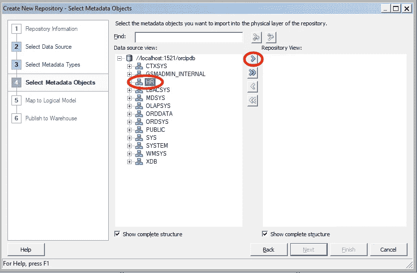

Click the Blue Arrow, Circled in Red Above

这样做后会弹出两个窗口——首先，您会看到一个如下所示的窗口。


把这个窗口拖开，暂时忽略它。将弹出的另一个窗口如下所示。将“超时”更改为无穷大。然后，单击“确定”

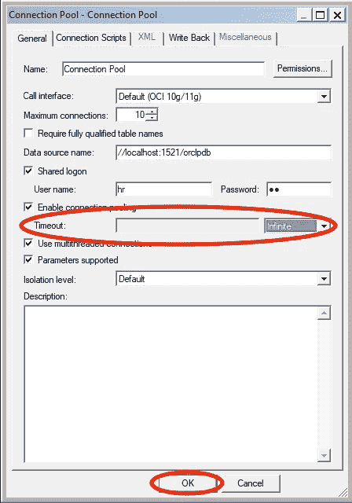

您的原始窗口现在应该看起来像这样。点击“完成”

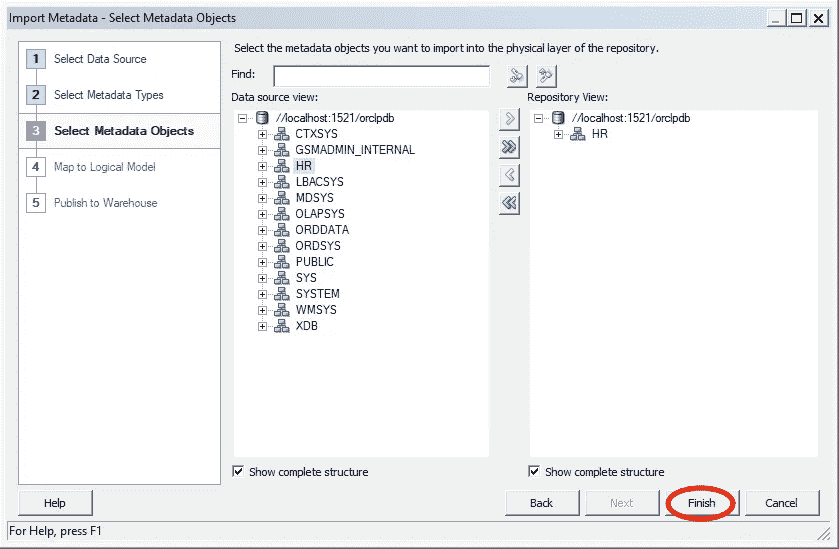

Click “Finish”

你的窗口现在应该看起来像这样。

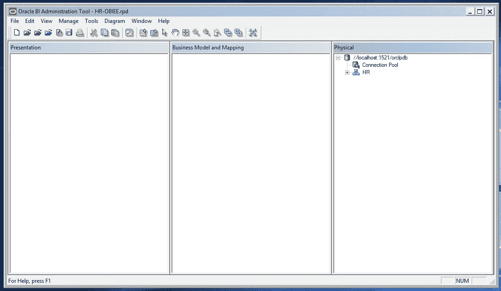

恭喜—您已经在 OBIEE 和 Oracle 数据库之间创建了一个连接。

