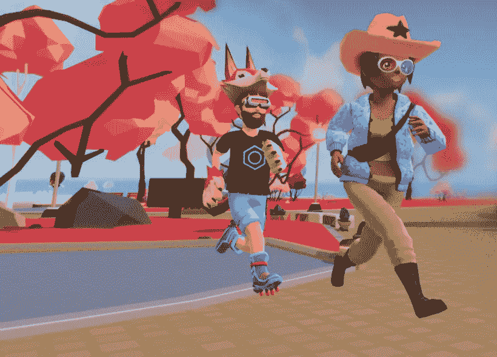

# 分权的第一步

> 原文：<https://medium.com/geekculture/the-first-steps-in-decentraland-31f8e522bf50?source=collection_archive---------3----------------------->

## 你能做什么以及如何开始盈利

The image represents a print screen made by the author from the official homepage of the game

D [ecentraland](https://decentraland.org/) 是有史以来第一个虚拟现实，它让你，玩家，成为其中某些部分的所有者，比如土地和你在自己拥有的土地上建造的东西。换句话说，这个网络游戏是一个由用户共享的虚拟世界。如果你没有尝试过《分散之地》,作为一个游戏玩家和区块链爱好者，我个人推荐它，因为这个游戏是建立在以太坊区块链上的，并且是完全基于加密的。

# 玩的要求

你需要一台至少有四核处理器、至少 4 GB 内存和一个好显卡的电脑，加上浏览器 Chrome 或 Firefox 和 Metamask wallet 扩展。

# 游戏的货币

## 陆地

游戏的不动产地段构成了加密资产土地，是游戏中不可替换的令牌(NFT)的一部分。你可以在游戏中用法力购买土地，并在上面建造任何你能负担得起的东西。随着时间的推移，一旦更多的玩家加入游戏，游戏中的经济发展，这块土地的价值可能会增加，就像你在现实生活中购买的房地产一样。你可以拥有自己的游戏，商店，或者任何你想在这片土地上建造的东西。

## 威望

有一种交易币叫 MANA，用来在网络世界买东西。它可以用来购买你在游戏中想要的一切，包括土地、可穿戴设备和收藏品。你可以从 [Uniswap 兑换](https://app.uniswap.org/)获得法力，通过兑换其他货币。

# 登录和游戏

我喜欢分散土地的一点是，你不需要安装任何东西，除了 MetaMask 钱包，它是浏览器的扩展。一旦你安装了 MetaMask，你将使用你的钱包账户登录，进入分散之地的世界，在那里你可以探索地区，聊天，交朋友，采矿，做任务和玩各种迷你游戏。

## 宣称你的名字

你可以要求一个只有 100 法力值的名字，否则，你的名字就不唯一了。一旦你有了这个名字，你也可以卖掉它，因为你将是唯一一个拥有这个名字的人，其他人将不得不给你钱来获得它。一些玩家已经声称自己的名字属于现实世界的名人。

## 通过传送到不同的区域进行探索

如果你想知道如何在分散的世界中导航，请按键盘上的 C 键。你也可以在底部的工具条上选择，比如任务按钮，建筑按钮，以及传送到不同区域的按钮，来探索分散世界。你可以步行或使用“跳进去”按钮。

## 完成获得 NFT 的任务

我完成的第一个任务是和安娜一起完成的蒸汽朋克主题的任务，她要求我为她的机器找到所有 5 个机械装置。齿轮遍布她的房子和院子。我通过这个任务获得了 NFT 奖。目前它可能一文不值，但谁知道将来它的价值会是多少。还有很多其他的任务可以尝试。

## 玩游戏、参加活动和购买土地

你可以玩分散之地各个地区已经有的游戏，或者你可以用法力购买土地并创建自己的游戏、商店、博物馆等。游戏也能给你 NFT，比如可穿戴设备。也可以参加[现场活动](https://events.decentraland.org/)。

分散的土地是一个很大的世界，你可以从中获得很多乐趣。在这里度过的时光也许有一天会让你赚到钱。你只需要收集 NFT 氏症。你也可以在这个虚拟世界投资购买土地，并开始自己的游戏业务。如果你是艺术家，你可以创建一个博物馆。有许多事情要做。一旦你沉浸在这个世界，它真的会让人上瘾。