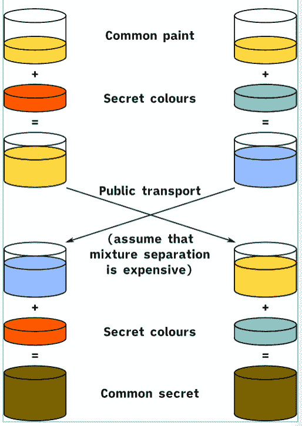
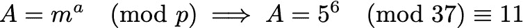
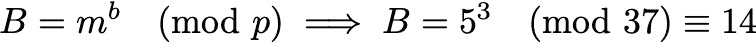
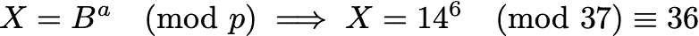
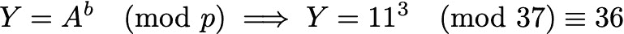

# 间谍首先要掌握的是…数学？

> 原文：<https://medium.com/geekculture/the-first-thing-a-spy-must-master-is-mathematics-an-intro-to-public-key-cryptography-387a90eaa1c9?source=collection_archive---------34----------------------->

## STEM 中的宝石:公钥密码学简介

我记得小时候看《间谍小子》的时候，希望自己也是一名间谍。我会做白日梦，在锐利的红色激光束之间做杀手体操，用那些他们不知何故让小孩子使用的疯狂的小玩意飞行。后来，我长大了，意识到我的身体状况根本不足以应付他们所做的一切，而且这基本上是免费的童工劳动(我一次也没有看到这些孩子因为他们的辛勤工作而得到金钱补偿)。

Spy Kids (2001) Poster

无论如何，间谍电影中的许多麻烦似乎在于无法安全或可靠地沟通，通常是因为内部间谍可以获得敏感信息，他们用这些信息来挫败“好”间谍。因此，虽然我可能无法作为一名间谍在身体上为*做出贡献，但也许我们可以在智力上这样做——就像那些在三台不同的计算机上快速打字的角色之一，同时将关键信息传递给主要角色。*

为此，今天我们将讨论四种主要加密技术之一:**公钥加密**(也称为非对称密钥加密)！要了解更多关于密码学的其他基础知识，请务必阅读我的上一篇文章！

正如我们上次学到的，对称加密(四种类型中的另一种)是指使用相同的密钥对消息进行加密和解密，并且所述密钥是双方事先约定的。这方面的一些例子包括凯撒的密码和维根涅尔的密码([两者都在另一篇文章](/geekculture/deciphering-taylor-swift-and-the-krabby-patty-secret-formula-the-basics-of-cryptography-e1fdb6b5b21b)中讨论过)！

但是，对称加密有一个明显的巨大缺点:创建和转发密钥的漫长过程。如果你真的想发送安全的间谍消息，你大概不会对每条消息使用相同的密钥。那么，如何有效地交换密钥来发送越来越多的消息，也许是发送给数百个不同的人——每个人都有不同的密钥？简单来说:不能。如果你试图管理这么多的按键开关，你的间谍任务可能会失败，从而导致世界末日(正如这些事情通常发生的那样)。

那我们该怎么办？难道我们只是把我们所有的秘密信息公之于众，然后抱最好的希望吗？正如你所希望的，不！(事实上，这可能会让世界终结得更快。)不用担心，我们不需要独自解决这个问题——聪明人已经在这个问题上努力了一段时间了！事实上，美国密码学家惠特菲尔德·迪菲和 T2·马丁·赫尔曼在他们 1976 年的创新论文中提出了一个解决这个突出问题的方案。

## **迪菲-海尔曼**

他们的方法被创造性地称为 **Diffie-Hellman 密钥交换(**但应该正式称为 Diffie-Hellman-Merkle，以表彰计算机科学家 Ralph Merkle 的同等贡献)，并且是第一个使用公钥加密的协议之一。为了恰当地解释这种方法，让我们设置一个场景:我，一个聪明而有经验的间谍，想给你，一个有很大潜力的新间谍，发送一条关于我腐败的老板(他正积极地试图窃听我们的消息)的秘密消息，但是我只能在我们的公共网络上发送它。现在，与只有一个密钥的对称加密不同，我们有两个密钥:一个是公开的，一个是私有的。虽然实际的方法涉及到很大很大的数字，但让我们首先用一个绘画类比来考虑它！

首先，我们公开同意一个不需要保密的密钥。在这个类比中，我们假设这个公钥是一个装满黄色油漆的油漆桶，任何人都可以使用。现在，我们都各自选择一种保密的颜色。我选择红色，你选择蓝绿色(分别是图片中的左栏和右栏)。

Source: Wikipedia

现在，重要的部分来了:我们都拿着那个公共的黄色油漆桶，把它和我们各自的秘密颜色混合在一起。在此之后，我现在有一个橙色的油漆(左栏)，你有一个浅蓝色的油漆(右栏)。现在，我们可以公开交换我们的新混合涂料。最后，我将从你那里得到的浅蓝色颜料与我原来的秘密颜料(红色)混合，最后得到一种浑浊的棕色。同样的，你把从我这里得到的橙色油漆和你原来的私人油漆(青绿色)混合，你最终得到的是同样的泥棕色！瞧啊。我们现在都有一个别人都不知道的秘密(油漆的颜色)。

但是怎样才能阻止我腐败的老板偷听我们的艺术交流并重现它呢？好吧，他有权使用黄色油漆和我们的第一次混合颜色(橙色和浅蓝色油漆)的公共交换。然而，他不容易发现我们的秘密颜料，因为尽管混合颜料很容易，但要逆转这一过程并分离出其中的颜料混合物却不那么容易。因此，他很难创造出我们最后的秘密消息。万岁，腐败暴露！

显然，我们不能真的使用这种绘画方法来发送我们的秘密信息，那么这如何转化为现实生活中的数字呢？好吧，我们可以用质数复制“不调漆”的难度。将两个巨大的质数相乘很容易，但是将一个数分解成两个巨大的质数的过程反过来要困难得多。直觉上，它确实有意义，因为乘法就是乘法(也可以认为是加法)——对于计算机来说，这是非常直接的计算，因此速度很快。但是分解一个巨大的数字(我说的是几百位数长)需要一台计算机一个素数接一个素数地运行和检查，因此需要很长时间。

好了，理论上的讨论已经够多了，让我们来看看 Diffie-Hellman 是如何用一个数字例子来进行第一手工作的！为了让事情更清楚，我选择了一个简单的例子，带有小素数(在现实生活中不会用到)，并且忽略了一些技术条件。作为一个提醒，这个例子确实需要对模运算有一点熟悉，所以如果这对你来说毫无意义——请随意跳过！如果你理解了上面的类比，你就基本上确定了。

我再一次试图给你传递一个秘密信息！(老实说，这有点累了。我们应该尽快拿下这个老板。)

首先，我们公开同意一个公共素数 p = 37(这是我们的模数)，基数 m = 5。

然后，我选择一个秘密整数 a = 6，我计算出数字 11，如下图所示。

(对于那些不熟悉模运算的人，请注意，对任何 p 取一个数 A“mod p”，就是求 A 除以 p 的余数，例如，38 等于 1 (mod 37)，因为 38/37 有余数 1。)

现在，你选择一个秘密整数！…我在等…选快点。好吧，那就 b = 3！然后，你计算数字 14，如下图所示。

回到油漆类比，我们看到黄色油漆就像我们的素数 p = 37 和基数 m = 5(两者每个人都有)，我们的秘密整数类似于我们的秘密油漆颜色。然后，计算这些同余就像把我们的私人颜料和公共颜料混合在一起，因为公共价值和私人价值在计算中是交织在一起的！

现在，我们交换我们的数字:我给你 11，你给我 14(就像我们如何交换我们混合的油漆颜色)。

最后，我计算下面的，得到数字 36！

同样，你计算下面的，得到…36！(这个你自己随便查吧！)

就像我们之前如何混合我们交换的油漆和我们的私人油漆一样，在最后一步中，我们将我们的秘密数字包含在计算中，并以相同的秘密(数字 36)结束，就像我们在另一个例子的结尾以相同的油漆颜色结束一样。

为什么这在数字上行得通的原因或证明实际上相当简单，但是为了节省时间和保持简单，我不打算在这里讨论它。如果你感兴趣，一定要去搜索一下！

正如我之前提到的，这种方法在现实世界中的执行将涉及更大、更坏的素数和数值(有数百位数字)，因此即使是今天最快的计算机也需要至少数百年才能破解它。它才华横溢，才华横溢，令人难以置信，令人惊叹，令人惊叹，引人入胜，…

……等等，我们该拿这个共享的秘密怎么办？它是如何让我们传递秘密信息的？好吧，既然没有其他人有这个号码，我们可以把它作为我们的秘密加密密钥！有了这个只有我们两个人知道的密钥，我们可以在我们的公共网络上安全地发送消息。任务完成。我什么时候能拿到工资？

下次见！如果你觉得这很有趣，掌声非常感谢！如果您想要下一篇专栏文章的通知，请务必关注我！如果您有任何问题或意见，请发电子邮件至[apoorvapwrites@gmail.com](mailto:apoorvapwrites@gmail.com)给我。

*要成为第一个听到我所有新文章、最近事件和最新项目的人，请务必订阅我的简讯:* [**信？我几乎不认识她！**](http://apoorvapanidapu.substack.com/)

*这个* [*专栏*](https://apoorvapanidapu.medium.com/list/gems-in-stem-e5f24767d315) *，STEM 中的宝石，是一个了解各种 STEM 主题的地方，我发现这些主题令人兴奋，我希望也会让您兴奋！它总是会被写得相当容易理解，所以你不必担心没有背景知识。然而，它偶尔会在接近尾声时变得更高级。感谢阅读！*