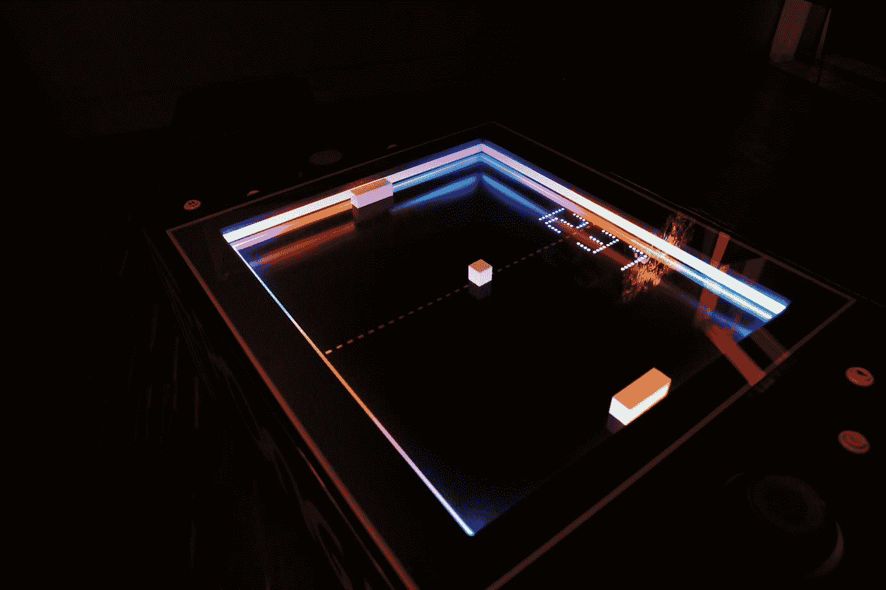

# 第一款电子游戏诞生 50 周年

> 原文：<https://medium.com/geekculture/the-first-video-game-turns-50-years-5595324def4c?source=collection_archive---------8----------------------->

## 比赛

## 两个破折号和一个点。1972 年是一个现在价值数十亿的行业的大爆炸。穿越商业上成功的视频游戏的前 17 年和一个处于萌芽阶段的新兴产业的旅程。

Photo by [Feelfarbig Magazine](https://unsplash.com/@feelfarbig?utm_source=medium&utm_medium=referral) on [Unsplash](https://unsplash.com?utm_source=medium&utm_medium=referral)