# 机器人学中的空间数学

> 原文：<https://medium.com/geekculture/the-following-article-describes-a-simple-approach-to-solving-a-common-problem-in-robotics-8276d0a6caee?source=collection_archive---------6----------------------->

Google.com

下面的文章描述了一种解决机器人学中常见问题的简单方法。通常，关节式机器人执行取放、码垛或卸垛应用的环境(机器人单元)可以在 3D 空间中通过跟随物体(见下文)及其相对于字框架的协调系统来描述— **A** (在这种情况下)。

在本文中，我将展示如何应对上述挑战，并找到解决方案。我给大家简单介绍一下特殊数学，定义常见矩阵之间的关系。

解决方案在 C++(和 Eigen 库)中给出——见我的 [GitHub](https://github.com/markusbuchholz/spatial_math_in_robotics) 。Peter Corke 使用 Python 中的[空间数学](https://github.com/petercorke/spatialmath-python)在 Python 中完成了 C++实现的可视化和验证。

考虑下面的 3D 图，我们可以看到固定到以下对象的特定坐标(框架)的五个位置。

A —与世界相关的帧(机器人单元)，
B —机器人的基础帧，
C —机器人的末端执行器，
D —摄像机位置，
E —机器人要拾取的对象。

Pick and place robot application (frames). by author

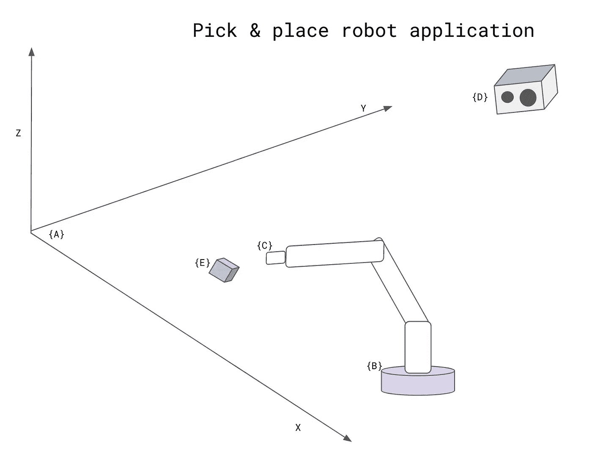

by author

{W}中对象/机器人的姿态/配置由位置(平移 **P** 因为我们参考世界坐标系)和方向([旋转](https://en.wikipedia.org/wiki/Rotation_matrix)矩阵 3x3 **R** 或[四元数](https://en.wikipedia.org/wiki/Quaternion))描述。R 和 P 都可以容纳在齐次变换矩阵 **H** 中(见下文)。

为了计算如何移动机器人手臂，以拾起物体，必须确定物体相对于机器人手的配置([变换](https://en.wikipedia.org/wiki/Transformation_matrix) **Hce** 矩阵)。

请注意，变换 **Hbc** 是利用机械手特定模型的运动学模型(此处为正向运动学)计算的。
在我们的例子中，我们认为在我们计算的时间戳中 **Hce** ，矩阵 **Hbc** 是已知的。基于矩阵 **Hce** 我们可以计算机器人目标:旋转-四元数，来自旋转矩阵 **Hce** (3x3)，以及平移 3D 空间也来自 **Hce** (1x3)。详情稍后给出。

我们需要理解框架之间的关系。框架旋转和平移**总是相对于另一个框架**给出。
分析上图，我们可以说相机旋转了:
-60[deg](x 轴)、60[deg](y 轴)和 60[deg](z 轴)，但相对于**世界坐标系 A** 并沿:2[m](x 轴)、3[m](y 轴)和 3[m](z 轴)平移。
物体 E 的框架由相机在相机框架坐标中计算。为了将 E 帧转换为 A 帧，我们应用了如下转换:

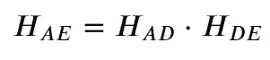

在设计机器人应用时，参考系的变化——见下图，相位将被考虑在内。

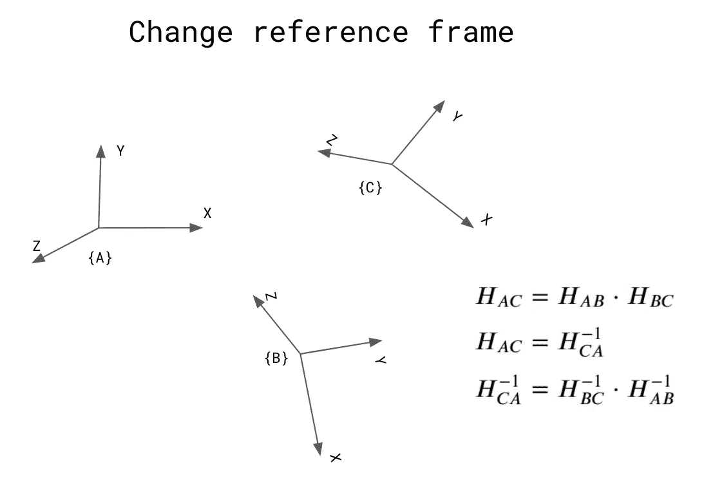

by author

# 机器人学中空间数学的理论介绍

在这一段中，我们将只着重于适用于我们情况的必要定义。
首先，我们将定义**齐次变换，**它将**旋转 R** 和**平移**的操作组合成一个矩阵乘法。

三维空间中的刚体运动或齐次变换矩阵是以下形式的所有 4 × 4 矩阵 H 的集合:

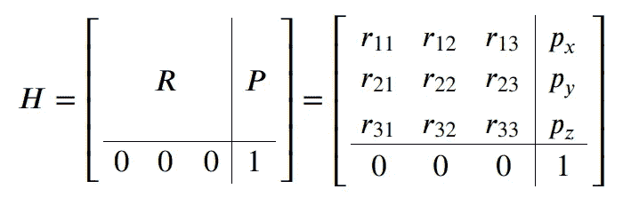

旋转矩阵 R 也可以被描述为围绕主坐标轴 z，y，x **以特定顺序连续旋转的产物(总是首先是轴 z，然后是 y，最后是 x，因此我们有“名称”:RPY。**

这些旋转定义了滚转角、俯仰角和偏航角(RPY)——[欧拉角](https://en.wikipedia.org/wiki/Euler_angles)，我们也将它们表示为φ、θ、ψ。

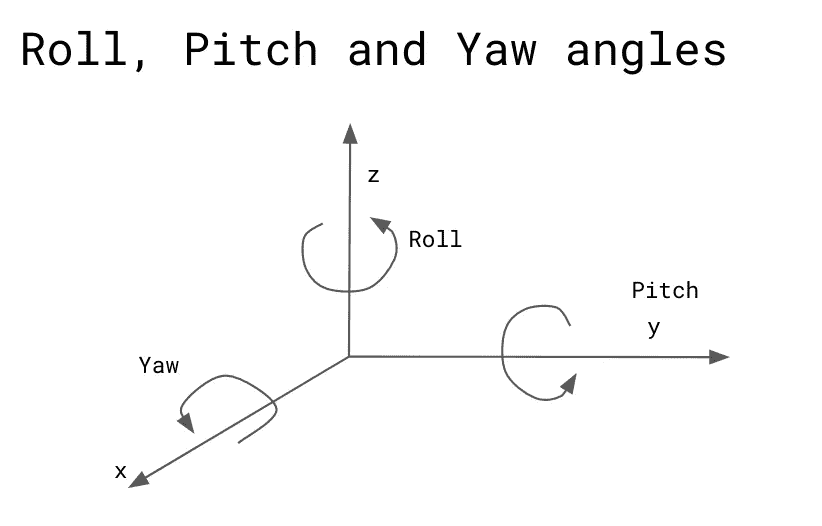

by author

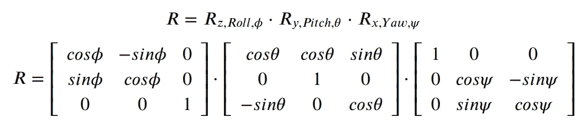

平移 P 被认为是从一个帧位置到第二个帧位置的帧的移动长度(在 3D 空间中)(在我们的情况下，我们可以说是从世界帧到机器人基础帧或者从机器人基础帧到末端效应器帧的平移，等等)。下图描述了机器人基座如何从世界坐标系平移(沿 x 轴为 2.8[m]，沿 y 轴为 0.5 [m])。沿 z 轴无移动。

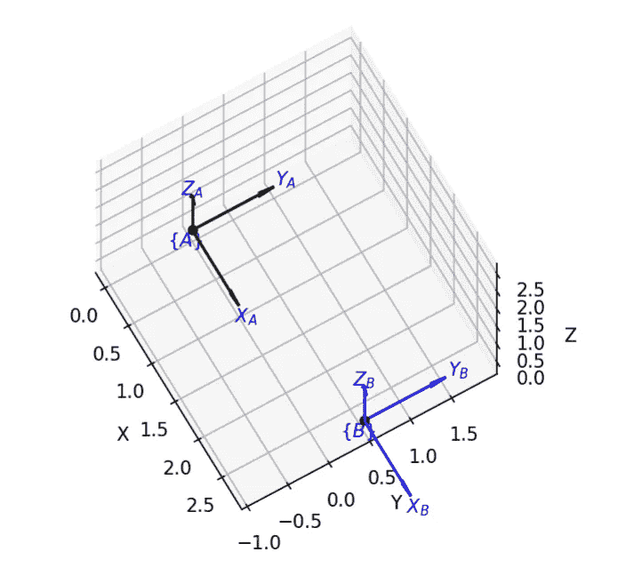

在我们的例子中，旋转可以描述如下。框架 C(机器人末端执行器相对于机器人基础框架 B 平移)旋转:45[deg](x 轴)、45[deg](y 轴)和-45[deg](z 轴)，并沿-1.8[m](x 轴)、1[m](y 轴)和 2[m](z 轴)平移。

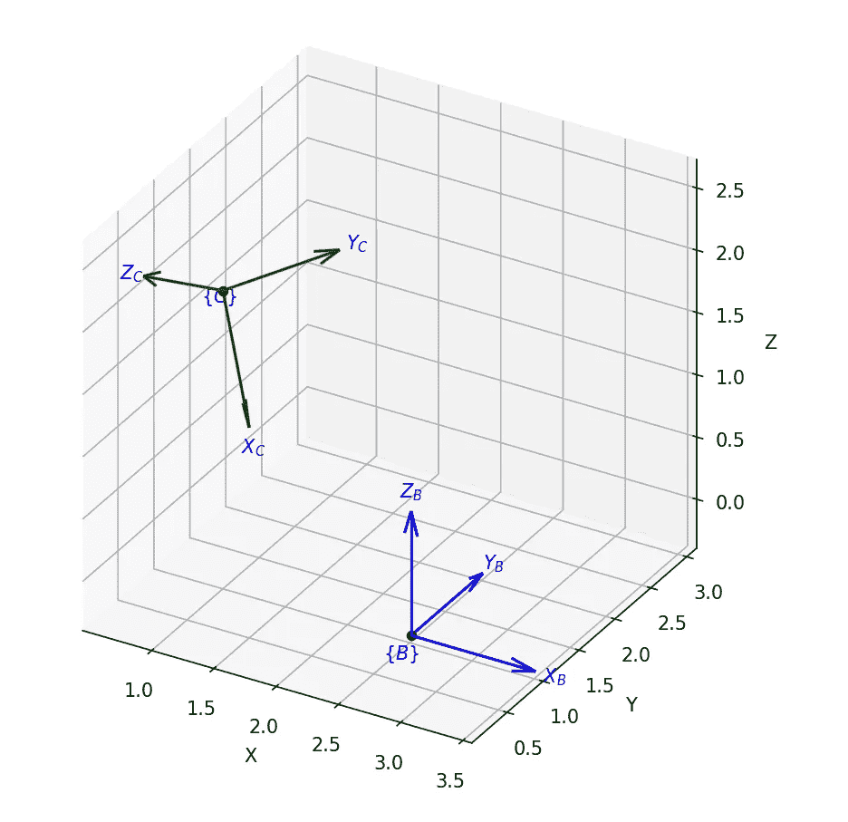

为了计算机器人末端执行器的位置，我们必须应用相应的矩阵变换，如下所示:

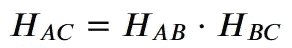

# **解决方案**

计算变换矩阵 **Hce** 的简单程序，以确定机器人的运动任务是拾取物体(帧 E)。
有了矩阵 **Hce** 我们就可以确定**机器人目标**(物体的位置和旋转——通常以四元数的形式给机器人控制器)。

基于本文开头描述的图形，我们可以导出一个矩阵方程(参见 C++中的解决方案)并求解 **Hce** 如下。

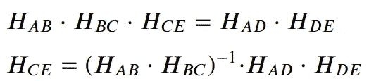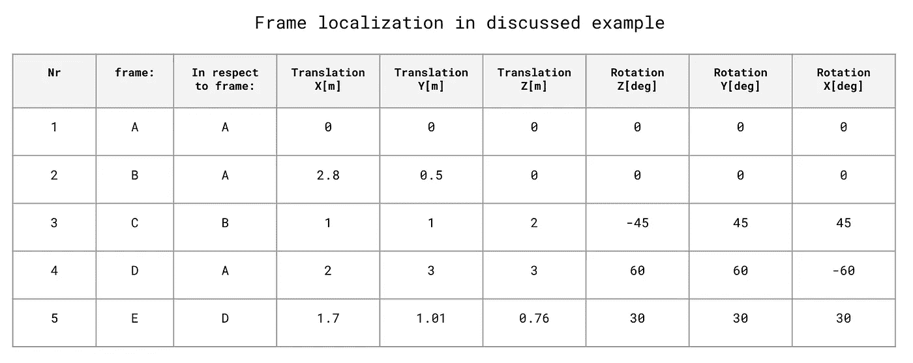

感谢您的阅读，