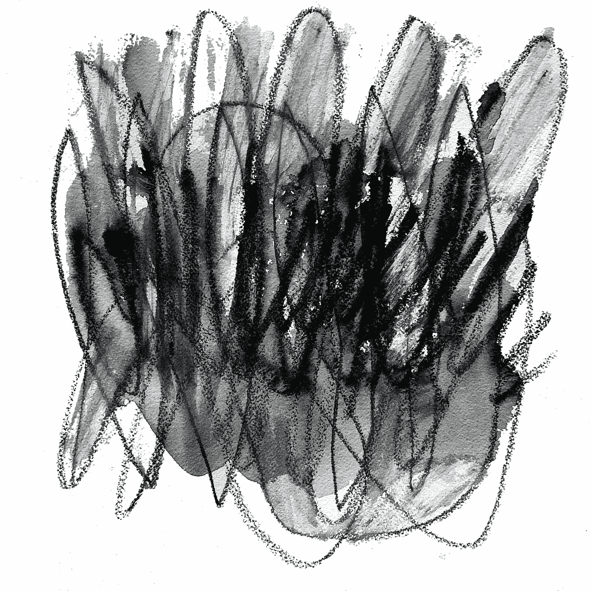

# 为改变而创造的自由思想者

> 原文：<https://medium.com/geekculture/the-free-thinker-creating-for-change-966b5109c11b?source=collection_archive---------17----------------------->

## 与梅尔·沙科特谈论非功能性测试

*“Fluctuate” by Mel Shapcott,* 2021

***“当一场运动的最前沿有独立的创造者和自由的思想者时，变革就发生了。”*——梅尔·沙科特**

我很高兴能与你分享这个博客，因为我有幸采访了一位自由战士——梅尔·沙科特。她是一名抽象艺术家，在现实世界中能看到更大的图景。