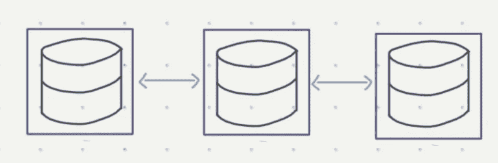
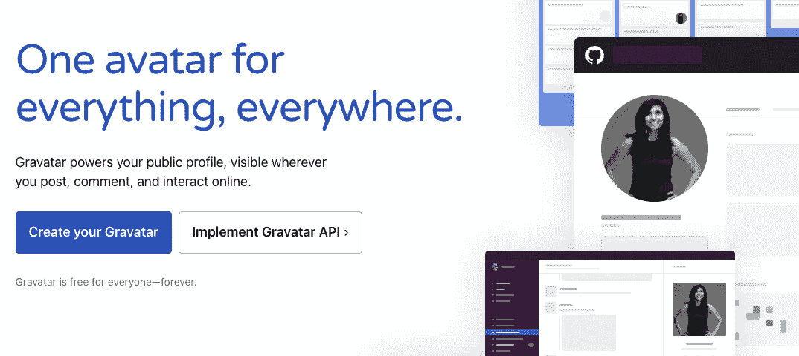
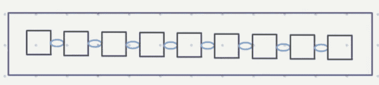
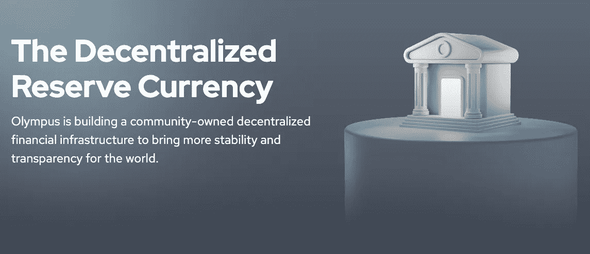
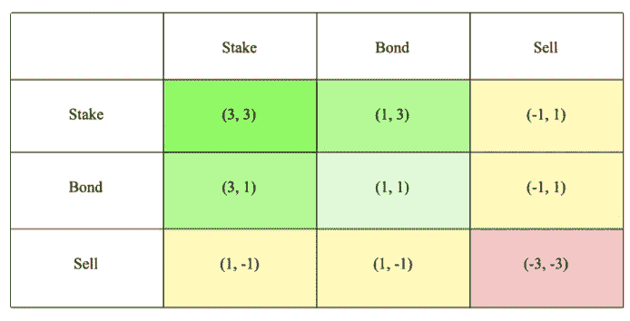
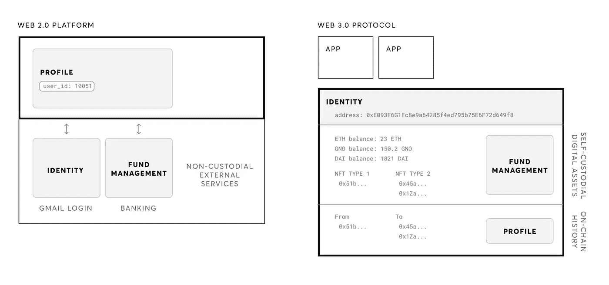

# Web3 的基本力量

> 原文：<https://medium.com/geekculture/the-fundamental-forces-of-web3-5285dfc381d2?source=collection_archive---------10----------------------->

## 未来互联网的内部运作

大家好👋,

这篇文章是我的时事通讯[未来的证明](https://midroni.substack.com/)的 2 部分 Web3 解释系列的第二部分。你可以在这里找到第一部。

第 1 部分解释了我们是如何进入当前的互联网范式(Web2)的，而本文将继续向前，解释我们如何能够克服开放网络开发中的挑战，以及这对互联网的未来意味着什么。

本文将涵盖:

-为什么新一代互联网建立在区块链
之上-为什么代币不仅仅是投机资产
-Web3 如何创建一个全新的数字身份模型
-如何开始自己的 web 3 之旅！

最后，我还介绍了一个新的框架，“Web3 的基本力量”，它解释了我们如何进入一个开放软件开发的新时代。

让我们开始吧🚀

# 第 1 部分概述

在开始之前，我们最好回顾一下我们在本系列第 1 部分中探索的内容。

*<急速吸入>*

早期的互联网最初是一个由标准化和开放的**协议**管理的网络。在这篇文章中会多次提到协议，所以有必要清楚地定义它们是什么。协议是在计算机之间传输数据以完成特定任务的定义方式。

*   当一个协议被标准化时，这意味着它是被广泛接受的、事实上的完成任务的方式，就像发送电子邮件一样
*   当一个协议是**“开放的**”时，这意味着任何人都可以使用该协议来完成任务，就像我们不需要特别的许可就可以连接到互联网一样
*   与开放协议相反的是私有协议，协议的使用权归私人利益和公司所有

我们称之为 **Web1** 的早期网络是由开放的标准化协议主导的，比如连接网站的 HTTP 或发送电子邮件的 SMTP。这些协议仍然是互联网的主干，但不再是互联网的全部。

在互联网历史的中期(21 世纪初)，在那些认为网络的未来是开放的人和建立专有解决方案的公司之间，有一场实用主义和哲学的斗争。最终，专有开发取得了胜利，这主要是因为在构建开放网络的过程中遇到了两大挑战:

*   **状态问题** : Web1 从未开发出能够存储用户及其在线活动数据的开放协议。如果不获取这些数据，即互联网的“状态”，早期的 web 应用程序就无法依赖 Web1 协议来完成各种任务(如支付、搜索等)。)
*   **开放开发的挑战:**开发和批准新的开放协议的过程异常艰难。巨大的利益相关群体需要协作和协调，这减缓了新互联网标准的进展速度

相比之下，公司通过将数据存储在集中的数据库中，轻松克服了州政府的问题，并且可以迭代产品，而不需要移动整个行业。这一优势决定了当代互联网是由公司及其专有的互联网解决方案主导的。我们称这种模式为 **Web2** 。

随着时间的推移，Web2 公司成长为有效的互联网。如今，我们的大部分在线体验都是通过少数拥有分销渠道的大型平台进行的。虽然消费者肯定受益于优秀的产品和更好的在线体验，但 Web2 的构成也存在一些关键问题:

1.  **分销依赖:**我们依赖主要平台提供互联网体验，因此容易受到利润动机和其他寻租行为的影响
2.  **锁定的价值链:**赢者通吃的网络效应集中了资源，形成了深深的护城河，阻碍了互联网大部分价值链上的公平竞争
3.  **数字孤岛:** Web2 的运行就像建立在孤立的数字孤岛上。数据和用户不能跨平台转移

*<大声呼气！>*

我表现如何？如果你觉得需要更多的深度，你可以从第一篇文章[这里](https://midroni.substack.com/p/web3-explained-part-1-of-2)得到上下文。

# Web3 的必要成分

现在我们已经定义了 Web1 和 Web2，那么传说中的 Web3 呢？我们该如何描述它呢？

幸运的是，我们不需要从理论上推测 Web3 *可能*是什么样子——创造新一代互联网的运动已经开始，而且相对来说已经有了明确的定义。

Web3 的当前模式是对 Web1 开放互联网愿景的回归。这是一种数字体验，用户和数据可以更自由地移动，这是通过在共享状态下运行的开放协议实现的。

正如你可能已经猜到的，粗体字很重要。

但即使是这种描述也充满了许多承诺。所有事情都开放协议？应用程序和用户都共享相同的数据？我们不是刚刚概述了阻止这些属性存在于开放网络中的关键缺陷吗？

你说得对。但是在过去的十年里发生了很大的变化。新的工具和平台赋予了我们在互联网上合作的能力。像区块链这样的突破性技术为开放网络的技术缺陷提供了解决方案。简而言之，我们可以通过回答以下两个问题来解释开放网络 3 的兴起:

*   我们解决了**开放状态问题了吗？**
*   **开放开发**的过程现在与专有开发有竞争力吗？

我们将回答这两个问题，并在此过程中获得非常有用的背景知识，以了解 Web3 的构建模块是如何融入图片的:区块链、令牌和软件开发的全新方法。

# 分散状态与共享状态

我们在这里定义的状态问题特别是使用开放协议管理网络数据的**挑战。**当计算机成功地协同工作来管理这些数据时，它们就有了一个*共享的网络状态*——网络上的每个人都可以访问的数据集。

相比之下，Web2 具有我们可能称之为**的碎片化状态**。没有网络整体的快照。取而代之的是，Web2 的互联网视图被划分到不同的公司数据库中。

Company databases are siloed (purple), and can only communicate through proprietary APIs (blue)

假设今天我们想要创建一个新的标准协议来管理 Web2 的状态。我们最大的挑战是，需要说服每一个拥有互联网份额的人采用我们的协议。但是拥有互联网最大份额的公司却最没有动力这么做。他们最好保持他们的数据优势，并在其私有数据库的基础上构建解决方案(问题#3，数字孤岛)。

这里一个很好的例子就是 [Gravatar](https://en.gravatar.com/) 。Gravatar 是一个开放的 API，网站所有者可以使用它来建立用户身份。这里的价值是，用户只需创建一个 Gravatar 配置文件，就可以在许多网站上拥有兼容的帐户。

尽管 Gravatar 已经运行了 15 年，但它还没有实现共享在线身份的愿景。作为用户，我们最终仍然有几十个帐户和密码需要单独管理。考虑到几乎每个网站都需要一个账户，但是几乎每个应用都有自己的解决方案。事实上，我们最接近通用账户的体验是通过谷歌或脸书登录(问题 1，发行依赖)。

展望未来，我们希望互联网能够支持大规模并发的多用户体验，就像 Ready Player One 中的共享虚拟现实空间一样。除了一个支离破碎的网络状态，我们根本不可能实现更大的复杂性。

# 打开状态的解决方案

为了好玩，让我们想象一下相反的情况:一个包含网络状态的大型数据库，上面的每个应用程序都有读/写权限。为了避免泛泛而谈，这个特定的数据库将通过跟踪用户资金来管理支付。

Different snapshots of the network state are viewed as a single entity (purple), communicating through open protocols (blue).

为了实现这一点，我们将为用户账户的借贷定义一个开放的协议。无论使用哪种应用程序，每当用户转移资金时，交易都需要反映在共享状态中。马上，我们可以看到以这种方式管理数据有许多有趣的含义。

1.  任何使用这个数据库**的应用程序都必须遵守支付协议**。否则，他们会因不恰当地管理状态而面临将用户与其资金分离的风险。换句话说，**开放状态激励遵守开放协议**
2.  开放协议以开源代码的形式存在于世界上。这意味着任何人都可以简单地通过复制或“分叉”代码并添加有用的新功能，为资金管理制定一个更好的*协议。如果成功，一个更好的支付网络将很容易在一夜之间崛起，**意味着网络本身变得更加灵活***
3.  现在所有的应用程序都遵循相同的理财规则，用户可以更容易地在使用数据库的任何应用程序之间移动。所以我们也看到**开放状态降低了用户的转换成本**

这似乎是一个令人兴奋的新数字景观，除了一件事:现实生活网络有**坏演员**。不能保证每个人都会遵守规则。尤其是在金钱网络中，如果每个人都有读/写权限，任何人都可以为了个人利益篡改数据。而当处于共享状态的数据不可信时，上面的网络就一文不值了。

这个问题不是一个技术挑战，而是一个博弈论问题。我们能否创造一个系统，激励所有参与者遵守规则？为此，我们希望我们的系统有一些属性:

1.  **透明性:**任何人都可以在任何时候审计数据库
2.  **一致:**网络的所有成员必须就其当前状态达成一致
3.  经济激励:遵守规则比违反规则收获更多

第一个成功结合这三种属性的网络是比特币。区块链满足了透明和共识驱动的数据库的需求。工作证明给网络参与附加了一个成本——为了获得一致投票，你需要做一些昂贵的事情，比如设置一个比特币节点。

然而，更重要的是防止参与者行为不端的激励措施。在比特币中，坏演员只有在克服共识的情况下才能操纵国家，而要做到这一点，他们需要拥有网络中的大多数计算机。这是非常昂贵的，尤其是当你可以玩得很好，并收到比特币作为奖励。

事实证明，我们只能通过**向网络注入经济激励**来*保持开放状态*。乍一看，比特币和以太网之类的代币只是区块链之上的又一层投机。但事实是，**令牌是一种在网络**内转移价值的机制，并满足维持开放状态所需的经济要求。

# 数字集体主义的工具

自从发现令牌是开放状态的关键，我们一直在开发令人兴奋的新方法来编码具有激励的网络。每一个新的机制，就像以太坊的利害关系证明，都增加了我们构建新的开放网络的工具包。这就是为什么今天我们的网络能做的远不止管理支付。

这也是为什么没有理解令牌就没有理解 Web3。在基本层面上，代币为网络参与者建立了选择集体利益而非个人利益的激励。它不仅仅是防止不良行为。这实际上是鼓励利益相关者参与到网络的最佳可能行为中。

此时此刻，最好的例子就是[奥林巴斯道](https://www.olympusdao.finance/)的欧姆令牌。OlympusDAO 推广了一个理念，即如果所有代币持有者都为集体利益而行动，那么代币持有者群体将获得最高的财务回报。

下表是 OHM 的[支付矩阵](https://www.math.uci.edu/~mathcircle/materials/2014.06.03MSMC.pdf)——这是一个可视化工具，用于表达玩家在游戏中的选择的博弈论结果。用符号表示，玩家 1 和玩家 2 的选择由(#，#)表示，其中' # '是玩家的选择给予系统的收益量。

如果欧姆持有者决定将他们的代币作为赌注，这通过从市场(+1)购买欧姆、锁定供应(+1)以及为协议(+1)提供流动性来提供系统范围的好处。当两个玩家这样做时，(3，3)，他们净得系统 3 + 3 = 6“利益点”。

OlympusDAO 是第一个直接推广集体行为优点的社区之一，因此,( 3，3) meme 像野火一样在 Web3 Twitter 上蔓延开来。(3，3)这个术语出现在许多 Twitter 的手柄上，传播着个人与集体的团结。

我有没有提到他们互相称呼对方为“哦”吗？

如果没有为集体主义创造明确激励的代币，让合作的想法成为迷因并具有传染性，这一切都是不可能的。

# 社区获取的价值

根据设计，当利益相关者一起工作时，网络能够更快地积累价值。但是代币不仅仅定义了激励结构，它们还引入了一种全新的方式，将用户纳入数字网络获取的价值中。

当网络处于其生命周期的早期，它们的价值主张和效用相对不明确。一个网络可能有一个强有力的叙事，但如果没有社区的支持，就无法实现它的承诺。这可能就是为什么许多加密网络在采用率低的时候就被淘汰了。

至关重要的是，这种现象不是 Web3 独有的，实际上是所有基于网络效应的商业所共有的**，比如社交媒体网站和在线市场。AirBnB 和优步都被嘲笑，直到它们的市场成熟，社区接受了进入陌生人的家和车的概念。**

一个关键的区别是，Web3 网络使用令牌来暗示用户网络的成功。这实现了一个良性循环，因为在某种意义上，所有令牌持有者都是付费的影响者。当 Twitter 用户互相“兜售”他们最喜欢的加密货币或在回复中参与部落话语时，我们可以清楚地看到这一点。虽然这种品质会给任何产品带来庞氏骗局般的余味，但它在增加网络成功的几率方面却不合理地有效。我想起了我们最近的文章[中的一句话](https://midroni.substack.com/p/tokenize-everything):

*“以太坊通过让其核心开发人员致富播下了成功的种子，因为他们现在可以全职工作来增加以太坊网络的价值”*

比特币的良性循环仅仅是一个社会飞轮，而以太坊的良性循环**给予其顶级贡献者财务自由**，激励有才华的个人构建网络。开发者**只能通过增加整个网络的价值**来增加自己位置的价值。在 Web2 产品中，一个薄弱的例子是客户推荐计划。只有让参与类似于所有权，一个网络才能展现这个飞轮的全部力量。到目前为止，我们只能使用令牌来做到这一点。

将代币的影响概念化的一个有趣的框架是使用臭名昭著的 CAC 指标(客户获取成本)。CAC 实际上是一个企业为了吸引新用户而支付的费用。所有企业的目标都是从用户身上赚更多的钱，而不是把他们带到平台上的成本。

在传统产品中，企业通过广告或提供折扣为客户付费。在 Web3 产品中，令牌创造了自我延续病毒式传播的飞轮。实际上，**令牌网络效应给了企业“负 CAC”**——这是一个有趣的概念，意在暗示现有用户正在将新用户带到平台上，而企业没有任何成本。但受益的不仅仅是企业。在[社区经济学](https://midroni.substack.com/p/community-economics)中，我们探讨了 NFT 如何通过让社区与充满活力的数字生态系统兼容，从而为社区注入网络效应。

此时你可能会问自己:*“所有这些象征性的东西看起来很酷，但是它是如何……你知道……工作的？”*

我听到了。很难想象令牌是如何融入互联网的，因为 Web2 并没有真正提供一种“拥有”令牌之类东西的方式。分裂国家的后果是几乎不可能追踪身份，因此所有权成为不可行的理想。这是 Web3 带来深刻变化的另一个领域。

# 新的数字身份

正如我们每天所经历的，Web2 公司将我们的身份定义为依赖于应用程序和平台。这看起来像是为你使用的每项服务获取一个新的“身份”或帐户。相比之下，Web3 拥有我们称之为**的聚焦于身份的网络模型**。应用程序围绕一个普遍认可的帐户概念来定义它们的服务。

Web2 apps encompass identities as features. Web3 apps sit on top of and depend on identities. src: [Inventories, Not Identities](https://blog.gnosis.pm/inventories-not-identities-7da9a4ec5a3e).

既然任何应用程序都可以识别身份，那么跟踪您拥有东西就容易多了。事实上，Web3 中的所有权就像是背着一个装满物品的背包在互联网上穿行。你的照片、文章和订阅可以随着你从一个平台移动到另一个平台。这是通过保存您的数字财产的加密安全钱包来实现的。从技术角度来看，为您的身份添加新功能就像创造新的方式来“拥有”数字事物一样简单。换句话说，添加新的协议。

这与 Web2 的价值锁定模式形成了鲜明对比:在这种模式下，你不能使用 Instagram 登录将照片加载到 Pinterest 上，也不能将你从 Google Play 商店购买的应用程序迁移到 iPhone 上。

# 自我主权身份

身份不仅是 Web3 的图示中心，也是一个哲学中心。Web3 的运作原则是，用户应该在没有任何中介的情况下控制其在线角色的所有方面。这体现在[自我主权身份](https://en.wikipedia.org/wiki/Self-sovereign_identity#:~:text=Self%2Dsovereign%20identity%20(SSI),control%20of%20their%20digital%20identities.&text=It%20is%20generally%20recognized%20that,required%20to%20use%20those%20credentials.)的理念中。实现自我主权身份需要在两个主要方面改变网络:**信任**和**所有权**。

我们已经理解了代币和基于钱包的身份如何实现自我主权所有权的原则，因此有必要解释一下 Web3 如何消除对中介的需求。

Web3 系统的目标是**不可信**。你应该能够参与一个 Web3 交易，而不需要把“信任”带到桌面上。现代法律体系是现实世界中不信任体系的一个例子。当你和一个商业伙伴都在虚线上签字时，你们对法律的共同信任创造了你们之间信任的抽象概念。

Web3 通过代码和加密实现了同样的效果。这是一个在线网络，在这里你可以与任何一方进行互动，因为你信任定义你互动的程序。与法律不同的是，法典不能随意解释。

在理解了开放状态、令牌和这个新的身份模型之后，我们对 Web3 有了相当全面的理解。对我来说，我最喜欢的一个定义最好地抓住了这些想法，这个定义来自(你猜对了)克里斯·迪克森。Chris 将 Web3 定义为:

> “一个由用户和建设者拥有的互联网，由代币来编排”。

我觉得这总结得很好，你觉得呢？

# Web3 的基本力量

到目前为止，我们已经讨论了作为新互联网基础的想法，但请记住，我们对 Web3 的兴趣有一定的渴望。我们想知道 Web3 能否解决我们从 Web2 继承的问题(**分销依赖**、**锁定价值链**、**数字孤岛**)。

随着新互联网的出现，新的力量主宰着价值和控制权的消长。Web3 基于全新的规则运行，这些规则是塑造所有用户和构建者体验的基本力量:这些力量是:

1.  **隐性分配定律**
2.  **流动性原理**
3.  **即插即用，增强动力**

# 隐性分配定律

在 Web3 中，没有一个应用程序有固定的用户基础。用户通过他们的加密钱包与互联网进行交互，钱包组由网络本身维护。从某种意义上说，所有的应用程序和用户都处于一个公平的竞争环境中。任何以太坊地址都可以被任何以太坊应用程序访问，反之亦然。这就是隐性分布的**定律。**

这为企业解决用户问题创造了巨大的经济激励。公司不必努力建立分销网络——事实上，Web3 中的分销问题几乎完全归结于市场营销的努力。用户需要*了解*项目，然后才能尝试。这解释了为什么具有高“模因价值”的产品具有天然优势。成功的项目通过做一些文化上引人注目或功能上有意义的事情来利用病毒式传播。一旦足够多的用户验证了一个项目，飞轮就开始旋转。

# 流动性原则

Web3 用户可以通过提前参与一个伟大的项目而获益良多。获得信息优势会带来有意义的，甚至是改变人生的奖励。这为用户尝试新产品和网络创造了巨大的激励，他们可以通过简单地交换一些令牌(例如比特币→以太坊)来实现这一点。

隐式分发允许用户在项目一上线就将价值转移到任何项目中。将这一点与实验的激励结合起来，价值转移的**速度就会达到超音速**。

这就是**流动性原理**。对用户来说，尝试新事物从未如此容易，也从未如此激励他们去尝试。这一原则的结果是，企业可以以破纪录的速度获得大部分潜在市场。有很多这样的例子:

*   2021 年 8 月至 2021 年 11 月 1 日期间，奥林巴斯道的国库价值从 500 万美元增至 6 . 38 亿美元
*   Axie Infinity 的峰值日用户从 2020 年 10 月的 5500 人增加到 2021 年 10 月的 200 万人

# 即插即用，改善动态

流动性原理的一个版本也出现在产品开发中。因为 Web3 运行在开放和标准化的代码上，所以应用程序大量由开放源代码组成。社区可以免费复制和使用这些代码，这转化成了绝对**可笑的产品速度**。

这就是为什么每周似乎都有一个热门的新产品或趋势席卷 Crypto Twitter。**因为有**。

我最喜欢把 Web3 生态系统比作它的行为就像一个进化培养皿。每一个产品和用例都会产生后代，每一个都是前一个产品和用例的基因混合，再加上来自社区的疯狂的新想法。时不时地，一种新的组合会与生态系统产生共鸣，并成为进一步创新的新原型。

你会经常听说 Web3 软件的行为就像“乐高积木”。因为代码是可访问的、开放的和标准化的，所以代码可以无摩擦地互操作和协同工作。正因如此，Web3 才是终极的，**即插即用，改善生态系统。**

价值链的大部分暴露在社区的注视之下。任何熟练的开发人员都可以识别出链条中的弱点，分叉代码，并为**整个网络**提供更好的解决方案。

尽管 Web2 平台看起来像一个单一所有者的平台，Web3 价值链看起来更像一个河流三角洲；由社区创建和拥有的分支代码层。

# 最后的想法

事实上，还有很多话要说。本系列可能值得在第 3 部分中更深入地探讨其他主题，分析案例研究，并对未来进行更深入的思考。

有很多问题值得一起探讨，比如:

*   我们应该如何看待使用代币导致的投机性、泡沫式行为？我们应该担心我们这个世界的过度金融化吗？
*   继 Web3 之后，下一代互联网会再次变得集中化吗？还是我们创造了一个不受集权影响的互联网？
*   与我们面临的其他问题相比，比如气候变化和日益加剧的社会不平等，为什么 Web3 如此重要？Web3 和这些问题有什么交集？

这些问题中的每一个都值得单独写一篇文章。

如果你现在正在读这篇文章，我为你的好奇心和对学习的奉献精神喝彩。Web3 可能令人望而生畏。这是我遇到的发展最快的技术领域。我希望本系列为您提供了有用的框架，并启发您更深入地研究。如果你觉得你只是触及了表面…加入俱乐部。但不管怎样，在每一首曲子的结尾，我都会有同样的感觉。

生活在一个多么美丽和激动人心的世界。

# 如何开始使用 Web3

1.  为了进一步阅读，你可以看看我策划的 [Web3 阅读清单](https://tinyurl.com/web3repo)。
2.  通过使用 crypto-on boarding platform[rabbit hole](https://rabbithole.gg/)来了解 Web3
3.  在 Twitter 上关注思想领袖。我最喜欢的如下:安妮卡·刘易斯(@annikasays)、克里斯·迪克逊(@cdixon)、大卫·菲尔普斯(@divine_economy)、加布·戈德堡(@gaby_goldberg)、马里奥·加布里埃尔(@mariogabriele)、娜塔莎·切(@realnatashache)、尼克·德维尔德(@nick_dewilde)、帕奇·麦考密克(@packym)、6529(@ punk 6529)——可能还有其他我正在遗忘的人！
4.  如果您有任何问题或需要进一步澄清的领域，您可以回复我的简讯或在 Twitter 上给我发 DM。我看到每条信息。

如果您喜欢这篇文章，请考虑 [***订阅***](https://midroni.substack.com/) 每周内容，了解将塑造我们未来的技术！

带着感激，✌️

库珀

## 库珀的顶级文章:

*   [开源培养](https://midroni.substack.com/p/open-source-culture)
*   [将一切符号化](https://midroni.substack.com/p/tokenize-everything)
*   [社区经济学](https://midroni.substack.com/p/community-economics)