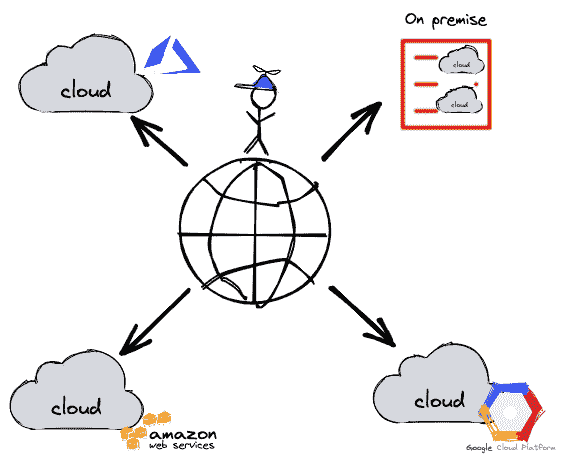
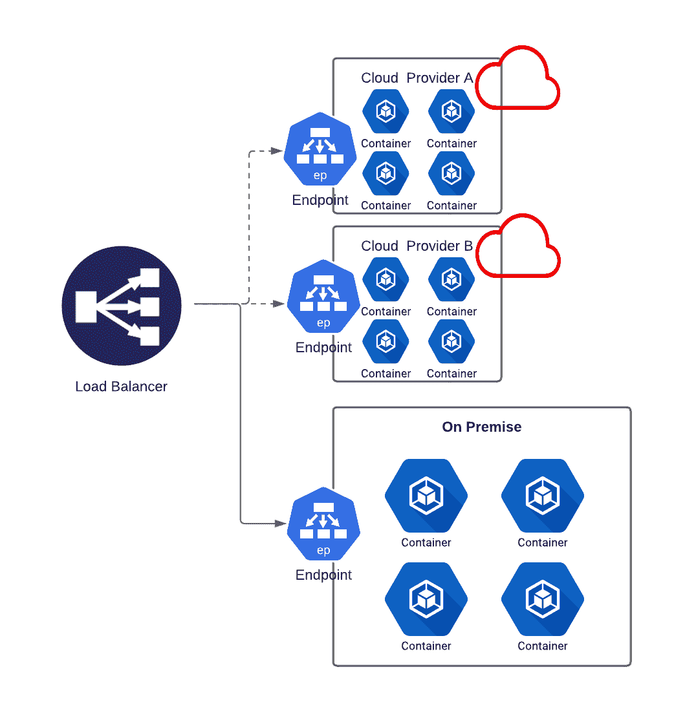
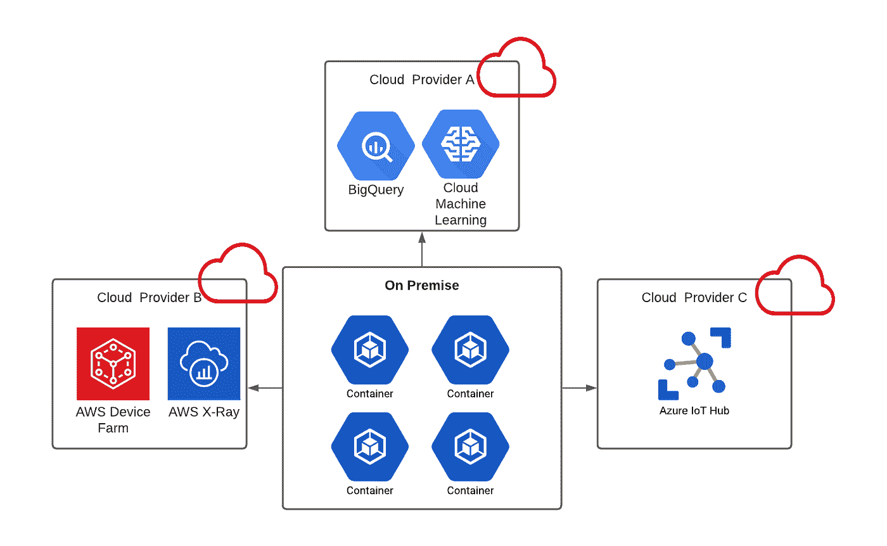
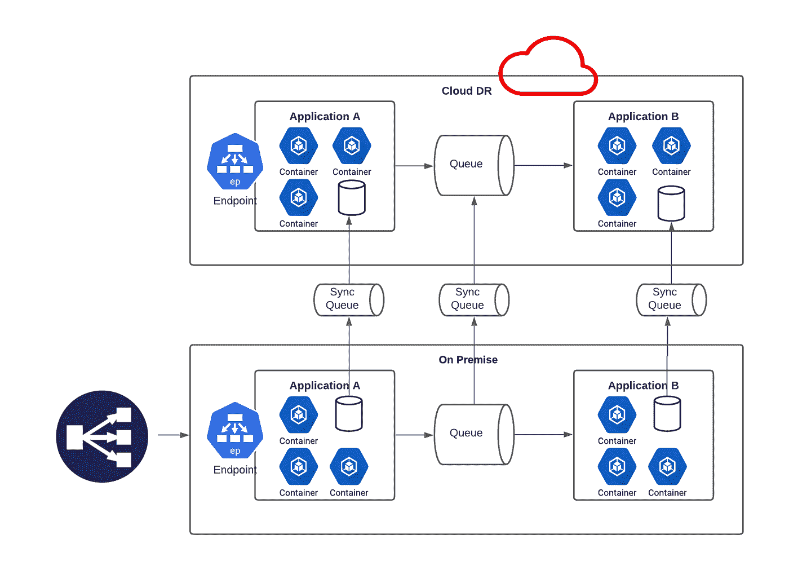
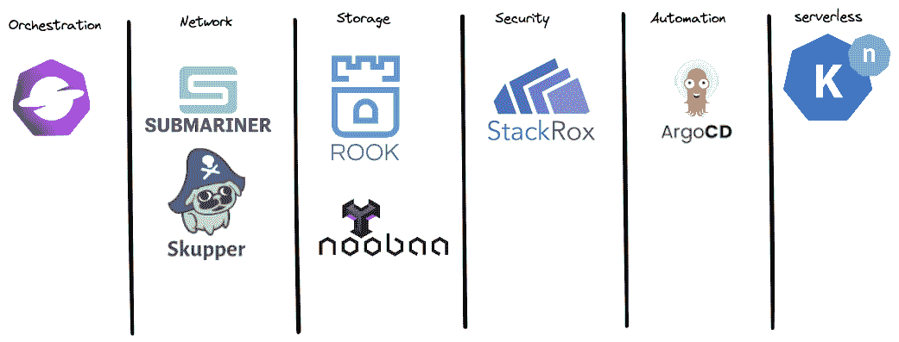

# 未来是混合的

> 原文：<https://medium.com/geekculture/the-future-is-hybrid-e3fae4295eff?source=collection_archive---------2----------------------->

从数据中心到公共云的旅程始于十多年前，允许小型初创公司和中型企业(SME)以相对较低的成本快速扩展。

云市场的整体前景似乎非常乐观。2021 年，整体云市场份额为【494.7 亿美元。预计到 2026 年将翻一番，达到 9473 亿美元，

据 Gartner 称，到 2025 年，80%的企业将尝试将其计算转移到云。此外，Gartner 预测混合云市场到 2026 年将增长两倍。混合云在 2020 年的价值为 521.6 亿美元，预计到 2026 年将达到 1450 亿美元。

根据[大观研究](https://www.prnewswire.com/news-releases/cloud-computing-market-size-worth-1-554-94-billion-by-2030-grand-view-research-inc-301489396.html)的建议，由于云和工业化服务的增长以及传统数据中心外包(DCO)的减少，混合云市场预计将成为增长最快的细分市场。

在本文中，我将尝试解释什么是混合云。

为什么增长这么快？以及为什么我认为云的未来是混合的。

# 什么是混合云？

> 混合云设置将公共云与私有云或内部基础架构相结合。内部基础设施可以是内部数据中心，也可以是在企业网络中运行的任何其他 IT 基础设施。

换句话说，它允许公司使用云来扩展现有的基础设施。

下图展示了云是如何发展的。

最初，云是作为扩展或外包企业自有数据中心的解决方案提供的。因此，主要供应商引入了更多技术来改善云基础设施。

公共云已经发生了巨大的变化，以相对较低的成本提供了高度安全和更好的性能。对于无力建设自己的数据中心的小公司来说，这是一个非常有吸引力的提议。但对大公司来说仍然不够优惠。这些公司更愿意投资私有云，在其数据中心运行云技术。

这就引出了我们今天的观点，组织有许多选择。

# 混合云常见使用案例

**云爆炸——处理预期和意外的负载。**

想象一个举办奥运会的国家。在有限的时间内，电信服务提供商可能会有巨大的预期负载。十年前，电信公司必须购买额外的硬件来满足这些峰值负载，但奥运会后，将不再需要这些额外的硬件。通过应用**云爆发配置，**服务提供商可以简单地通过在公共云上增加额外负载并将负载分布到其他地方来克服过载。

当达到请求负载时，可以自动触发起转过程，或者手动安排一段有限的时间。

参见[此链接](https://www.youtube.com/watch?v=ZdRsIe-pdkQ)了解使用开源工具的多云爆发演示。

**云特定服务** — **用于补充服务的云提供商**

云提供的特定服务也是常见的用例。很好的例子可以是图像识别(例如[谷歌云视觉](https://cloud.google.com/vision/docs/#docs))、语音转文本(例如[亚马逊转录](https://docs.aws.amazon.com/transcribe/latest/dg/what-is.html))、 [Azure 机器学习](https://azure.microsoft.com/en-us/services/machine-learning/#product-overview)、分析处理等等。

例如，机器学习需要专用硬件，如特殊的 GPU 芯片，以获得更好的性能。通常，这种硬件是昂贵的，并且不总是需要恒定的资源量。使用“独特的服务”模式，在有限的时间内，常规工作负载在本地，ML 培训或分析在公共云上运行，可以大幅降低成本。

**灾难恢复(DR) —随时准备应对意外的系统故障**

灾难恢复站点需要至少一个远程(不同地理位置)数据中心，以及额外的硬件、IT 管理员和安全性。

此模式包括主动-主动设计，具有主要的“本地”站点和“同步”云灾难恢复，或者应用主动-被动云灾难恢复，其中持久组件频繁更新和备份。只有在发生灾难时，被动灾难恢复才完全可用。

建立云灾难恢复站点以防故障转移具有相当大的好处。

**多地理位置**就云设置而言，灾难恢复站点是一项简单的任务。此外，大多数云提供商正在大量投资存储和备份技术，以高效管理海量数据存储；因此，他们可以提供各种可靠的冷备份或热备份解决方案。

维护云灾难恢复站点的总体成本大幅降低。

但是，保持云灾难恢复站点同步是一项复杂的工作，需要进行分析和规划。

您可以在此处 阅读 [**更多关于使用 OpenShift 实现混合灾难恢复的信息。**](https://cloud.redhat.com/blog/a-guide-to-high-availability/disaster-recovery-for-applications-on-openshift)

对于更多的模式，我推荐阅读 Gregor Hope 的博客:[混合云:给大象切片](https://architectelevator.com/cloud/hybrid-cloud/)

# 混合云挑战

混合云仍处于早期阶段，在完全采用之前需要克服一些关键问题。我列举了我最近处理的一些问题。

**便携式应用**

过渡到混合云需要对现有软件架构进行深入审查，并应用合适的模式。在我遇到的大多数情况下，现有的应用程序不适合混合云。一些例子可能是:

*   旧的 monolith 应用程序在虚拟机上运行良好。然而，它依赖于特定的操作系统功能或网络资源，这些功能或资源在迁移到公共云时会以不同方式使用或不可用。一个可能的解决方案是在一个容器化的虚拟机上运行这个应用程序，比如 [kubevirt](https://kubevirt.io/)
*   能够访问特定云提供商提供的服务或 API 的工作负载。当迁移到混合云时，无论容器位于何处，这些云服务都应该是可访问的。
*   具有“支持”配置的容器映像需要特定的基础架构(严格来说，仅在 x86 处理器体系结构等上)。)
*   状态工作负载，其中状态存储在受限访问存储解决方案中
*   在一种硬件架构上构建的容器可能不适合其他硬件架构；因此，它们将无法运行。

**管理多个基础设施**

混合云架构需要掌握不同的基础设施、操作系统、虚拟化和容器。例如，一个组织可能拥有 Linux 服务器、Windows 服务器、VMware、云工作负载和自我管理的流程编排工具。确保在所有服务器类型上应用安全补丁会导致复杂的 IT 流程和管理，从而导致更高的成本。

**跨云网络**

建立安全快速的跨云网络是另一个挑战。理想情况下，一个云上的服务应该能够轻松地与另一个服务通信。

**分布式工作负载**

管理分布式工作负载将需要**强大的编排工具**。类似于 Kubernetes，但适用于混合工作负载。这个编排工具应该能够确保所有云的**安全策略和权限**。**使用规则引擎和 **CI/CD 管道**部署**工作负载。从不同的集群收集统计数据，用于**监控和警报。**建立**网络**跨云连接

所有大公司都明白，一站式业务流程工具是引领云市场的重要组成部分。谷歌正在开发 Anthos。AWS 有[前哨](https://aws.amazon.com/outposts/)、[天蓝色弧](https://azure.microsoft.com/en-us/services/azure-arc/#product-overview)。Red Hat 提供了一种基于 Kubernetes 的方法，提供[高级集群管理](https://www.redhat.com/en/technologies/management/advanced-cluster-management)或开源版本[开放集群管理](https://open-cluster-management.io/)。

尽管这些平台的产品略有不同，但它们都试图解决混合云流程编排问题。

# **混合云开源项目**

在列举了混合云的挑战之后，我意识到如果我不提出几个我所熟悉的新兴开源项目来克服这些挑战并帮助构建一个可靠的开放混合云是不合适的。

请注意，所有这些开源项目都是 Kubernetes 的附加组件。多年来，Kubernetes 已被所有公共云广泛使用和提供，使其成为运行混合云工作负载的可靠、通用平台。

**编排**

*   [开放式集群管理](https://open-cluster-management.io/) —云供应商中立平台，用于跨多个 Kubernetes 集群部署工作负载。开放式集群管理为透明地放置工作负载提供了灵活而丰富的规则引擎。开放式集群管理(OCM)架构使用集线器代理模型。集线器集中控制所有被管理的集群。名为 klusterlet 的代理驻留在每个被管理的集群上，以管理向中心的注册，并从中心运行指令。

**网络**

*   [Skupper](https://skupper.io/) —建立第 7 层服务互联的多云端 Kubernetes 集群插件。支持 Kubernetes 集群之间的安全通信。
*   [Submariner](https://submariner.io/getting-started/) —混合/多云 Kubernetes 插件，使用 pod 和服务之间建立跨集群 L4 连接

**安全**

*   [Stackrox](https://github.com/stackrox/stackrox) —该项目不仅面向混合云。然而，它非常有用，尤其是在多个环境中运行工作负载时。StackRox Kubernetes 安全平台对容器环境进行风险分析，提供可见性和运行时警报，并提供建议，通过强化环境来主动提高安全性。

**自动化**

*   [Argocd](https://argo-cd.readthedocs.io/en/stable/) — Argo CD 是一个用于 Kubernetes 的声明式 GitOps 连续交付工具。混合云部署可以通过[结合](https://youtu.be/L-3XF4wTIRA?t=501)和 [OCM](https://github.com/open-cluster-management-io/multicloud-integrations) 来实现

**存储**

*   [NooBaa](https://www.noobaa.io/) —混合云存储解决方案— NooBaa 通过从私有或公共云中连接到任何存储孤岛，并使用相同的 S3 API 和管理工具提供单一可扩展的数据服务，从而简化了数据管理。NooBaa 允许对数据放置进行完全控制，允许您在应用程序的粒度中基于安全性、策略和成本考虑来放置数据。
*   Rook — Rook 是一个云原生存储协调器，它将 Noobaa 等存储软件转变为自我管理、自我扩展和自我修复的存储服务。它自动执行部署、引导、配置、供应、扩展、升级、迁移、灾难恢复、监控和资源管理。Rook 使用底层云原生容器管理、调度和编排平台提供的设施来履行其职责。

**其他**

[Knative](https://knative.dev/docs/) —提供企业级无服务器平台，在混合云环境和多云环境中实现可移植性和一致性。Knative 为 Kubernetes 上的云原生应用程序提供了零扩展、自动扩展、集群内构建和事件框架等功能。无论是在本地、云中还是在第三方数据中心，Knative 都编纂了成功的基于 Kubernetes 的框架所共享的最佳实践。

# 混合动力是现实。

列出了上面的问题后，我认为混合云是云市场的下一次发展，因为这是市场的需要。

很大一部分企业已经在使用不止一个云。此外，企业正在寻求敏捷性，不会接受供应商锁定。因此，混合或多云解决方案成为运营的核心关注点。

此外，边缘计算工作负载也开始受到关注。对混合云、多云和边缘的需求为利益相关者(如云提供商、软件供应商和开源社区)提供合适的解决方案创造了强大的动力。

其次，在现实中，许多公司不能仅仅迁移到公共云。

> “没有哪位首席信息官会在某天早上醒来发现自己所有的工作负载都在云中。混合云已经成为现实。”

多年来，许多企业在数据中心上投入了大量资金，不能就这样放弃硬件，转向云。

此外，由于现有法规阻止将敏感数据移动到公共云，特别是在军事、金融和保险行业。

这些公司正在寻找混合云解决方案，以充分利用私有云和公共云。

康威定律提出，“任何设计系统(广义定义)的组织都会产生一种设计，其结构是该组织沟通结构的复制。”

当我在混合云未来采用的背景下思考康威定律时，它的相关性令人震惊。

自疫情以来，尤其是科技行业，已经完全采用了混合工作模式。

在任何一天，团队成员都可以选择在办公室或远程位置执行任务。跟踪康威，

难道我们不应该期待混合工作在未来混合云系统中的反映吗？