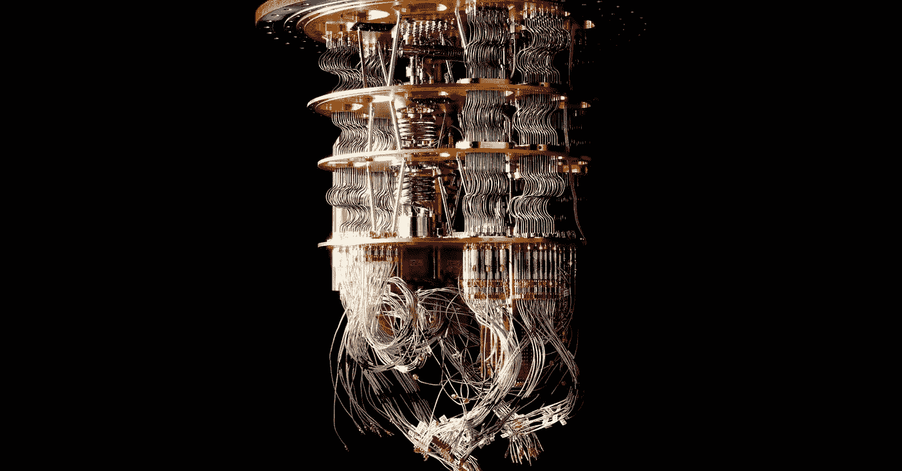
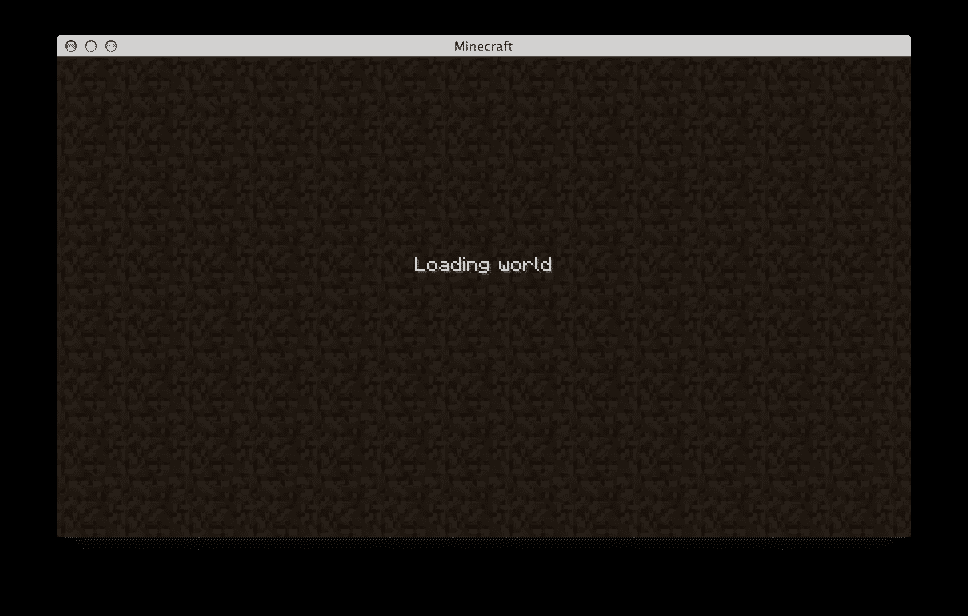
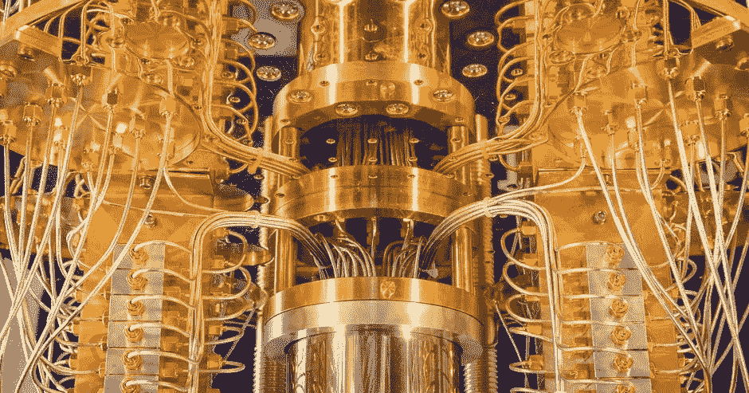
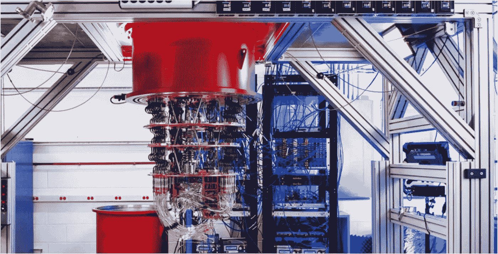
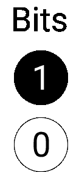
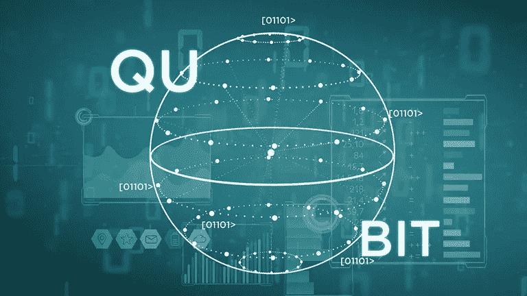
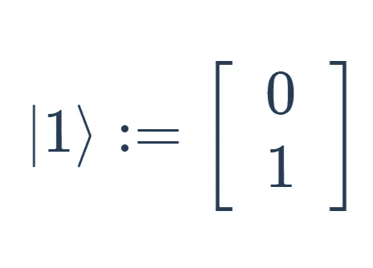
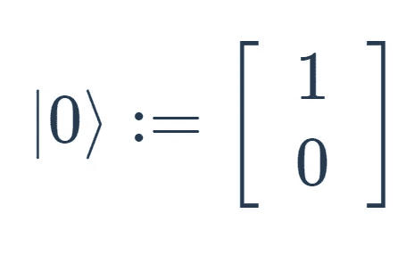
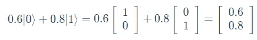

# 进入计算的新时代|量子计算

> 原文：<https://medium.com/geekculture/the-future-of-computers-quantum-computing-4429cc23c3dd?source=collection_archive---------16----------------------->

# 装载老《我的世界》

今天是周六，你无事可做，所以你决定找点乐子，玩一会儿 minecraft！你加载了一个新的世界，然后等待你的电脑加载所有这些数据。它在 7 秒钟后就完成了加载，你可以开始在你的新世界里玩了！

这只花了很短的时间，因为这是一个新世界，这个世界需要生成的数据很少。

然而，如果不是加载一个新世界，而是加载一个包含大量数据的世界。你有了一台全新的电脑，你开始加载这个世界。这需要一段时间，3 个小时后，你终于加载了你的世界。

即使你有一台非常快的电脑，它仍然不能一次加载所有的数据！

> 嗯…只是 minecraft。这不是什么非常重要的事情

但是如果是呢！

现在很明显，公司和政府不会使用你的普通电脑来存储大量的数据。相反，他们将使用一种叫做**的超级计算机！**

Supercomputers

超级计算机，顾名思义，基本上是非常快速的大型计算机，用于执行需要大量数据和速度的复杂任务！

让我们回到 minecraft。使用最快的超级计算机，将允许你在几秒钟内加载所有的数据！

> 但是……如果有什么东西可以在一眨眼的功夫做到这一点呢！

这看起来很疯狂，像是从梦里出来的东西，但这是真实存在的！这可以用**量子计算来完成！🤯**

# 我们要量子化了

**量子计算机**是利用**量子现象**计算其数据的计算机。量子很疯狂，是一个复杂的话题，但是不要担心，我会尽我所能，尽可能简单地解释量子计算。

> 让我们了解一些背景知识，看看量子计算机到底有多强大。

2019 年 10 月，谷歌宣布他们为某项任务实现了**量子优势**。他们声称这项任务将需要一台普通的计算机 10，000 年才能完成！你能猜出量子计算机的运算速度吗？

**200 秒！**

在此声明之后，IBM 宣布他们最快的计算机能够在 2.5 天内完成这项任务！证明谷歌是错的！

但是，2.5 天还是很长，200 秒还是快了 waaaay！我们也可以考虑这样一个事实，IBM 使用了他们最快的计算机，但仍然没有达到那个水平。

这就是量子计算机的惊人威力！

Google’s Quantum Computer

所以，为了理解量子计算机的一些概念，我们必须首先了解普通计算机的一些概念。

> 让我们开始，一点一点来(明白吗？)

# 古典音乐片段

经典计算机运行在一种叫做机器语言的特殊语言上。这种语言很无聊，因为它只由**0**和**1**组成。

这些 0 和 1 也被称为**位**。

每个位可以是 **1** 或 **0** ，基本上相当于一个开关，其中 0 表示关闭，1 表示打开。

1 位将由 **2 个状态**组成，因为它可以是 1，也可以是 0。

根据有多少位，可能状态的数量会有所不同。

如果你还是不明白，这里有一些位的例子和它们的状态数。

1 位— 2 种状态:[0]或[1]

2 位— 4 种状态:[00]、[01]、[10]或[11]

…

10 位— 1024 种状态:[0000000000]、[000000001]、[111111111]

如你所见，在仅仅 10 位中有许多可能的状态！

我们可以使用以下公式，而不是写出该位可能处于的所有状态:

> 2ⁿ，其中 n 等于比特数。

大多数计算机由 64 位组成。这意味着将有 **1.8446744e+19 个状态！**

这是 bits 的基本要点。现在你知道了，让我们继续讨论量子比特，看看它们有多疯狂！

# 量子比特(量子比特)

当谈到量子计算时，量子位或量子位的工作方式与常规位略有不同。

一个量子位的状态被称为**量子态**，是一个**二维向量。**

类似于常规比特，量子比特也有两个量子状态，每个对应于常规比特中的 0 和 1 状态。

0 的量子态表示为 **∣0⟩** ，1 的量子态表示为 **∣1⟩** 。这叫做**偈记法**，而∣0⟩和∣1⟩之类的东西，则被称为*偈记*。在我们的例子中，这些状态也可以用向量表示为:

Vector representation of both quantum states

这些状态被称为**计算基础状态**。

你可能想知道∣的*和⟩的*是什么意思。它们其实没有任何意义，它们主要是向我们展示，这是一个量子态。

现在，与常规位不同，**有不止两种可能的状态，**这使得执行常规计算机无法完成的某些任务成为可能。

例如，一个量子位的状态也可以是 0.6∣0⟩ + 0.8∣1⟩

分解一下，0.6 乘以∣0⟩向量，0.8 乘以∣1⟩向量。简化后会是这样:

Simplifying the state of the qubit into a vector

## 叠加

在任何与量子相关的事物中，你都会听到最常见的术语之一是**叠加**。就量子而言，叠加就是将多个状态加在一起，产生一个有效的状态。

例如，许多人会说 *0.6|0⟩ + 0.8|1⟩* 是|0⟩和|1⟩.的叠加这意味着国家是|0⟩和|1⟩.的一个 ***线性组合***

现在你可能想知道为什么我选择 0.6 和 0.8 而不是其他数字。为了理解这一点，我们必须首先知道如何称呼这些数字。从数学背景来看，你可以说这些数字是|0⟩和|1⟩.的系数在量子计算中，我们称这些系数为**，振幅为**。

我选择这两个数字而不是其他数字的原因是因为这个规则:

> 振幅的平方和必须等于 1。

这就是为什么我选择了 0.6 和 0.8，它们的平方(0.36 和 0.64)加起来就是 1。这也是你可以选择的最简单的两个数的集合。

不过量子态很复杂，所以很难选择用哪个数字来表示它。这就是为什么我们用 **α** 和**β***来表示这些复数。*这意味着状态将显示为***α*∣0⟩+*β*∣1⟩**。

用我们的规则，我们会看到 *∣α∣ +∣β∣ =1。*

这被称为**规范化约束**。

> 量子位喜欢他们的隐私…你会看到的😉

好吧，当一个量子比特处于叠加态时，我们实际上不知道它处于什么状态，直到我们测量它。但是你看，量子真的很有趣，因为一旦你测量了量子位，它会自动地从叠加态*坍缩*到它的基本态 1 或 0。

当量子位崩溃时，并不总是有 50/50 的机会让它处于哪种状态。量子比特一旦处于叠加态，就有一定的概率处于每种状态。这甚至可能是一个 *1/99* ，意味着有 99%的几率量子位会坍缩到状态 1。

## 纠缠

量子位具有的另一个特性叫做**纠缠。**

当两个量子位*纠缠*时，这意味着它们在某种程度上**相互连接**。

Visual Representation of Entanglement

因此，如果你改变其中一个量子位的状态，它会立即以一种可预测的方式改变另一个量子位的状态。

当我们看一个纠缠的量子位时，它要么是 1，要么是 0。在这种情况下，假设它变成了 1。

这意味着，即使你没有看另一个量子位，它仍然会变成 0。

它们有多远并不重要。即使它们在几十亿光年之外，只要它们仍然纠缠在一起，状态仍然会改变。

> 与经典计算机相比，叠加和纠缠使量子计算机能够采取更少的步骤来执行任务。

# 但是量子计算机能做什么呢？

现在我们已经了解了量子计算机的基础知识，让我们来谈谈量子计算的一些不同应用。

## 机器学习和人工智能

机器学习和**人工智能**已经彻底改变了世界。已经到了你可以在家里为**免费**创建自己的 AI 项目的地步了！

唯一的问题是，当你在训练一个模特的时候，你要花很长时间来训练！量子计算机可以用来加速这一过程，并开启机器学习的新水平！

量子机器学习提供了一整套全新的机器学习**算法**和**应用**！(还有一大堆更复杂的数学)

## 药物发现

一家公司发现一种新药，并将其推向市场，需要超过 10 年的时间。显然，这并不实际，我们需要一些东西来加速这个过程。

**量子计算可以显著改变这一点！**

它可以让科学家和制药公司分析大规模分子。经典计算机被用来运行数百万个分子的比较。然而，这需要很长时间，当量子计算机开始变得容易获得时，它将为更多的**进步**和**治愈**一系列疾病打开大门！

## 网络安全

如前所述，量子计算机可以在几分钟内完成经典计算机需要几十万年才能完成的任务！这也适用于加密数据。

许多加密都是基于数学公式的，这需要计算机花费大量的时间来解决。这是因为当涉及到加密时，会涉及到很多因素，从一个巨大的数字开始，并尝试因素化，这将需要一段时间。

量子计算可以很容易地分解这些大数，并解码这些加密。这都要归功于一种叫做 **Shor 算法**的量子算法。现在，我不会太深入这是什么，但本质上允许这些量子计算机比经典计算机更快地轻松分解大数。

然而，通过量子计算，我们可以做与解码相反的事情，加密更强的密钥，使人们更难破解系统。

# 🔑关键要点

嗯，我想我们终于接近这篇文章的结尾了。但是不要担心，这里是这篇文章中最重要的几点。

*   比特是由 1 或 0(开/关)组成的二进制数字
*   计算可能状态数的公式: **2ⁿ，其中 n 等于存在的比特数。**

## 量子

*   **量子计算机**是利用**量子现象**来计算数据的计算机。
*   一个量子比特(量子比特)的状态被称为它的**量子态**，它是一个**二维向量**。
*   0 的量子态表示为 **∣0⟩** ，1 的量子态表示为 **∣1⟩** ( *Ket 符号*)。又名**计算基准状态**

**叠加**

*   叠加是指将多个状态相加，得到一个有效的状态。
*   当一个量子比特处于叠加态时，它是|0⟩和|1⟩.的线性组合
*   这些状态的系数被称为**振幅**，振幅的平方和必须等于 1。这被称为**标准化约束**。
*   量子态是复杂的，因此我们用 **α** 和**β***来表示这些复数。*表示状态将显示为***α*∣0⟩+*β*∣1⟩**。
*   当一个量子比特处于叠加态时，我们不知道它处于哪种状态。一旦我们测量了量子位，它就会自动坍缩成 0 或 1。

**纠缠**

*   当两个量子比特*纠缠*时，这意味着它们在某种程度上**相互连接**。当你改变一个量子位的状态时，它会立即改变另一个量子位的状态，这是可以预见的。

**量子应用**

*   量子计算可以与机器学习一起使用，以加速这一过程，并开辟新的机器学习算法
*   量子计算可以用来分析大规模的分子，明显地促进药物发现。
*   Shor 算法是一种易于分解大数的量子算法。这为更快的加密和解密打开了大门。

*好了，我现在就说这么多，但如果你有任何问题，你可以随时联系我*[***LinkedIn***](https://www.linkedin.com/in/bagavan-mar/)***。*** *既然你来了，何不* [***加入我的简讯***](https://landing.mailerlite.com/webforms/landing/k7c4q5) *看看我也一直在做的一些事情！*