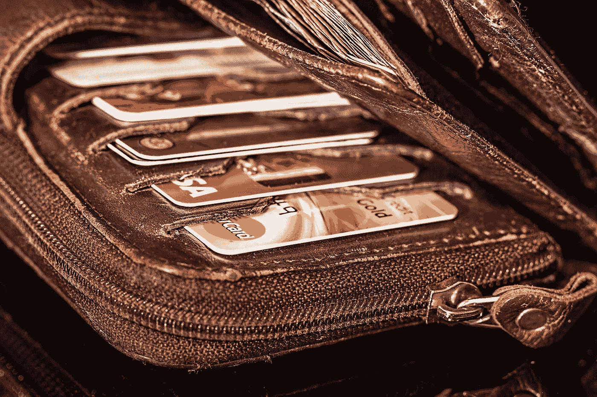

# 加密钱包的未来

> 原文：<https://medium.com/geekculture/the-future-of-consumer-wallets-f23c6e5b4ee7?source=collection_archive---------16----------------------->

加密钱包将如何满足 web3 爱好者的需求？

[https://pixabay.com/images/id-908569/](https://pixabay.com/images/id-908569/)

加密钱包会有比交易更多的功能吗？

在过去的几周里，这些以及更多的想法模糊了我的思绪，我认为详细阐述消费者钱包的未来是很好的。

加密货币和 NFT 的爆炸式增长带来了用于不同目的的加密钱包的采用。然而，加密钱包并不是第一个被创新的钱包。

沿着记忆漫步，找到你的第一个钱包。是什么让你得到了一个？你可能已经买了一个钱包来帮助你有效地存放钱和一些你认为是私人的物品。随着时间的推移，这个钱包变成了你认为非常私人的东西，存放着你的现金、身份证和其他你认为私人的东西。

这正是钱包应该有的样子。随着 web3.0、DeFi、NFTs 和加密货币的其他方面的兴起，用户一直在寻找一个让他们感到安全的钱包。

难怪在 2021 年 11 月，据报道 [MetaMask 的月用户数已经超过 2100 万](https://decrypt.co/86263/ethereum-wallet-metamask-reports-21-million-users)，这是自 2021 年 4 月以来约 420%的增长，这都要归功于 DeFi、NFTs、DAOs 和 play-to-earn 模型的快速增长。

随着这一点的确立，让我们来看看加密钱包的基础。

# **什么是加密钱包？**

加密钱包是使加密用户能够管理其加密货币的设备或应用程序。它允许用户安全地存储、发送或接收加密货币。理想的加密钱包具有以下特征

1.它允许跨不同地理位置即时转移资产，而不需要中介

2.它既安全又易于使用

3.允许从一个用户向另一个用户转移各种加密货币

加密世界由不同类型的投资者组成，因此产生了满足每个投资者需求的其他类型的钱包。

# **加密钱包的种类**

有两种类型的加密钱包，它们是热钱包和冷钱包。

**1。热门钱包**

任何需要使用互联网连接来评估其资产的加密钱包都被称为热钱包。虽然它们为用户提供了访问权限，并且对用户友好，但是它们不太安全，容易被黑客攻击。热门钱包有各种类别。它们包括

*   移动钱包:这些钱包需要下载一个移动应用程序作为你的钱包。有趣的是，它为加密用户提供了灵活性，尤其是新手。手机钱包提供商让你控制你的私人钥匙。示例包括信任钱包、元掩码等
*   网络钱包:加密用户可以通过网络访问他们的网络钱包，无需下载任何应用程序。一些网络钱包提供商代表你持有和管理你的私人密钥。这类钱包的例子包括 coinbase、币安等
*   桌面钱包:在桌面钱包的情况下，用户必须在他们的桌面上下载应用程序。与一些网络钱包相比，它的优势在于你可以完全控制你的资产和钥匙。例子有驻极体、原子钱包、出埃及记等

**2。冷钱包**

当谈到保护资产的更安全的替代方案时，冷钱包是首选，冷钱包是使用物理介质以离线模式存储用户资产的钱包，从而使它们能够抵御在线黑客攻击。冷钱包有各种类别。它们包括

*   纸质钱包

在纸质钱包中，钱包的地址和私人密钥以二维码的形式打印出来，扫描后进行交易。

*   硬件钱包

这些是指生成公钥和私钥的设备，公钥和私钥是设备本身，不与互联网连接。硬件钱包传达了冷钱包的真正定义，例子包括 safepal 钱包、Trezor、Ledger 等。

虽然目前有几个针对加密用户的钱包，但我的观点仍然是，为了让下一个 1 亿用户进入 web3.0，目前的加密钱包需要有更多的功能，而不仅仅是执行交易和存储资产。

# **目前加密钱包的局限性**

虽然已经建立了许多加密钱包来实现加密交易，但是它们在许多功能领域都失败了。

## 1.作为交易实体的钱包

虽然加密的核心是在不需要第三方的情况下进行交易，但随着世界的发展，加密领域也在发展。许多加密钱包被构建为仅处理购买、出售和持有加密令牌，这限制了加密钱包。向 Web3.0 的迁移开启了对更具互操作性和社会性的互联网的需求，让用户对他们的钱包应该是什么样的以及他们如何在钱包里度过更多时间产生了很多幻想。

例如，NFT 利基去年获得了巨大的牵引力。许多进入 NFT 利基市场的用户需要能够安全存放他们的 NFT 的钱包，并允许他们随时回来欣赏就在他们钱包里的这件美丽的艺术品。因此，不仅仅是交易，加密用户希望在钱包里花更多的时间，这导致了 MetaMask 的月活跃用户数量激增。

## 2.钱包用户体验

无缝的用户体验是每个加密用户想要的。然而，这在加密钱包中并不常见。各种加密钱包中的高质量体验可以导致 web3.0 的大规模采用，并使用户感到安全、可靠和被充分理解。没有什么比与易于理解、用户友好的应用程序或设备进行交互更好的了，它能让你在探索其实用性和功能时有宾至如归的感觉。

## 3.钱包身份

购买传统钱包时，它的一个基本特点是能够随心所欲地使用它并显示您的身份。各种卡片揭示了主人的身份，从信用卡到图片、信件、手写笔记等。

这正是今天的加密钱包所缺少的一个特征。如果加密钱包能够允许用户管理他们拥有的资产，像选择钱包颜色或按类型分类资产这样简单的事情，它将大大有助于让他们的钱包感觉像一个花更多时间的地方。

鉴于目前加密钱包的这些局限性，让我们来看看加密钱包的未来。

# **加密钱包的未来**

我想知道加密钱包是否会比消息应用、银行应用和社交媒体应用更常用。现有的钱包并不特别关注元宇宙。为了让下一个 10 亿以上的人进入 web3.0，我们需要一个更好的钱包，并对加密钱包的基础设施进行一些改变。这些改变应该从消除当前的限制开始。

加密钱包的未来看起来会有点类似或更像这些:

## 1.各种加密钱包中的无缝用户体验

不同的加密钱包提供商应该优先考虑不同加密钱包中的简单导航。

## 2.钱包身份

加密钱包提供商最终会明白，用户首先是人，然后才是客户，因此，他们会优先考虑在产品中集成身份显示的需求。这将使用户能够显示他们的收藏，内容和令牌，因为他们希望与不同的颜色和功能的定制选项。

## 3.数据保密

web3.0 承诺允许用户拥有自己的数据，并拥有尽可能多的隐私。将这一想法融入未来的加密钱包将让用户随心所欲地管理他们的权限和数据，而不用担心他们的交易被监控。

## 4.无缝冷热钱包集成

两个加密钱包之间的差距现在相当大。在未来几年，我希望用户不必在冷钱包和热钱包之间做出选择；相反，这两种钱包将迅速整合，以更好地促进加密和 web 3.0 的采用。

每个成功项目的支柱是其背后的社区，在加密领域，这已被证明是正确的。我指的是有共同兴趣的一群人。将不同的以消费者为中心的基础设施整合到加密钱包中将会加强加密社区。

## **结论**

我相信我们仅仅触及了加密钱包的表面及其众多的潜力。通过将适当的基础设施和以消费者为中心的功能整合到不同的加密钱包中，我们正在迈向下一个 10 亿用户。他们会深深爱上 crypto，它的用例，以及 web3.0。