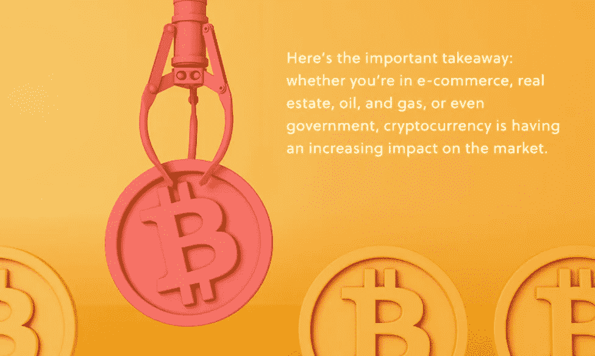
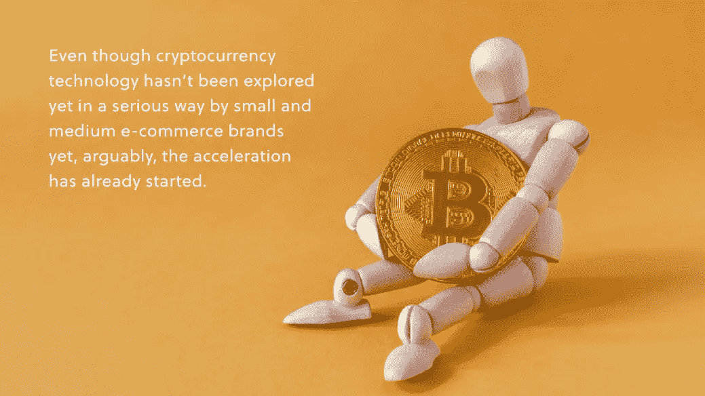

# 电子商务中加密货币的未来

> 原文：<https://medium.com/geekculture/the-future-of-cryptocurrency-in-e-commerce-d2ea7f20d44b?source=collection_archive---------26----------------------->

## 电子商务中的加密货币

## …品牌需要做什么

加密货币已经流行了一段时间了。然而，它仍然是相当新的，第一种加密货币(比特币)是在 2009 年发明的。

尽管是新的，但加密货币已经对市场产生了巨大的影响。

加密货币背后的技术被称为区块链，它仍然非常深奥，很少有人费心去了解它是什么。让我们暂时把“如何”和技术方面放在一边，因为电子商务品牌将只需要把技术视为一种支付形式。

作为支付，硬币本身给了电子商务品牌一个更熟悉的概念。如果加密货币已经在为产品付费，那么电子商务中的加密货币的未来会是什么样子？现在品牌需要了解什么？他们应该做些什么准备？

# 一、加密货币到底是什么？

加密货币是一种数字货币，它因完全独立于银行而出名。它不是由任何政府铸造的——事实上，每一种新的硬币“类型”都是被发明出来的。

加密货币之所以如此命名，是因为它使用加密技术来控制其使用和验证。交易由一个完全分散的系统进行验证，验证硬币的人和硬币的所有者可以匿名。

同时，每笔硬币交易过账的数字账本是完全公开的账户。这就是如何防止硬币所有者多次花费硬币。

困惑了吗？

**重要的一点是:无论你是在电子商务、房地产、石油和天然气行业，还是在政府部门，加密货币对市场的影响都越来越大。**去年的新闻加速了这一趋势，比如[埃隆·马斯克对比特币](https://www.bbc.com/news/business-55939972)的 15 亿美元投资和[比特币基地](https://www.thestreet.com/investing/coinbase-cryptocurrency-exchange-public-direct-listing-031721)的公开发布。比特币的价值从 2020 年 10 月的每枚 11500 美元开始攀升，直到 2021 年 4 月的每枚 63000 美元达到顶峰。比特币也不是唯一的加密货币——这意味着所有加密货币的更大市场影响确实是巨大的。

为电子商务品牌找出最佳的下一步措施需要认真审视加密货币的承诺和风险，以及品牌在平衡中可以采取的现实行动。

# 电子商务中的加密货币承诺

基于一些有吸引力的承诺，加密货币已经获得了普及和消费者的采用。这些大多是电子商务品牌和消费者的意外之财。

最受吹捧的承诺包括:

1.  **降低交易成本**

电子商务中的交易费降低了品牌的利润率，并通过更高的价格转嫁给消费者。通过 Stripe 或 Square 处理支付的品牌支付每笔交易的 3-5%，而加密货币交易通常是无感的或低至 1%。想象一下，对于一个年网上销售额只有 500 万美元的品牌来说，这会带来多大的变化。

2.**新的消费群体**

有些消费者不喜欢信用卡和银行。虽然他们是少数，但为你的产品提供加密货币支付将会进一步扩大你的电子商务范围。随着加密货币获得更多的采用，预计这一消费者群体将会增长，你可能已经获得了他们的忠诚度。

3.**降低欺诈风险**

这又进入了技术层面，但加密货币因减少欺诈而受到许多人的欢迎。欺诈性退货和其他类型的退款会伤害你的品牌底线，但加密货币技术有可能永远根除欺诈性收费。

# 电子商务中的加密货币风险和障碍

电子商务中的新技术总是令人兴奋的(像 AR 的超级酷的使用)，但它总是伴随着风险和采用的障碍。就加密货币而言，可以说其风险高于你今天看到的大多数进入电子商务的新技术。这意味着你必须更认真地考虑这些风险。

例如:

1.  **小消费者买入**

就支持加密货币的消费者而言，加密货币仍然是“利基中的利基”。这部分是因为对于不了解其技术细节的人来说，它近乎神秘的性质。另一大部分是它的*价格*。不，你不必花超过 6 万英镑买一整枚比特币，但即便如此，目前的价格还是把一些消费者挤出去了。

2.**波动性**

说到比特币价格，加密货币的波动性是出了名的。对一些消费者来说，这感觉有点像赌博，这进一步削减了采纳者。比特币(尤其是比特币)的价格正在飙升，并且在可预见的未来确实有保持高位的迹象。因为它没有任何法定货币的支持，所以没有真正的“知道”价格会走向哪里。

3.**交易验证不是即时的**

这是电商店铺的一大考量。电子商务购买的即时满意度略有下降，因为加密货币必须根据公共账本(记录其历史的账本)进行验证。这仍然是近即时处理，但它需要的时间也将取决于加密钱包和网站在使用中。

4.**没有消费者保护**

消费者知道他们不对欺诈性的信用卡费用负责，电子商务品牌明智地将一定数量的退款计入他们的预期收入。然而，没有一种加密货币有消费者保护，这意味着消费者在欺诈的情况下会损失惨重(除非电子商务品牌出于好心建立了自己的保护措施)。

5.**硬币碎裂**

2021 年初，T4 有超过 4000 种加密货币。这就让每个电子商务品牌在众多选项中导航，以实现客户最常用的硬币支付。

6.**能源和可持续发展**

也许这对你来说会是一个惊喜，但加密货币也因使用大量的能量而闻名，以便通过在区块链上验证它们来创建(或“开采”)硬币。在不深入技术层面的情况下，这种能源消耗足够显著，以至于比特币采矿(更不用说其他硬币了)[每年消耗的电力比整个阿根廷](https://www.cnbc.com/2021/02/05/bitcoin-btc-surge-renews-worries-about-its-massive-carbon-footprint.html)还要多。谁知道加密货币有这么大的碳足迹？

如今，没有一家公司愿意成为碳排放“问题的一部分”,因此能源是品牌应该认真考虑的问题之一。

# 电子商务品牌应该做什么

加密货币和电子商务会是一对充满活力的搭档吗？还是说“弊”大于“利？”

如果有什么是肯定的，那么在 2020 年享受了消费者对电子商务前所未有的采用的电子商务品牌已经知道，任何其他市场转变都可能以意想不到的方式加速今天的趋势。

**尽管中小型电子商务品牌尚未认真探索加密货币技术，但可以说，加速已经开始。**

对于电子商务品牌，下一步将考虑每个公司的立场，同时保持耳朵大开。即使你的客户群不是抛比特币的类型，了解整个市场的采用情况也很重要，所以如果接受加密货币突然成为新的现状，你可以做好准备。

以下是您的品牌现在可以做的:

1.  **关注您的客户**

从仔细观察你的客户群开始。评估你当前的客户以及那些你想吸引更多客户的群体(但是还没有“做大”)。这些客户群中有采用加密货币的吗？他们注意到了吗？

如果是的话，你应该认真考虑让他们选择在线支付你的产品。如果不是，你现在可能不需要考虑这个选项，但是你仍然想采取接下来的两个步骤。

2.**关注你的竞争对手**

无论你是否认为你的客户是“加密货币类型”，你的竞争对手可能会有不同的看法。[定期查看你的竞争对手](https://www.amberengine.com/blog-content/top-13-tools-to-research-emarketplace-competition?utm_source=blog&utm_medium=referral&utm_campaign=medium-blogs)，看看他们提供什么样的付款方式。

即使提供加密货币支付，但很少在竞争对手的网站上使用，你也不想看起来像下一个家伙旁边的恐龙。另一方面，如果很少或没有竞争对手提供加密货币支付，你可能需要一些时间才能被迫进行转变。

3.**展望未来**

无论你做什么，保持警觉是至关重要的。加密货币的好处和风险很难自己衡量，但越来越多的市场和电子商务专家正在研究、评论和撰写几乎每天都在发生的变化。

订阅你喜欢的以加密为重点的新闻来源，然后准备好在新趋势出现时迅速转移。

作为电子商务中的一个品牌，您对技术的整体采用依赖于敏捷性和成本效益分析。

当你[考虑在](https://www.amberengine.com/blog-content/how-to-choose-the-best-marketplace-for-your-products?utm_source=blog&utm_medium=referral&utm_campaign=medium-blogs)上通过哪些渠道销售你的产品时，这是真的；当你将 AR 和 VR 融入你的产品列表时，这也是真的；对于加密货币和我们遇到的其他所有新奇技术来说，这也是真的。

今天是你选择你的品牌如何适应的日子。