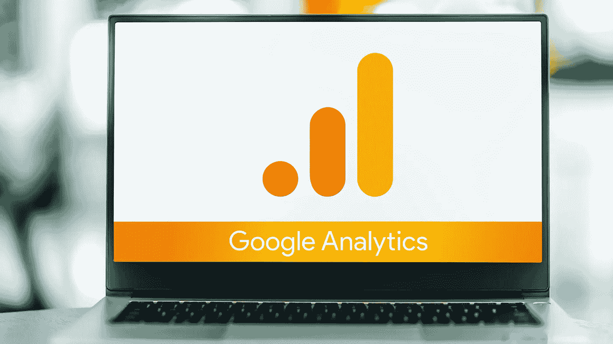

# 数据测量的未来:GA4

> 原文：<https://medium.com/geekculture/the-future-of-data-measurement-ga4-8bbbcc1d4f47?source=collection_archive---------14----------------------->

GA4 is not a platform upgrade, but an entirely new way of doing analytics and data modeling. (photo credit: monticello / Shutterstock.com)

谷歌分析 4 (GA4)正在取代通用分析。在过去，谷歌已经为最终用户提供了各种改进，但没有重大变化，但这次更新是不同的。谷歌即将彻底改变其分析平台。是的，完全是。

要访问 GA4，您需要设置一个全新的帐户。您当前的 Universal Analytics 数据不会迁移到您的新帐户…