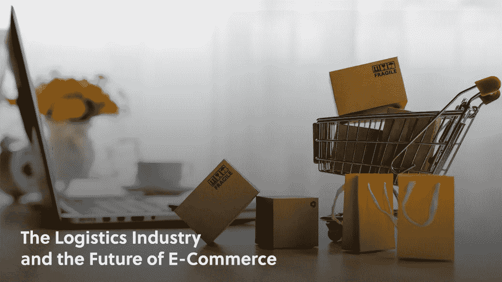
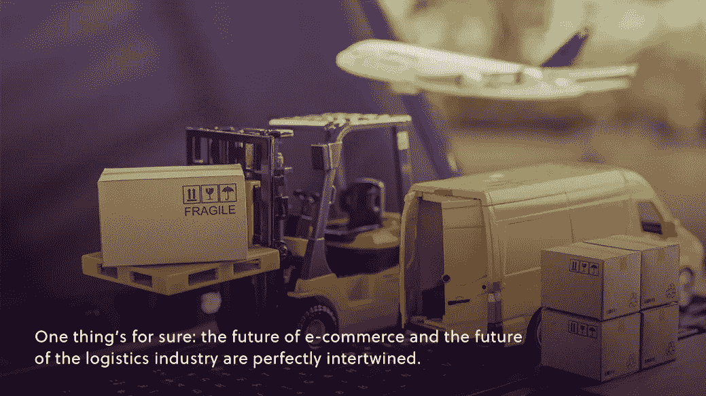

# 物流业和电子商务的未来

> 原文：<https://medium.com/geekculture/the-future-of-e-commerce-is-behind-the-scenes-54db1ad357ef?source=collection_archive---------8----------------------->

## **物流和电子商务**

进入电子商务的黄金时代后，许多行业专业人士和企业家都在关注是什么造就了成功的电子商务品牌，或者是什么打破了成功的电子商务品牌。

随着以客户体验为中心的转变，超个性化营销努力的推动，以及远离传统实体商店的总体趋势；我们越来越擅长跟踪[行业在前端是如何变化的](https://www.amberengine.com/blog-content/the-future-of-ecommerce?utm_source=blog&utm_medium=referral&utm_campaign=medium-blogs)，但你是否密切关注幕后发生的事情？

当天送达并不是在亚马逊应用程序中加入这一选项后才出现的。如果你曾经停下来想一想，很难想象它是如何实现的。快速变化的商业行业也意味着物流行业的巨大变化，彻底改变了履行和客户体验。

让我们仔细看看。

# 消费者习惯的转变

互联网一代的一些成员已经到了投票的年龄，不管我们是否生来就有 iPad 来娱乐，我们都已经慢慢但肯定地适应了这个世界，智能手机和闪电般的互联网连接只是我们一天中无关紧要的部分。

我们只需轻点屏幕，就可以观看经过算法筛选的视频，我们的设备可以在我们进行早晨例行工作时为我们朗读新闻，而你忘记为晚餐购买的食材可以在几分钟内送到你的家门口。

消费者希望事情比以往任何时候都更快、更容易，而我们通常认为理所当然的技术已经使这成为可能。

技术赋予我们的另一个伟大的东西是一个几乎没有边界的世界。瞬间，不同的城市、州和国家之间就发生了互动。

很自然，这延伸到了商业领域，但幕后工作比在盒子上贴上“国际运输”标签要稍微复杂一些。

# 运输、仓库和自动化

这个越来越国际化和越来越按需的世界的性质实际上需要物流行业的范式转变。实体店或许可以依靠每周发货，而竞争激烈的电子商务品牌需要确保你的订单在你购买的那一刻就已经在路上了。这种转变不会在一夜之间发生，用传统的交通方式也不可能实现。

应对快速交付挑战的一种方法是使用大量的仓库，这些仓库通常位于人口密集的地区附近。这减少了运输距离和时间，更容易满足客户的期望。

这造成的一个问题是对空间的争夺。虽然消费者享受着越来越快、越来越方便的运输速度，但品牌必须首先争夺使这种高标准成为可能的仓库空间。

我们可以在物流领域见证的另一个转变是全心全意地采用自动化。尽管我们不愿意承认，但机器人就是比我们工作得快。当谈到快速、高效和准确的履行时，自动化流程往往占据主导地位。许多重要的仓库，像 T2 阿里巴巴 T3 的仓库，已经基本实现了自动化。

# 这些趋势意味着什么

很难想象事情会变得比现在快得多，但是，每一次技术突破都是如此。事实是，消费者已经习惯了令人难以置信的快速服务和令人印象深刻的准确率，这意味着较小的品牌将不得不继续投资于物流流程。

与亚马逊的当天送达竞争可能不可行，但通过[优化](https://www.amberengine.com/amz-checklist?utm_source=blog&utm_medium=referral&utm_campaign=medium-blogs)采取战略履行决策并增强竞争优势仍然是中小型电子商务品牌的优势。

有一件事是肯定的:电子商务的未来和物流行业的未来完美地交织在一起。

拥抱自动化等强大的趋势是走向成功的关键一步，正确识别这些趋势是一切的起点。幸运的是，有大量的[资源](https://www.amberengine.com/blog-content/the-future-of-ecommerce?utm_source=blog&utm_medium=referral&utm_campaign=medium-blogs)让你跟上动态的电子商务行业。