# 电子商务个性化的未来是人工智能

> 原文：<https://medium.com/geekculture/the-future-of-ecommerce-personalization-is-ai-c3c00085e705?source=collection_archive---------12----------------------->

By: [YesPlz。艾](http://yesplz.ai)

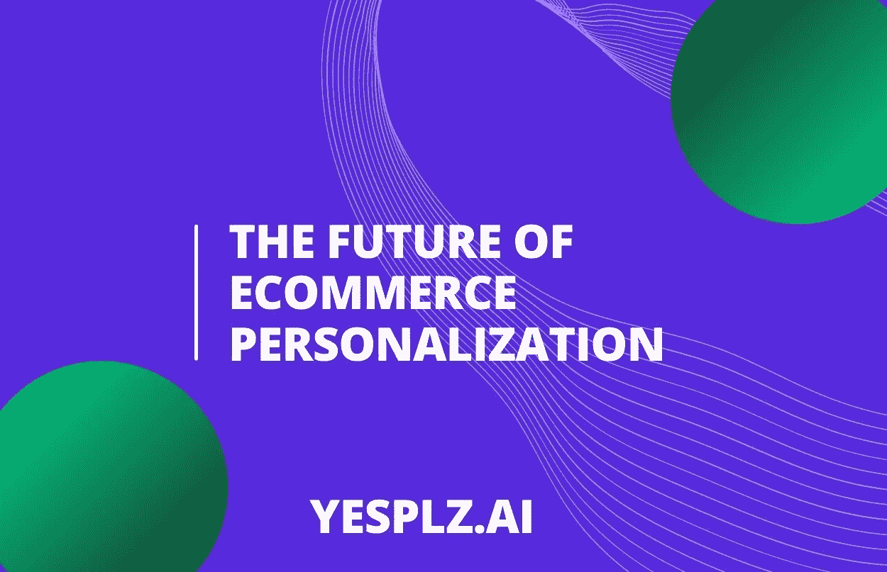

电子商务个性化背后的技术故事——及其重要性。

*“我因为浏览不相关的物品而感到沮丧”
“我厌倦了去多家商店寻找我的风格”
“网上购物简直让人筋疲力尽”*

这些只是女性对她们购买服装经历的评论精选。超过 58 名女性响应了我们关于个性化购物体验的反馈号召，评论开始潮水般涌来，

我们了解到，女性对当前的电子商务体验感到沮丧，并寻求更多。

我们采访的女性希望获得无缝、个性化的电子商务体验。

# 但是，电子商务个性化意味着什么？

电子商务个性化的核心是为在线客户创造独特的定制体验。在网络的早期，它可以简单到根据浏览历史来推荐顾客可能喜欢的产品。

随着技术的进步，电子商务个性化方法变得更加先进。随着更多数据点的收集，零售商可以使用客户数据，如浏览历史、查看位置、年龄统计数据或以前的购买情况，来创建独特的在线购物体验。

零售商需要收集的数据点比以往任何时候都多。

但是，你有没有收到过这样的邮件:

这是电子商务个性化的错误做法，可能会损害一个品牌的声誉。

在本指南中，我们将探讨电子商务个性化的基本要素，从其历史到数据的作用，以及零售商如何在竞争中脱颖而出。

## [**了解更多关于电子商务个性化和人工智能的信息**](https://yesplz.ai/resource.html)

# 电子商务个性化简史

个性化在零售业中并不是什么新鲜事——商店员工接受培训，了解店内购物偏好，并根据风格、场合和人口统计数据提出建议。

想象一下，一位 40 岁的母亲走进当地一家精品店，为工作购买一件上衣。根据这些信息和背景(人口统计，如年龄)，店员可能会推荐几件有纽扣的衬衫。根据所提供的“数据”和她自己对办公室着装的了解，店员不会建议穿平头。

同样的分析也发生在网上，但是没有商店助理的帮助。心理人口统计信息或购买意向等数据将继续影响购物者在网上购物时看到的产品。

在电子商务个性化的早期，亚马逊等商店包括“如果你喜欢这本书”和“买了这本书的顾客也买了”等功能。产品推荐是静态的，基于浏览历史。

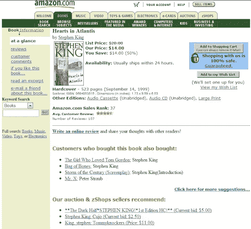

*2000 年亚马逊个性化的早期例子
来源:[wordpress.com](https://entre528.wordpress.com/2013/04/06/amazon-com-a-unique-approach-to-social-strategy)T2*

现在，我们对个性化的理解已经超越了产品推荐，变得更加动态。

2000 年代，Birchbox 等订阅盒将个性化带到了顾客的家门口。通过收集关于美容和皮肤偏好的数据，Birchbox 创建了一个个性化的、精心策划的美容产品盒子，让每位顾客都感到独一无二。

而现在，个性化是顾客的一种期待。

# 个性化和定制化有什么区别？

在讨论如何创造量身定制的体验时，这两个词经常互换使用。

个性化和定制化的目标是一样的:为购物者创造独特的定制体验。但是，有一点小小的不同:

定制是由购物者完成的。

定制示例:

*   向在线个人资料添加详细信息
*   选择如何查看产品
*   在购物应用程序中关注时尚影响者

个性化是由应用程序或电子商务平台完成的。

个性化示例:

*   基于以前的客户行为发送推送通知
*   在购物者放弃购物车后向他们显示特定的登录页面
*   产品推荐

个性化和定制化是密切相关的。有了更好的购物者信息(购物者可以定制)，个性化工具可以更有效地工作。

但是，稍后会详细介绍。

# 电子商务个性化的 7 个流行用例

在整个客户旅程中，电子商务个性化不乏用例。以下是几个例子:

**1。场外社交重新定位:**购物者在电子商务网站上点击了一条宽腿牛仔裤，并继续在脸书和 Instagram 上看到同一条牛仔裤。可以根据购物者的行为(放弃购物目标、查看特定产品、访问主页)来个性化社交重新定位活动。

【Glossier 的一个社交广告，在多次访问他们的网站后

**2。有针对性的电子邮件:**品牌可以向每个购物者发送特定的电子邮件，突出个人偏好的品牌或独特的促销活动。

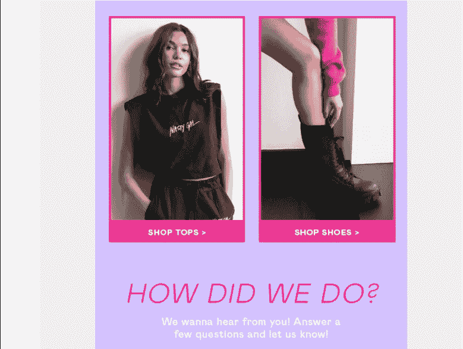

*来自 NastyGal 的购后电子邮件*

**3。动态推荐:**基于用户历史、用户行为和人口统计的产品推荐。

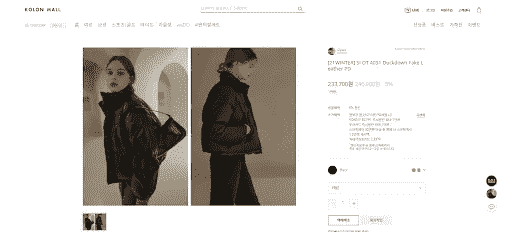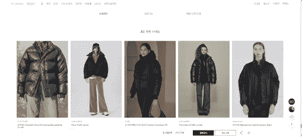

*yes plz Kolon Mall(韩国领先零售商)AI 产品推荐*

**4。用户生成内容(UGC):** 当整合到产品细节中时，UGC 可以成为一个强大的电子商务个性化工具。

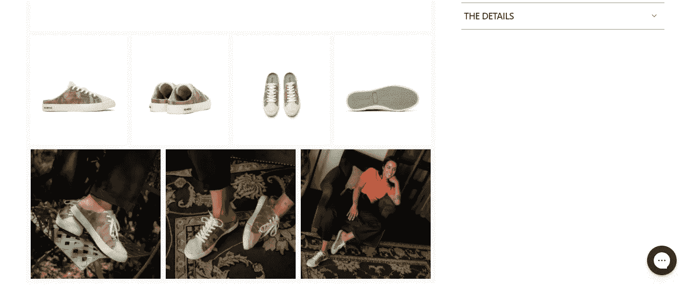

*Seavees 鞋子:专业产品图片和 UGC 的组合*

**5。Evergreen shopping:** 购物者返回到电子商务页面，可以从他们离开的地方继续购物。在下面的示例中，产品在关闭会话后仍保留在购物车中。另一个例子是:购物者可以继续浏览之前的产品。

*返回宗教改革的网站后，所有购物车物品都会自动保存
(也称为“持久购物车”)*

**6。如上所述，定制是有效个性化的必要条件。通过让购物者参加关于风格偏好的小测验，电子商务个性化可以更加准确。**

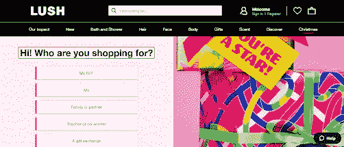

【Lush Cosmetics 的一个测验，为朋友和家人寻找节日礼物

**7。现场重定位:**用户行为触发的动作。例如，当购物者从他们的购物车中删除商品时，他们可能会在提供产品促销的不同页面上收到消息。

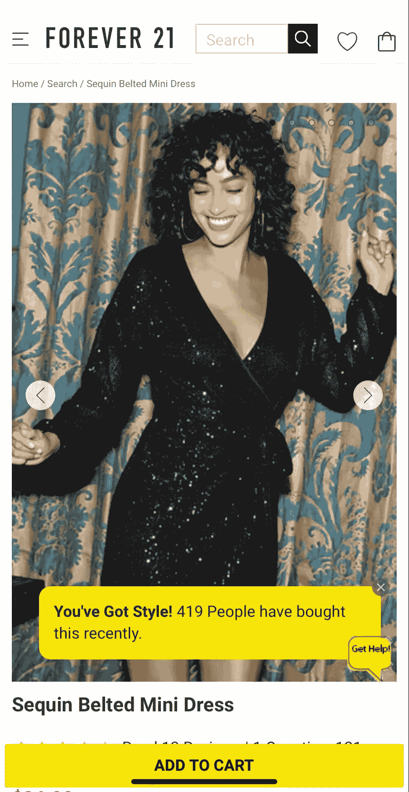

*在查看产品且未采取任何行动后，该弹出窗口被发送*

**奖励:搜索个性化:**

电子商务个性化正朝着搜索个性化发展。随着用户对预设文本搜索越来越失望，零售商正在寻求通过使搜索过程个性化和可视化来围绕搜索进行创新。

# 你的电子商务个性化有多大的可扩展性？

通过电子商务个性化技术，扩展个性化方法变得越来越容易。

确保您的电子商务个性化可扩展的首要方法是什么？通过确保你收集了好的数据。

你的数据应该是:
1。**干净:**没有人为错误，比如打错数字
2。**完整:**不应有任何缺失的输入数据或半成品数据集

你还记得这个例子吗？

Firstname%是一个不完整数据泄露的例子，它变成了一封糟糕的个性化电子邮件。

请记住:您的数据越准确和完整，就越容易推出可扩展的电子商务个性化解决方案

# 电子商务个性化:为什么它很重要

当电子商务个性化做得好，它可以克服电子商务购物的最大挑战之一:疲劳和沮丧。网上购物可能会让人不知所措，失去个性，尤其是当购物者被迫点击数百件商品时。

电子商务个性化可以激发快乐，吸引购物者，在品牌和顾客之间建立独特的纽带。

当然，它可以增加销售额，提高客户忠诚度和保留率，并提高净推广分数(NPS)。换句话说，良好的电子商务个性化会带来更多的收入和更多的客户。

但是，如果做错了，它可能会很烦人，甚至令人毛骨悚然。一个容易犯的错误，比如叫错顾客的名字，或者给顾客看太多有针对性的广告，都会导致挫败感和对品牌的负面印象。

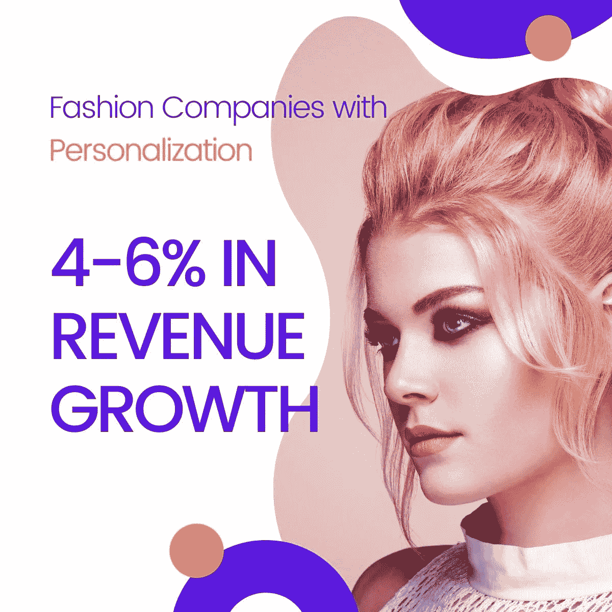

根据麦肯锡 2021 年的一份报告，实施个性化的时尚公司看到了有影响力的结果。

电子商务个性化也是从竞争对手中脱颖而出的一种方式。通过取悦顾客，品牌可以在顾客购物时占据首要位置。

# 电子商务个性化是如何工作的？

为了创造量身定制的体验，电子商务个性化工具依赖于元数据，如基于用户输入的产品名称、描述和品牌。

过滤信息有两种方式:

**1。协同过滤**以用户的历史点击量进行产品推荐。它倾向于使用相似用户的资料来预测要展示的产品。“相似的购物者也喜欢…”将是一个合作过滤的例子。

冷启动问题是协同过滤中的一个挑战。当一个新的项目推出时，协同过滤方法没有任何过去的数据、用户评论或信息可以提取，因此不会推荐新产品。

在电子商务中，每天都有成千上万的 SKU 被添加进来。购物者在他们的推荐中看到新产品是必要的，否则这些产品的销售会减少。

**2。基于内容的过滤**根据从内容中提取的关键定义特征提出建议。例如，如果用户查看低胸、合身的服装，则诸如领口、服装合身度和服装材料之类的定义特征将用于做出推荐。

但是，这只是故事的开始。强大的电子商务个性化过滤系统可以分析:购物者意图(点击冬季夹克的购物者会对其他冬季商品感兴趣)、浏览历史和产品属性。

# 数据在电子商务个性化中的作用

这些复杂过滤系统的核心是什么？

数据。

为了启动电子商务个性化，零售商需要收集和分析数据。

可以想象，有成千上万的数据点需要收集，再加上人为错误和过时的系统，在收集或分析数据时很容易出错。

基于文本的元数据可能会变得过于混乱，因为零售商和供应商会不断更新产品信息和标签——如果有人打错了产品细节，会发生什么？

[视觉搜索有助于](https://yesplz.ai/resource/ecommerce-guide-visual-search-and-search-clothes-by-image.html)解决产品标签问题。通过人工智能驱动的视觉搜索，可以提取合身或轮廓等重要信息，并将其添加到个性化过程中。

例如，在 YesPlz AI，[我们的产品推荐引擎](https://yesplz.ai/resource/introducing-yesplz-x-shopify-product-recommendations-for-fashion.html)可以识别和标记关键产品属性(产品类型、颜色、风格)，以推荐符合客户档案和需求的类似商品。YesPlz 产品推荐引擎使用视觉搜索和人工智能来快速准确地识别对客户最重要的属性:合身、廓形和风格。

**YesPlz 产品推荐:**

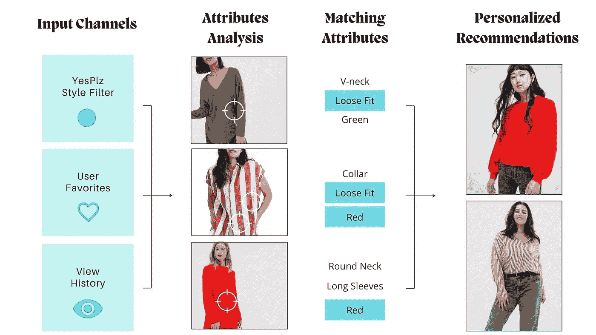

因为，归根结底，一切都是为了客户。

*谈到电子商务个性化，我们的研究表明，轮廓是顾客最重要的属性。*

# 人工智能和电子商务个性化

没有一个有用的、知识渊博的销售助理来指导电子商务购物者的旅程。店内的销售助理可以根据内在联系快速分析并做出决定(一个 6 英尺高的女人对看小号的衣服不感兴趣)。

那种与生俱来的常识在网上就失去了。通过人工智能，电子商务品牌可以像销售助理一样理解客户(甚至更好)。

通过图像或文本，AI 可以快速分析和提取产品的关键属性或元数据。

另一方面，人类需要手动分析相关产品并将其与购物者匹配。人工智能可以在几秒钟内处理和分析数千种产品，使电子商务个性化可扩展。

人工智能在电子商务个性化方面的最大优势(无论是通过协作还是基于内容的过滤)是它可以建立的联系。人工智能可以在产品和购物者之间建立联系，为购物者准确预测其他产品。

当人工智能算法在时尚和购物者偏好方面训练有素时，结果可能是强大而令人愉快的。

例如，以下是 YesPlz AI 定制个性化系统的工作原理:

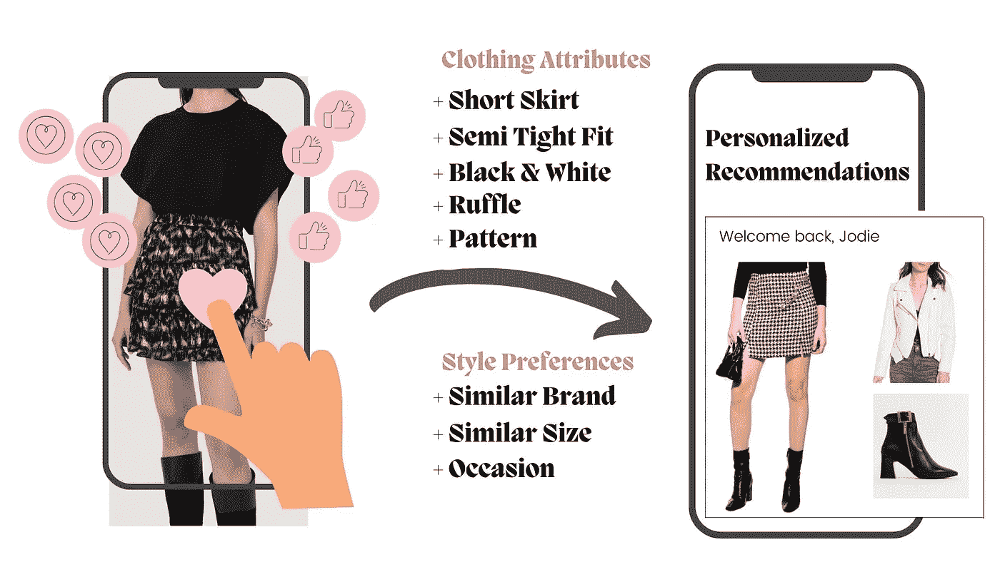

**工作原理:**用户喜欢自己喜欢的风格、品牌、尺码和服装属性。作为回报，她会收到定制的、精心挑选的款式。然后，通过基于用户行为和偏好而变化的动态登录页面，体验被进一步个性化。

# 电子商务个性化和未来:

虽然电子商务个性化有无限的可能性，但有一点要记住:电子商务个性化不需要很难。

实现过程不需要很复杂。有一些个性化工具可以与您公司现有的技术和数据配合使用，并且易于实施，效果显著。

时尚的人工智能技术可以改变购物者的电子商务体验，让他们享受搜索和发现的乐趣。

通过 YesPlz 人工智能产品推荐和视觉搜索过滤器，您的电子商务品牌可以使用强大的人工智能个性化购物体验。

[**安排一次对话，了解更多关于电子商务个性化的信息。**](https://yesplz.ai/contact.html)

注:本文最初发表于[这里。](https://yesplz.ai/resource/ecommerce-personalization1.html)