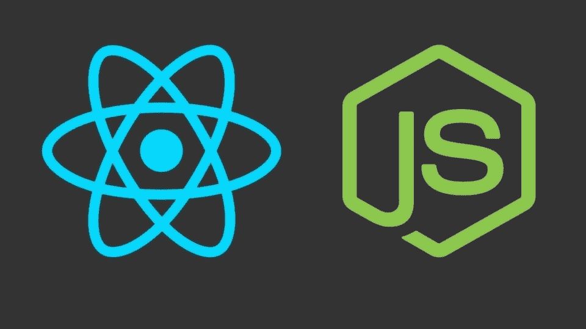

# 带有 React 挂钩的功能性 React 组件的未来

> 原文：<https://medium.com/geekculture/the-future-of-functional-react-components-with-react-hooks-1ebc7bdd9cdd?source=collection_archive---------11----------------------->



*在****React Conf 18****期间，Sophie Alpert 介绍了 React Hooks，随后是 Ryan Florence 对问题和解决方案的详细分析。*

**React Hook** 是由 [RFC](https://github.com/reactjs/rfcs/pull/68) 提出的一项实验性功能，帮助开发者构建简单、可伸缩、可维护的*功能性* React 组件，就像*有状态*组件一样。

# 类与纯函数

*很少有库使用像“重组”这样的高阶组件来解决这些问题。*

从一开始，React 就采用了一种基于*类的*声明性语法来呈现带有状态、上下文和属性的 UI。状态本质上成为了 React 框架中反应式编程的主要特征，它依赖于类声明。

随着时间的推移，一群开发人员鼓励用另一种方式来开发 React 组件，那就是通过纯粹的无状态函数。一个类似于前面的函数将一组道具作为参数，并返回注入到 DOM 中的 *JSX* 元素。唯一的问题是，到目前为止开发的功能组件没有办法拥有自己的状态。因此需要放入一个有状态的 React 类组件，它有自己的状态并作为 props 传递给功能组件。

# 扭转解决方案

现在，让我们看看有哪些方法可以帮助我们解决 React being as it is:

1.  **只创建基于类的 React 组件:**正如这里的[和](/@Zwenza/functional-vs-class-components-in-react-231e3fbd7108)和[这里的](https://hackernoon.com/react-stateless-functional-components-nine-wins-you-might-have-overlooked-997b0d933dbc)所提到的，这将包括大量不必要的冗余，以将所有的类转换成函数。此外，并不是所有的组件都是有状态的，在这种情况下使用类是没有意义的。
2.  **UI 与逻辑的分离:**流行的方式是区分组件的[需求。UI 呈现由功能组件完成，相关的业务逻辑和状态处理在*容器*类中完成。但是这里的问题是，随着复杂性的增加，无状态组件和有状态容器之间的界限变得模糊。此外，还涉及许多切换(从*无状态*到*有状态*，反之亦然),整体组件数量迅速增加。](https://medium.freecodecamp.org/how-to-split-an-application-into-its-three-main-layers-fd18b11994a0)
3.  **使用高阶组件:**使用某个[第三方库](https://recompose.docsforhumans.com/)或类似的来创建一个处理状态行为的抽象层，而代码库保持完整的功能。主要的问题是，它创建了一个长长的层次链，并且很容易导致不可维护的高度耦合的组件。此外，通过创建更大包，它还会导致性能急剧下降。

# 引入 React 挂钩

为了重用*有状态*组件之间的逻辑，同时保持包大小最小化以及避免特设层次地狱，React 社区在现有框架的基础上引入了一个新特性，该特性是向后兼容的，因此不会破坏现有代码。React hook 由一组全新的 API 组成，可以从*功能*组件调用这些 API 来实现状态和上下文，就像*类*一样。

根据[反应文件钩子概述](https://reactjs.org/docs/hooks-overview.html)，这些钩子可以分为以下几类-

1.  **状态钩子-** 状态钩子由 *useState()* API 公开，用于为功能组件创建本地状态。这里，状态可以是任何东西，从对象到 JS 中的任何原始数据类型。函数 *useState* 接受一个参数，即默认状态值，并返回一个由两个对象组成的数组，这两个对象分别是状态和更新函数。这与组件类中的 *setState* 有点类似，除了这里的更新函数对每个状态都是局部的。对于单个组件中的多个状态，如果需要，必须多次调用 *useState* 。
2.  **效果钩子-** 效果钩子由 *useEffect()* API 公开，用于维护组件变化或 DOM 更新的副作用。简而言之，它提供了一个抽象层来处理来自纯函数声明的 React 组件的生命周期。主要区别在于，类中的每一个生命周期事件/方法(即*componentid mount*、*componentid update*和*componentid unmount*)都统一在一个 API 中。此外, *useEffect* 可以在一个组件定义中多次调用，允许将每个逻辑事件彼此分开。

# 用钩子做实验

***注*** *:* *此处显示的代码仅供理解，不可复制。*

让我们考虑一个简单的组件，它在一个表中呈现一系列商品及其价格。第一种方法是声明一个类，并在 render 方法中提供细节。

```
import React, { Component } from 'react';

export default class PriceList extends Component {

  constructor(props) {
    super(props);
    this.state = {
      list: []
    };
  }

  render() {
    const { list } = this.state;

    return (
      <table>
         <thead>
            <tr>
              <th>Item</th>
              <th>Price</th>
            </tr>
         </thead>
         <tbody>
          {
            list.map(item =>
              <tr key={item.id}>
                <td>
                  { item.name }
                </td>
                <td>
                  { item.price }
                </td>
              </tr>
            )
          }
        </tbody>
      </table>
    );
  }
}
```

现在，为了获得列表，我们需要一些*获取*或类似的 API 调用我们的数据服务。

```
import React, { Component } from 'react';

export default class PriceList extends Component {

  ...

  componentDidMount() {
    this.fetchData(); *// Defined Somewhere in the Component*
  }

  componentDidUpdate() {
    this.setState({ list: this.props.data }); *// Data is the incoming props*
  }

  ...
}
```

现在让我们开始将上面的内容转换成功能性的组件，首先让我们为视图层制作 UI 组件。

```
import React from 'react';

export default ({ list }) => (
  <table>
    <thead>
      <tr>
        <th>Item</th>
        <th>Price</th>
      </tr>
    </thead>
    <tbody>
      {
        list.map(item =>
          <tr key={item.id}>
            <td>
              { item.name }
            </td>
            <td>
              { item.price }
            </td>
           </tr>
        )
      }
    </tbody>
  </table>
);
```

现在，在 hook 之前，我们需要用状态和生命周期方法创建一个类似于之前的类，并将列表作为道具注入到我们刚刚创建的功能组件中。

```
import React, { Component } from 'react';
import PriceList from './PriceList';

export default class PriceListContainer extends Component {

  constructor(props) {
    super(props);
    this.state = {
      list: []
    };
  }

  componentDidMount() {
    this.fetchData(); *// Defined Somewhere in the Component*
  }

  componentDidUpdate() {
    this.setState({ list: this.props.data }); *// Data is the incoming props*
  }

  render() {
    return <PriceList list={this.list} />;
  }
}
```

这根本不是一个好的代码。我们在 UI 组件中减少的所有代码对逻辑组件没有太大影响。使用*钩子*我们可以在一个功能组件中执行类似的状态更新和生命周期处理。

```
import React, { useState, useEffect } from 'react';
import PriceList from './PriceList';

export default () => {
  const [ list, setList ] = useState([]);

  useEffect(() => {
    const fetchData = () => {
      ...
    };
    const data = fetchData();
    setList(data);
  });

  return <PriceList list={list} />;
};
```

因此，我们可以清楚地看到，我们可以多么容易地将钩子集成到我们的代码库中，使它更加清晰和简洁。

# 结论

钩子使我们能够超越类来创建和连接 web 应用程序中的 React 组件。这也为应用程序的设计和架构带来了新的视野和相关的新问题。

*原载于*[*https://www.linkedin.com*](https://www.linkedin.com/pulse/future-functional-react-components-hooks-progyan-bhattacharya/)*。*