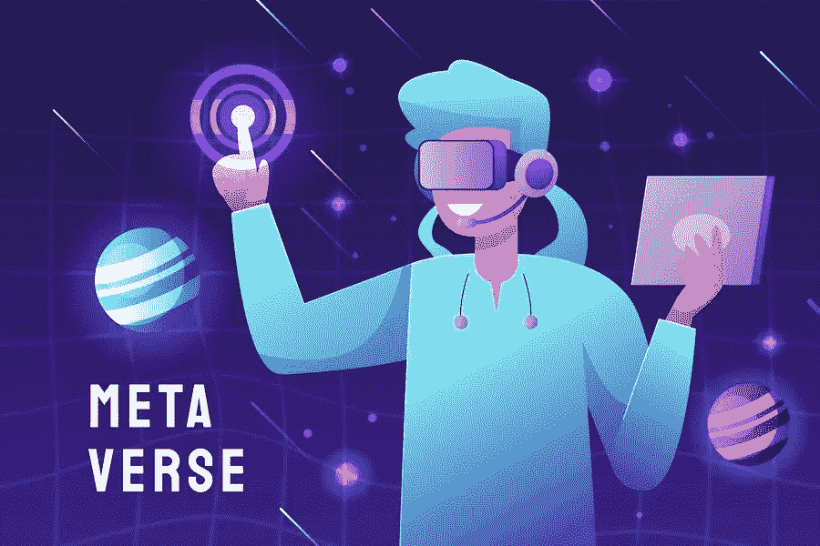
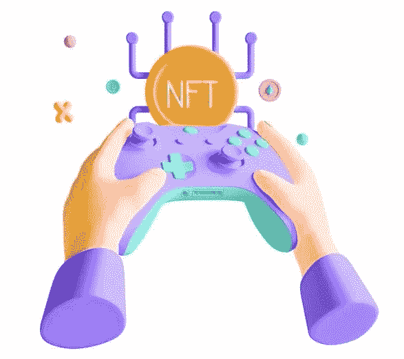

# 游戏的未来与元宇宙的力量！

> 原文：<https://medium.com/geekculture/the-future-of-gaming-with-the-power-of-metaverse-201c8c35c012?source=collection_archive---------17----------------------->

游戏不再仅仅是一个娱乐产业。区块链加入游戏行业使得游戏平台不仅仅是随机的视频游戏，而是一个提供赚钱机会的平台。这一切之所以成为可能，要归功于区块链技术，它将 NFTs 带入了我们玩的传统视频游戏中。NFT 游戏平台正逐渐为元宇宙腾出空间，这被预测为科技史上的下一件大事。游戏的发展从一开始就非常迷人，因为这是一个对任何技术变革都开放的行业。

这一次，游戏行业对 NFTs 和区块链有点太认真了，并带来了一系列新的游戏来赢得 NFT 游戏。因此，元宇宙的概念是加入俱乐部，带来未来的游戏！这里是你需要知道的关于元宇宙的一切，它将在不久的将来接管世界！

# **数字时代走向数字世界！**

> 自从数字概念出现以来，世界已经慢慢变得数字化。发生在屏幕上的数字革命几乎取代了纸和笔。数字这个词引起了人类的兴趣，我们现在正在创造一个数字化的世界。

我们在现实世界中拥有的一切，从埃菲尔铁塔到你所在街区拐角处的星巴克咖啡馆，都在元宇宙以数字方式成形。

所以如果你问元宇宙是怎么回事，它是一个数字世界，截至目前，你有许多游戏来体验这项新技术。尽管技术还处于起步阶段，但它已经在科技界引起了轰动。

你可能会问，既然你有现实世界的经验，为什么你需要一个数字世界，虚拟地体验一切。嗯，如果你开始了解这项新技术的应用，它会更有意义。

## **登陆元宇宙**

当脸书更名为 Meta 时，世界见证了新技术的到来。如果像脸书这样的公司正在认真研究这项技术，并为它改名，那么这项技术一定是巨大的。而这也是人们开始热切等待这项技术的原因。不仅仅是 Meta，微软、Nvidia、Roblox 和其他许多科技巨头都在制造元宇宙。

我们总是梦想进入我们玩的游戏，见证一切数字化。我们总是喜欢人们进入数字世界的电影。虽然所有这些都是虚构的，但元宇宙将虚拟世界真实地呈现给我们去体验。

回到为什么元宇宙会成为下一个大事件，他们提出的申请是一个重要的原因。

他们可以带来一种新的社交和娱乐方式。今天，你通过社交媒体平台、聊天和视频与世界各地的人交流。在你的 3D 虚拟形象中有了元宇宙，你可以虚拟地拜访人们，和他们共度时光。你可以玩游戏、购物、听音乐会等等。

你可以把元宇宙带到任何行业，从教育、房地产、娱乐、工作场所、游戏等等。今天，有许多游戏平台试图让人们一窥元宇宙。可以预见，元宇宙将把游戏带入下一个阶段。

## **使用 NFTs 进行游戏**

NFTs 一进入区块链，就给了人们拥有可交易的数字文件所有权的奢侈；玩家也可以给他们游戏道具。这催生了一系列新的支持 NFTs 的游戏平台。NFT 游戏平台不仅给了游戏玩家大量回卖他们的 NFT 物品的机会，还帮助他们获得了被动收入。这就产生了玩赚 NFT 游戏，该游戏使用区块链用于 NFT 游戏项目及其交易；它也给一些游戏带来了透明度和去中心化。虽然这些总部位于区块链的公司给了游戏玩家一种新的体验，但当加密市场走下坡路时，他们确实几乎被游戏玩家抛弃了。虽然有报告证明，在加密崩溃期间，对游戏 NFT 的需求和游戏 NFT 市场的流量从未下降，但这些游戏错过了玩家正在寻找的东西。这种缺失的元素就是游戏体验，而元宇宙正在填补这一空白！

## **元宇宙博彩业**

今天有许多游戏，像分散的土地，沙盒，地平线世界，等等，给你期待已久的元宇宙体验。虽然这些平台仍处于开发阶段，但它们在图形和速度方面得到了评论。到目前为止，这些平台都是图形和动画的初级水平，预计在未来几年内会有所提高。

这些游戏包括让玩家使用 VR 头戴设备虚拟体验游戏。这种新的游戏方式使得游戏玩家尝试这些平台。随着区块链成为带来元宇宙的强大技术之一，NFT 和加密货币通过它创造了一种元宇宙经济。

虽然 NFT 有助于在这个数字世界中拥有东西，但加密货币是这些数字资产的载体。像分散土地这样的元宇宙游戏现在是一个平台，玩家可以通过游戏中的加密令牌购买 NFT 土地。它们甚至可以在 NFT 博彩市场 的 [**再次出售。这些地块可以用来建造购物中心、剧院或任何建筑。你甚至可以在这个游戏里面建立一个游戏来增加游戏内的经济。**](https://www.jump.trade/)

## **展望**

简而言之，未来的元宇宙可以是一个虚拟游戏，人类可以在其中共存。NFT 游戏平台今天与元宇宙肯定是一个中心的吸引力，在游戏产业。除此之外，还有许多元宇宙平台在发展，留下了互操作性的问题。由于这项技术发展缓慢，这个问题还没有答案。然而，许多科技巨头和品牌都表示，元宇宙将在未来十年成为科技的未来，并将像我们今天拥有的互联网一样覆盖数十亿人！