# 谷歌硬件和软件设计的未来。

> 原文：<https://medium.com/geekculture/the-future-of-google-design-in-hardware-and-software-2c12f7090b99?source=collection_archive---------37----------------------->

谷歌最终成为了这两条战线上的挑战者了吗？

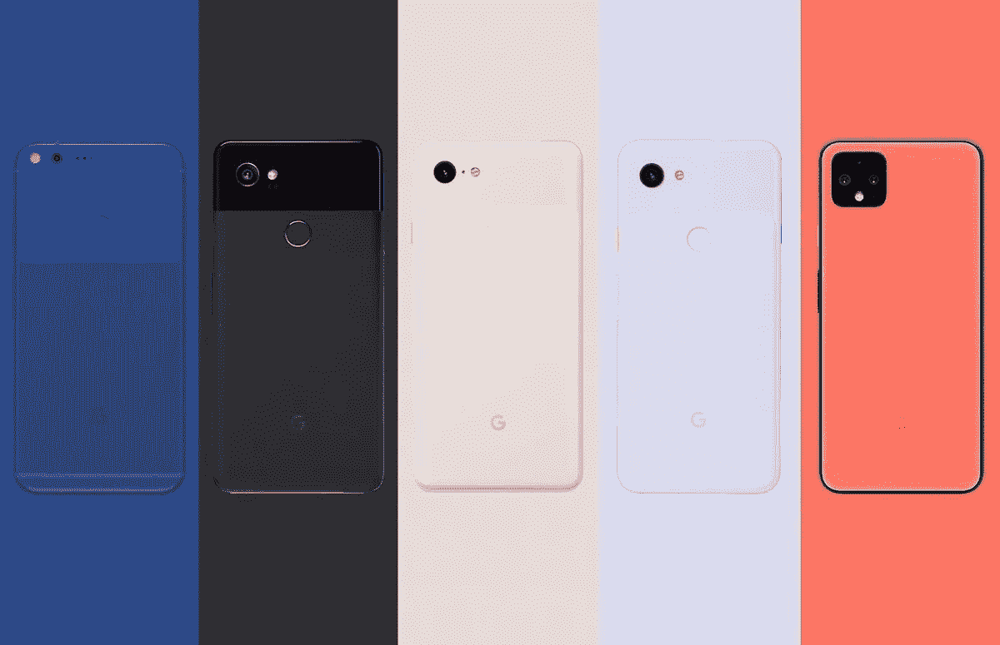

在过去的五年半时间里，我们看到谷歌试图在硬件方面挑战苹果和三星，同时在软件方面做了一些令人惊叹的事情，所以他们最终能联合起来，给用户一个不折不扣的设备。

谷歌已经是软件之王，Android 是世界上最受欢迎的移动操作系统，拥有 30 亿用户，但当他们在 2016 年以 Pixel 系列进入硬件业务时，他们这样做是为了向所有人展示 Android 应该是什么样子。

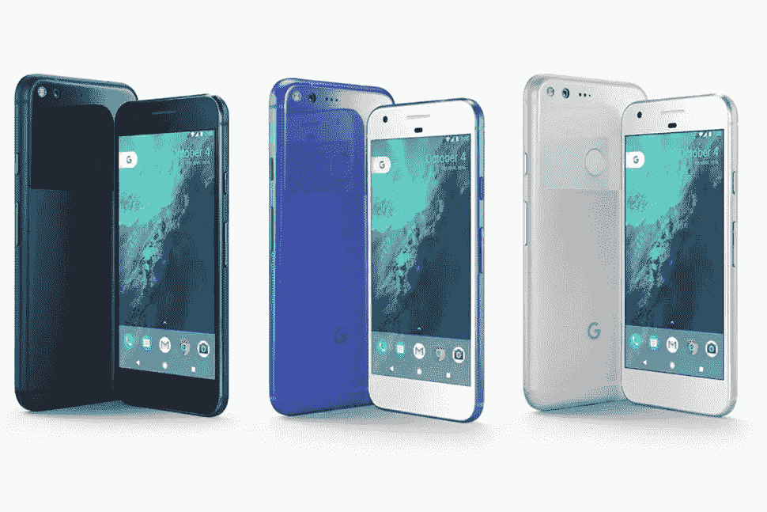

**Original Google Pixel line up.**

现在，我们正在接近今年秋天的第 6 个 Pixel，过去几周的一些惊人泄露确实使今年成为谷歌自最初的 Pixel 以来最重要的一年，他们在设计、硬件、智能手表和现在的相机方面都落后了。

在 Pixel 系列之前，Android 在许多设备上总是被视为落后或丑陋，因为三星、LG、HTC 或其他希望将他们的设计添加到软件中的公司的 UI 皮肤。对于那些对自己的选择感到满意的人来说，这很好，但对于谷歌来说，这意味着许多人不会看到他们对 Android 的真正愿景和设计，Nexus 系列是展示库存 Android 的一种方式，但这些产品从未卖得很好，实际上是由 HTC、三星和 LG 多年来与谷歌合作制造的开发设备，普通人甚至从未听说过它们。

快进到 2016 年，Pixel 的到来，现在我们有了一个由谷歌制造的真正的设备，并得到了他们的大力推广，这是一个非常棒的入门设备，因为它拥有出色的摄像头，这真的改变了智能手机上的摄像头游戏。在 Pixel 之前，苹果真的让相机方面的事情慢了下来，停滞不前，但仍然以普通的图片和像样的视频录制引领市场，Pixel 立即击败了它，直到 Pixel 4，苹果才最终在照片和视频录制方面领先。

Pixel 2、3 和 4 在发布时都缺乏硬件方面的东西，从肥大的边框、巨大的缺口、糟糕的电池，他们都面临着问题和设计缺陷。然而，Pixel 5 是一股新鲜空气，低成本，简洁的基本设计，出色的电池，漂亮的显示屏和摄像头，但它不是一些人想要的高端设备。

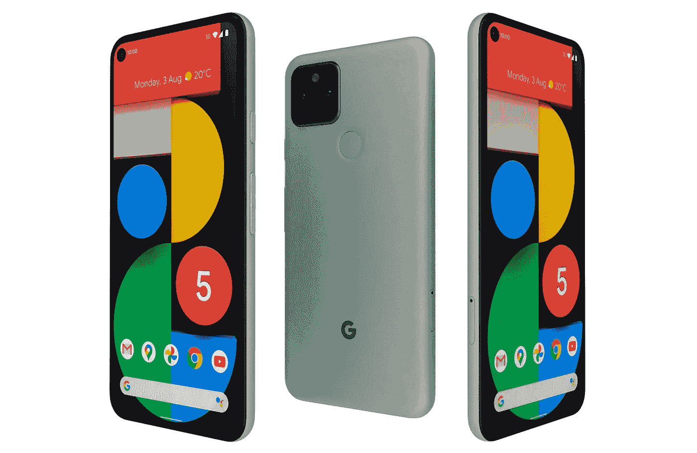

**Google Pixel 5**

Pixel 5 对谷歌来说是一个有趣的设备，它配备了一个中端芯片，而不是通常的高端 snapdragon，这是谷歌的一个过渡年，因为他们正在进行的工作以及 2021 年将会出现的东西和 Pixel 6 系列。

**谷歌像素 6。**

白教堂不仅是伦敦著名的开膛手杰克出没的地方，它也是将出现在 Pixel 6 中的谷歌自己的硅芯片的代号，这使得 Pixel 6 成为第一个由谷歌制造、设计和完全属于谷歌的设备。

Android 12 和 Google silicon 肯定会成为该系列的游戏改变者，我们已经在 Pixel 系列上有了如丝般平滑的软件，但想象一下软件和硬件专为协同工作而构建，就像 iPhone 上的 iOS 和 Apple silicon 一样！

对于谷歌来说，这是一个黄金机会，通过让同一组设计师和开发人员制作芯片和软件，让 Android 获得与 iOS 前所未有的平等地位，它不必是一个发电站，但它需要足够流畅和快速，让你感觉这是一个自然的过渡。

再见，高通。

接下来是设计，我们有一些乔恩·普罗瑟最近泄露的令人印象深刻的渲染，我不得不说，这真的很令人震惊，但在一个好的方面，谷歌终于真正提升了他们的游戏。

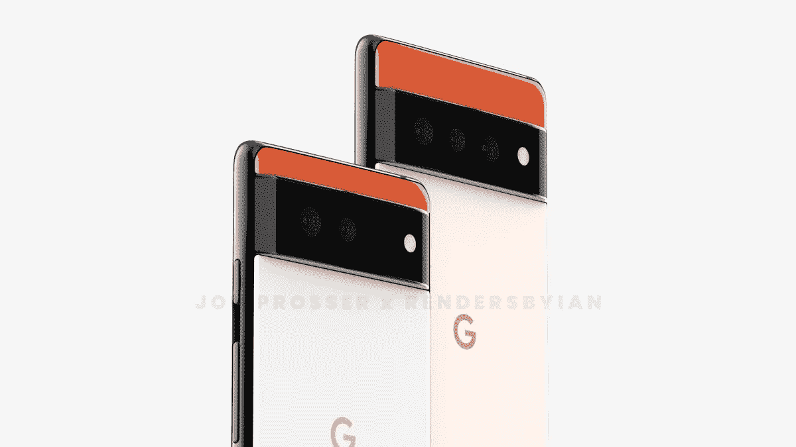

**Google Pixel 6 and 6 Pro.** | By [Jon Prosser](https://twitter.com/jon_prosser?ref_src=twsrc%5Egoogle%7Ctwcamp%5Eserp%7Ctwgr%5Eauthor)

新的更大的摄像头布局和高级外观可能意味着照片和视频的改进，其设计旨在像一件珠宝一样脱颖而出，我们知道标准的 Pixel 6 将有两个摄像头，Pixel 6“Pro”现在被称为将有三个镜头。

与 iPhone 不同，弯曲的边框留在了 Pixel 设备上，这对于更舒适的握持来说可能是一件好事。visor 相机的设置非常引人注目，非常突出，“G”标志现在居中并自豪地显示出来，两种色调的背面也为那些喜爱著名的熊猫 Pixel 2 XL 的人提供。

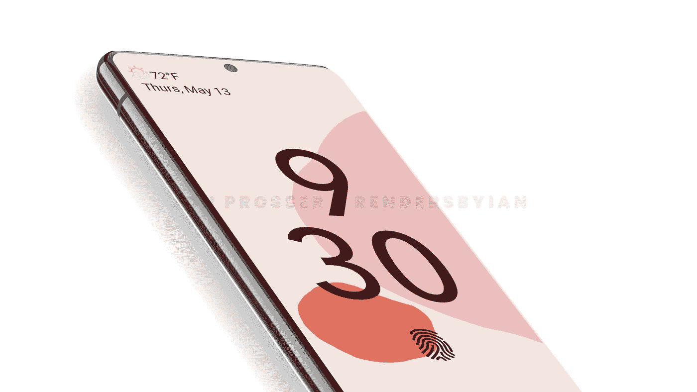

**Google Pixel 6 render** | By [Jon Prosser](https://twitter.com/jon_prosser?ref_src=twsrc%5Egoogle%7Ctwcamp%5Eserp%7Ctwgr%5Eauthor)

显示器将与中心打孔相机边对边，显示指纹读取器，并有望在两个型号上显示 1444p 显示器。

这些泄露给我的信息表明，谷歌的硬件正在朝着一个新的方向发展，一个更时尚、更工业化和更圆滑的外观，而不是他们过去几年使用的有趣、多彩和充满泡沫的设计。如果这些像素的规格和材料与我们预期的一样高，我们应该预计这些像素的价格会比去年的 Pixel 5 高一点，但谷歌仍将为低成本设备提供 Pixel A 系列，这将使每个人都可以使用令人惊叹的 Android 12。

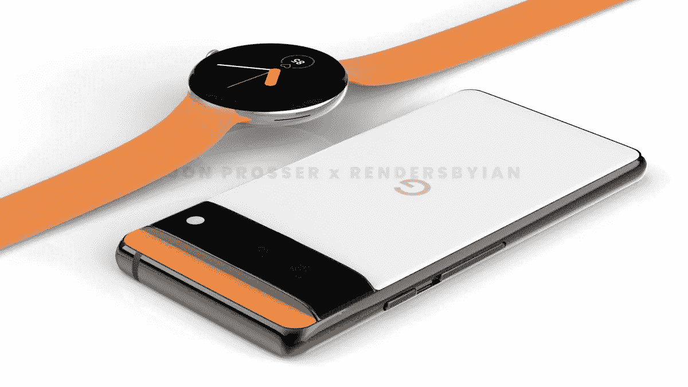

**Google Pixel 6 render** | By [Jon Prosser](https://twitter.com/jon_prosser?ref_src=twsrc%5Egoogle%7Ctwcamp%5Eserp%7Ctwgr%5Eauthor)

我马上会谈到 Android 12，但在此之前，我们还有一些来自谷歌的硬件，接下来是一些已经酝酿多年的东西。

**谷歌像素手表。**

Pixel Watch 已经传言多年，我们知道 LG 正在与 Pixel Watch 合作，但在 2016 年被取消。

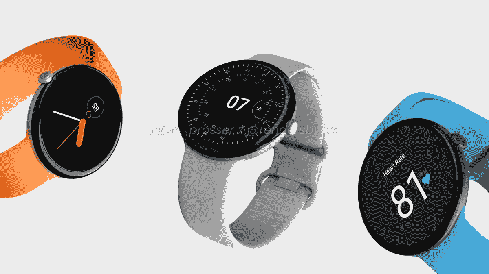

**Google Pixel Watch render** | By [Jon Prosser](https://twitter.com/jon_prosser?ref_src=twsrc%5Egoogle%7Ctwcamp%5Eserp%7Ctwgr%5Eauthor)

但现在它又回来了——据泄密者[乔恩·普罗瑟](https://twitter.com/jon_prosser?ref_src=twsrc%5Egoogle%7Ctwcamp%5Eserp%7Ctwgr%5Eauthor)称，它的官方名称是谷歌像素手表。

普罗瑟保证，手表、表带和表盘的设计在他提供的图片中得到了忠实的复制，我个人认为这看起来很棒。

如果他们做得对，这可能是设计最好的智能手表，看起来很棒，**如果**它有一个很棒的扬声器，触觉，NFC 和良好的电池，那么它将是 Android 用户的完美选择。

**Wear OS 3 was announced at Google I/O.**

WearOS 今年在 I/O 大会上受到了极大的欢迎，它进行了用户界面翻新，并与三星合作将 Tizen 整合到 WearOS 中，谷歌刚刚为 WearOS 发布了 Gboard，并更新了 Youtube 音乐、Google Pay、地图等应用程序，以及一个用于健康跟踪和锻炼的新 Fitbit 应用程序。

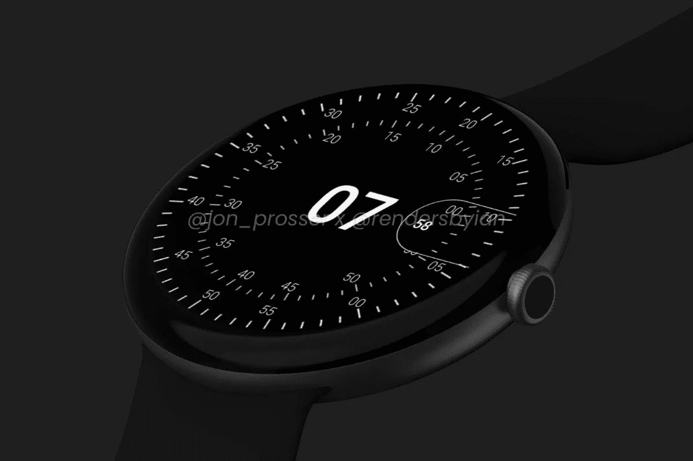

**Google Pixel Watch render** | By [Jon Prosser](https://twitter.com/jon_prosser?ref_src=twsrc%5Egoogle%7Ctwcamp%5Eserp%7Ctwgr%5Eauthor)

我们也不应该忘记，谷歌拥有 Fitbit，并从他们那里获得了大量的健康功能，他们肯定会将这些功能添加到 Pixel 手表中，预计将同时推出 20 种不同的表带，手表应该有银色或黑色铝框，但不知道它们是否会有不同的尺寸。

从手表的设计来看，这似乎延续了他们的硬件设计语言，这种语言随着 Pixel 6、Pixel Watch、Pixel Buds 和 PixelBook Go 的出现而开始成形，所有这些产品都具有智能、平滑和时尚的外观，带有一丝 20 世纪 20 年代的装饰艺术风格。

因此，我们有了令人惊叹的新硬件，与三星合作的新 Wear 操作系统和这一新设计，还剩下什么？

**哦，安卓 12 怎么样。**

如果设备的外观和感觉都很好，软件必须要符合任务，Android 11 是 2020 年的一个小更新，老实说，我觉得它有点冷，过时和繁忙。现在谷歌 I/O 已经结束，我们已经看到了 Android 和 Pixel 用户的未来，以及他们对今年秋天的期待。

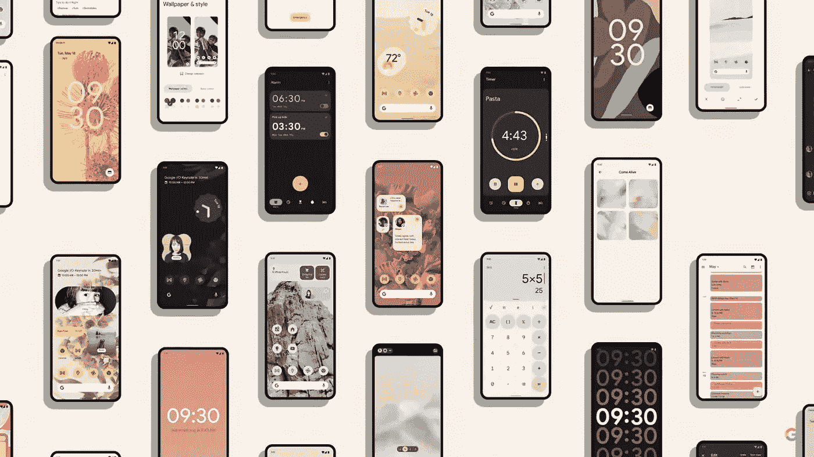

**Android 12**

Android 12 从上到下进行了彻底的重新设计，使用了 Material You，这是一个更个性化的用户界面，可以随着壁纸的变化而变化，给人一种更吸引人和温暖的感觉。

现在有了曲线，更多的定制，非常需要改进的部件和一些可爱的独特设计选择，我个人喜欢部件，动画和锁屏的外观。

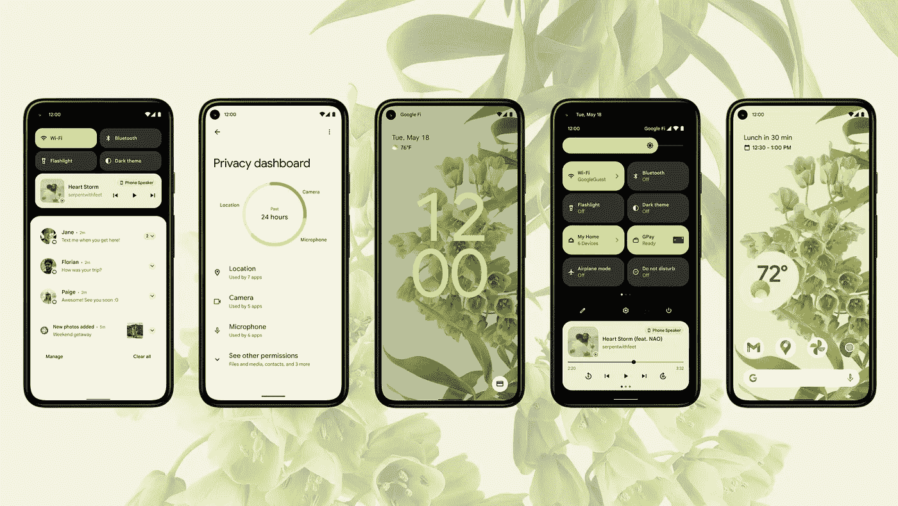

**Different sides of Android 12.**

作为一个使用 iOS 的人来说，小触摸非常受欢迎，我觉得微妙的动画是一种不错的触摸，对于你手中冰冷的金属来说更友好。

我发现谷歌的一些设计非常大胆，不像我在移动设备上看到的任何东西，它感觉非常受欢迎和用户友好，可能会吸引那些对以前的 Android 外观不感兴趣的 iOS 用户。

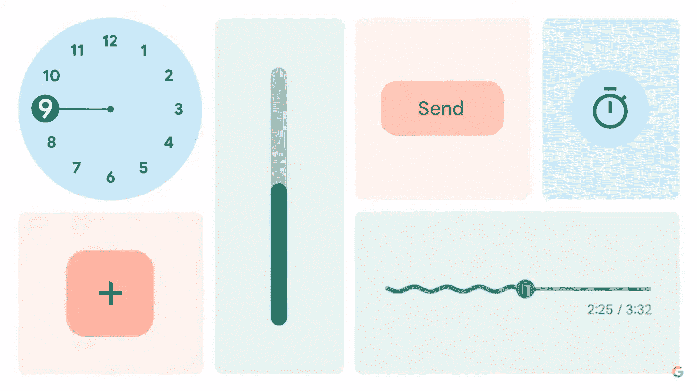

**Some nice design choices within Android 12.**

圆形边缘与新的 Pixel 6 和 Pixel watch 的圆形相匹配，有点同步，给你一种真正的欢迎体验。

那还剩下什么？

谷歌生态系统正在增长，随着 Android 12 的推出，它看起来真正独特和特别，老实说，我以前从未在 Android 上看到过这种东西。随着 iOS 7 的推出，苹果用其干净友好的设计铺平了道路，但它从未改变，近年来变得陈旧，所以谷歌需要从中吸取教训，继续建立在这一新设计上，目前这是最好看的移动操作系统，我迫不及待地想在今年秋天的 Pixel 6 上试用它。

当然，WWDC 将于 6 月 7 日开始，我们也可能会对 iOS 进行大规模的用户界面改革，但我对此表示怀疑，我只是不认为苹果公司有那么大胆，在过去的 8 年里，他们一直安全地进行较小的用户界面更新。

Pixel 系列和 Android 12 是谷歌设计的未来，坦率地说，这非常大胆和令人兴奋。

对于谷歌的软件和硬件来说，这将是重要的一年。