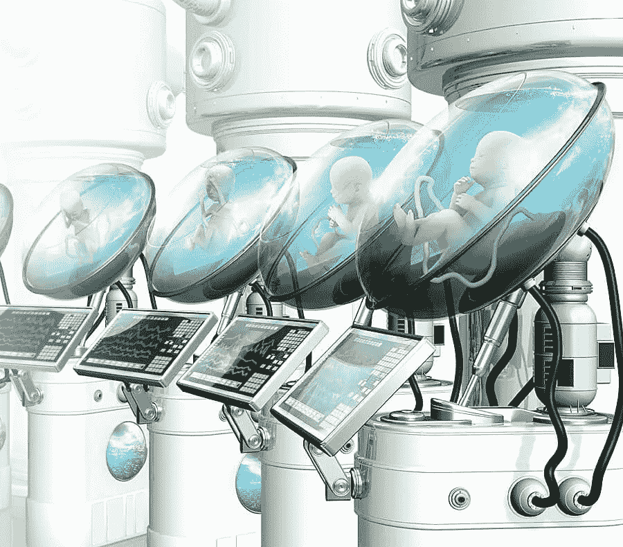

# 人类的未来是没有母亲的婴儿

> 原文：<https://medium.com/geekculture/the-future-of-humanity-is-motherless-babies-785246315965?source=collection_archive---------10----------------------->

## 人工子宫世界的一瞥

Depiction of future artificial wombs (Source: [Genetic Literacy Project](https://geneticliteracyproject.org/2018/10/12/are-we-ready-for-the-artificial-womb/))

人造子宫是多年来只在科幻电影中看到的东西，但不知道我们生活在一个旧科幻电影中出现的许多技术今天都可以使用的世界。科学家们已经研究人造子宫很多年了，而且理由很充分。每一年…