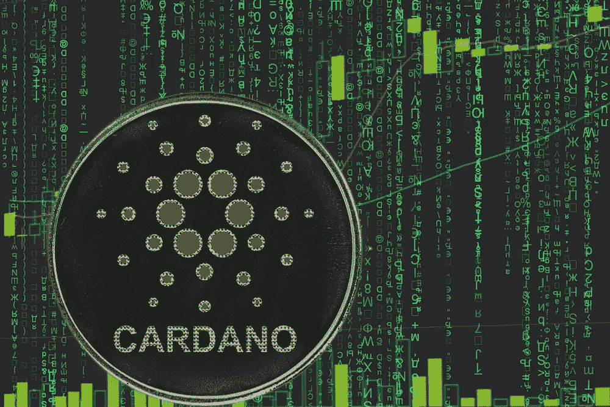

# 卡尔达诺上 NFTs 的未来

> 原文：<https://medium.com/geekculture/the-future-of-nfts-on-cardano-bc0f0c35f542?source=collection_archive---------12----------------------->

Courtesy of [depositphotos.com](https://depositphotos.com/)

*这项研究由*[*plot eror*](https://plotaverse.com/#!/?tab=loops&search-category=members&profile=Portfolios&preview=Comments)*赞助，这是一个创新的 NFT 创作套件，提供一套 iOS 移动、桌面和网络应用程序，帮助艺术家在运动艺术领域进行创作。*

## 卡尔达诺

Cardano 是一个区块链平台，使用比比特币更低能耗的方法来维护其计算机网络。它不需要任何特殊的电脑，只需要一台台式机…