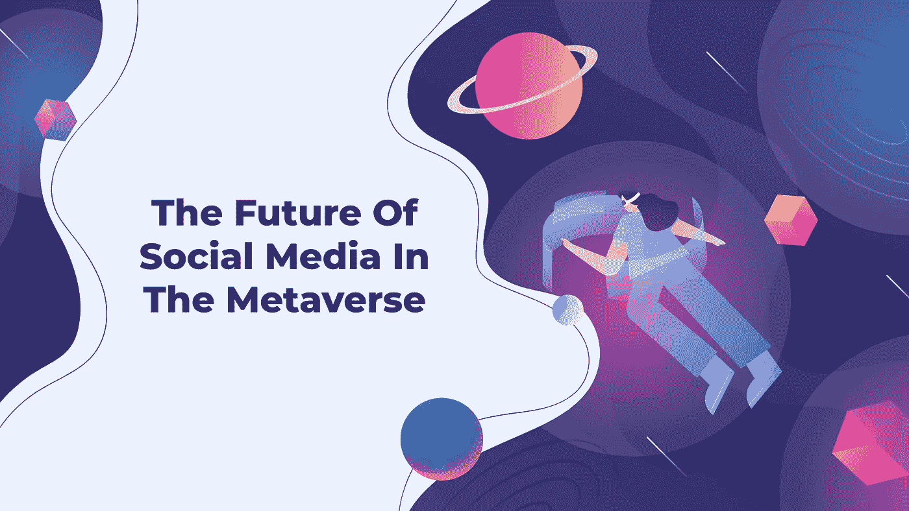

# 元宇宙社交媒体的未来

> 原文：<https://medium.com/geekculture/the-future-of-social-media-in-the-metaverse-137947d3ebb7?source=collection_archive---------12----------------------->

元宇宙正引领互联网进入一个新时代。然而，元宇宙的概念以前已经提出过了。这个概念是由小说家尼尔·斯蒂芬森提出的，他在 1992 年的小说《冰雪奇缘》中首次使用了“元宇宙”这个词。这个故事解释了个人如何利用虚拟化身在周围环境和 3d 模型中见面。今天，元宇宙为营销人员、投资者和其他人创造了新的机会、危险和问题。

脸书更名为 Meta 标志着该公司从一个社交媒体巨头转变为一个多元化的公司。Meta 表示，它将继续在元宇宙实现其主要目标。简单来说，社交媒体中的 Meta 正在建立一个支持 VR 的社交网络。这对社交媒体行业意味着什么？这是否意味着目前在元宇宙蓬勃发展的社交媒体网站有新的潜力？还是会有新的玩家可以建立一个小说，元宇宙社交媒体？

这篇文章提供了一个完整的指南来解释元宇宙及其对社交媒体的影响。

# **元宇宙——什么事？**

元宇宙是数字和物理现实的混合体。它物理上耐用，并提供更多身临其境的体验。它使孤立的活动得以进行(如购买数字土地、构建虚拟家园或参与虚拟社会体验)。这些活动最终将在元宇宙进行。因此，它与设备无关，不受单个制造商的控制。这是一个不依赖任何商家的虚拟经济。

元宇宙就是现在的互联网，但是是三维的、沉浸式的、体验式的。它将增强现实与虚拟世界相结合。这意味着互联网用户将能够在二维屏幕上观看内容，并使用 VR(虚拟现实)耳机体验三维内容。例如，用户可以在自己家中舒适地在虚拟购物中心购物，购买古驰和阿迪达斯等品牌的商品。

用户还可以参加像元宇宙时装周这样的活动，并选择建造房屋出租或创建电子商务业务。用户可以使用可替代和不可替代的令牌(NFT)在这些虚拟世界中买卖对象，所有交易都记录在区块链上。这可以通过发展他们自己的 NFT 市场来实现。通常，元宇宙统治着整个密码世界。因此，可以开发元宇宙 NFT 市场来推出其数字资产。

元宇宙是几种趋势和技术的集合体。其中包括用于元宇宙开发的技术。

*   虚拟现实
*   AR 云
*   增强现实
*   物联网
*   人工智能
*   加密货币
*   空间技术
*   区块链
*   不可替换的令牌(NFT)
*   头盔显示器(HMD)

目前有四个主要的元宇宙世界:

*   沙箱
*   Somnium
*   分散土地
*   隐体素

然而，新的元诗句在不断发展，既带来了可能性，也带来了风险。分散的土地大约有 300，000 月活跃用户，而沙盒有 500，000 月活跃用户。两者都吸引了大量的资金流入和关注。

# **让我们看看元宇宙是如何工作的**

根据建筑结构，元宇宙有七层。这些是:

*   **体验**——元宇宙将为我们提供现在无法拥有的三维(3D)和二维(2D)体验。
*   **发现—** 传入和传出发现机制在元上都可用。入站发现发生在人们寻找真实信息时，但出站发现发生在消息被发送给人们时，无论他们是否请求这些消息。
*   **创造者经济—** 以前，在互联网上开发和构建工具需要编程技能。另一方面，Web 应用程序可能是在没有任何编程技能的情况下使用 Meta 生成的。
*   **空间计算—** 空间计算集成了 AR 和 VR，用户可以利用 Instagram 上的人脸滤镜进行空间计算。
*   **去中心化—** 去中心化的元宇宙提供了一个至关重要的特性:所有的资产和用户活动都在区块链被记录，允许用户在元宇宙构建和货币化头像。
*   **人机界面—** 通过查看现实世界，用户可以了解他们的周围环境，开发地图，甚至分享 AR 体验。空间计算、人机界面和增强现实的结合使得地图的接收和使用成为可能
*   **基础设施—** 技术基础设施，包括 5G 网络，是帮助最大限度减少拥塞和提高带宽的附加层的存在所必需的。

# **元宇宙和社交媒体**

元宇宙将使社交媒体更具沉浸感。在过去的二十年里，社交媒体已经成为一个主导问题。它使个人能够以电子方式进行互动、交易和分享他们的兴趣，而不必旅行。流行的平台吸引了数十亿人，模糊了视频分享、博客、短信和论坛之间的界限。许多社交媒体公司围绕其主要活动建立了庞大的服务和产品网络。今天，社交媒体组织被迫重新考虑他们的战略，以便将自己与竞争对手区分开来。由于越来越多的人了解数据隐私、侵入式营销，以及对元宇宙等创新概念越来越感兴趣，公司也在遭受用户增长延迟的影响。

元宇宙是社交媒体的延伸。它将把沉浸感带入等式中，并为客户提供新的体验。元宇宙将结合许多常见的社交媒体组件，如协作、商务、现场活动以及基于虚拟和增强现实(AR)的沉浸式体验。

然而，这将需要一些时间，因为元宇宙仍然主要是概念性的，其底层技术还处于早期发展阶段。监管机构将积极监控元宇宙的增长，以识别用户及其信息可能面临的风险。

此外，规则将是元宇宙的一个主要问题，因为社交媒体受到营销、虚假信息、在线破坏、数据隐私问题和模仿体验的困扰。元宇宙平台在收集用户的生物特征和其他个人数据时，预计会遇到类似的问题。

# **元宇宙对于社交媒体的优势**

元宇宙有潜力为社交媒体公司带来丰厚的利润。这将使他们扩大用户群，特别是在世代标签中，定义为 1991 年至 2005 年间出生的所有人。这一类人包括数字原住民，他们重视与他们的身体身份相匹配的数字存在。此外，他们还渴望参与新的技术和服务，以扩展他们的在线活动。许多社交媒体组织，从视频分享到在线约会，正在进入元宇宙，以满足一代标签的需求。为了吸引这一人群，包括时尚(如耐克、古驰)、银行(如摩根大通、汇丰银行)和科技(如埃森哲)在内的许多行业的企业都在元宇宙抢占了先机。尽管许多公司仍在寻找如何为这一人群提供最佳体验的方法，但开始与社交媒体平台合作至关重要。这表明，元宇宙可以用来发展社交媒体，同时也为消费者和公司收购创造新的前景。

另一方面，元宇宙是一个虚拟的共享场所，融合了所有虚拟世界、互联网和增强现实。用户将通过使用他们的元宇宙头像加入并参与元宇宙。这将改变社交媒体营销环境。广告商将通过客户的在线形象和虚拟环境来锁定客户。交互式 3d 模型和创新策略将彻底改变产品营销。蓝月亮就是一个突出的例子。这是第一个全球性的合作元宇宙 NFT 市场。它将 VR/AR 的所有组件整合到自己的元宇宙中，并使用社交媒体来增强生产者和消费者的能力。Bluemoon 使用户能够构建定制的虚拟现实位置，在那里他们可以以新的方式展示他们的产品或品牌。

虚拟搜索在元宇宙是一个至关重要的想法，允许用户通过关注虚拟位置的单个对象来搜索东西。社交媒体营销人员将有一个新的机会，为有需要的人提供更好的产品。

同样，公司将受益于使用 Snapchat 的 3D 头像工具创建 3D 头像。用户可以用独一无二的服装和配饰来个性化他们的元宇宙头像，虚拟杂志将展示穿着独一无二套装的著名头像。

社交媒体营销人员可以使用增强现实来创建内容。他们可能与生产商和名人合作，为他们的产品做广告。

# 元宇宙会取代社交媒体吗？

如果你能改变你的视角，去理解元宇宙的新团体是如何接管社交媒体的，这将会有所帮助。元宇宙是关于互动的，而社交媒体是关于社交媒体的。许多原本被视为游戏室的网站正迅速成为社交网站。Roblox 和堡垒之夜是最受欢迎的，但还有许多其他的。

元宇宙仍有特定的社交媒体网站。它们为利用元宇宙的优势和开发新应用提供了一种独特的方法。重力就是这样一个平台。该网站的主要原则是用户授权，它是第一个进入元宇宙的社交媒体平台。Gravity 允许用户控制他们的新闻源，并为他们使用该网站支付加密货币代币。重力最终是一个 SocialFi 项目。对于元宇宙社交媒体公司来说，这可能是最具变革性的一个词，标志着从中央集权制的转变。它开创了一个时代，在这个时代，消费者控制他们的数据，企业受益，忠诚得到回报。这是通过一个结合了 NFT 合约、金融服务、区块链和社交网络的链接网络实现的。

虽然很难预测元宇宙何时会完全取代社交媒体网络，但它肯定会释放出前所未有的商业和社会优势。

# **总结**

元宇宙将会产生重大的社会影响。它将使品牌和企业能够探索新的想法，释放创造力。虽然它可能是现有社交媒体平台的更新，但元宇宙最终将改变地球。将会有新的技术和创新利用元宇宙潜在的行为转变。社交媒体将从二维过渡到三维，在线连接将变得更加身临其境，让我们能够以全新的方式联系世界各地的家人和朋友。

到目前为止，元宇宙和元宇宙发展的重要性被详细描述。由于元宇宙无疑正在增长，现在创建一个[元宇宙 NFT 市场](https://www.clarisco.com/metaverse-nft-marketplace-development)将会更有效地买卖或交易你的数字资产。此外，还有许多[元宇宙发展公司](https://www.clarisco.com/metaverse-development-company)遍布世界各地，并提供元宇宙相关服务。因此，抓住这个千载难逢的机会，享受虚拟时代吧！！！