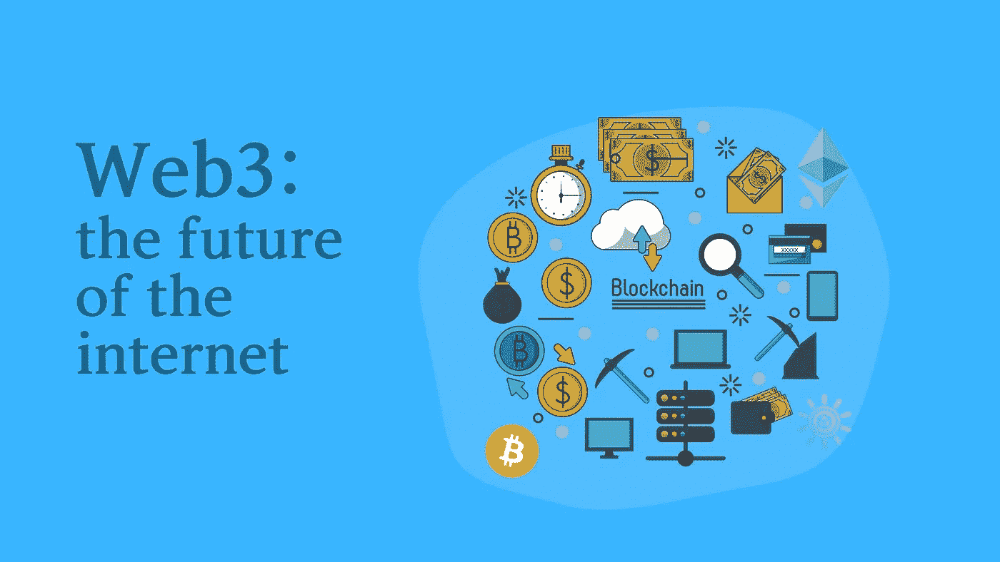

# 互联网的未来:Web3 和为什么开发者应该学习它

> 原文：<https://medium.com/geekculture/the-future-of-the-internet-web3-and-why-developers-should-learn-it-7cdb565b3938?source=collection_archive---------0----------------------->

## 对 web3 的介绍，以及为什么它正在改变世界

Image by the author

我们现在使用的互联网和十年前大不相同了！互联网的发展已经融入了我们日常生活的许多方面。从工作到学校，个人生活等等，我们几乎都在使用互联网…