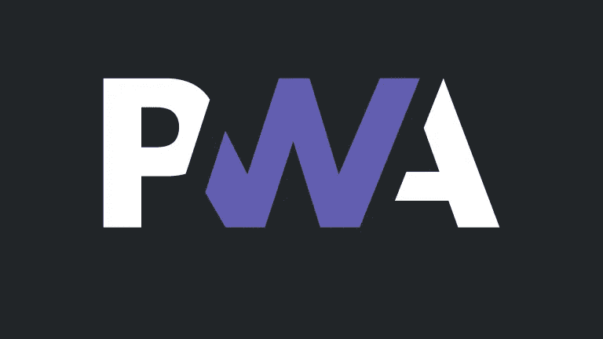

# 网络的未来，渐进式网络应用

> 原文：<https://medium.com/geekculture/the-future-of-web-progressive-web-application-5f5743899195?source=collection_archive---------28----------------------->

你知道吗，万维网上有超过 20 亿个网站，但是只有不到 4 亿个网站是活跃的 T2 网站。出乎意料的是**有 1180 万**个网站在谷歌搜索引擎结果页面中排名靠前。

事实上，几乎所有这 1180 万个网站都使用了最佳搜索引擎优化(SEO)策略，保护了 4 亿个网站。重要的搜索引擎优化技术包括

1.  改进的 UX/用户界面
2.  网站上使用的关键字
3.  响应式网页设计
4.  来自专业网站/博客的反向链接
5.  内容管理
6.  元标签

如果这 6 个专业的元素可以带领一个网站进入 SERP，但是这是我们为我们的客户提供最好的用户界面所做的一切吗？这是我们为我们的网站吸引新客户所做的一切吗？可能不是，我们必须改善移动第一体验，提高页面速度，使其离线工作**，**简而言之给我们的网站注入强大的维生素。

是的，一旦我们将我们的传统网站转换为渐进式网络应用程序，我们的网站就可以直接安装到任何 Android 设备上，我们还可以在我们的网站上使用 Web 推送通知功能，这可以成为吸引潜在客户的最大好处。

渐进式网络应用程序做得比预期的多得多，这些是一些拥有 PWA 的顶级公司

1.  星巴克
2.  进行我的旅行
3.  优步
4.  推特
5.  油管
6.  Spotify

现在，让我们更深入地研究这个问题。

正如我在标题中提到的，火这个词释放了它的解释—

F —快速

I —整合

R —可靠

电子商务

**快速—**

几乎 53%的用户放弃了我们的网站，如果我们的网站加载超过 4 秒，这对一个有着惊人 UI 但需要时间加载的网站来说是毁灭性的，我们会失败。

在这里，我们必须专注于网站的速度，尽可能使其容易呈现功能和元素，显示图像，以及所有相关的东西。

**整合—**

在这里，从某种意义上来说，用户甚至不应该考虑他们在网络上的事实，他们必须像其他移动应用程序一样感受我们的网络应用程序。试图让用户保持流动，让他自由地使用我们的应用程序。

将你的应用程序整合到我们的网站中，让他们感觉安全可靠。

**可靠—**

当用户网速慢或没有网络连接时，他们不会费心去尝试浏览一个 web 应用程序，我们需要改变这种看法。网络应用程序必须在没有网络连接时加载。用户期望加载，这在用户和 web 应用之间产生了可靠性。

**啮合—**

内容管理，客户评论和反馈，吸引人的图片让我们的潜在网站访问者参与网站。他们在网站上花的时间越多，就越有可能将访问者转化为顾客。

我们必须继续在我们的网站上写吸引人的内容，这对今天的互联网世界至关重要。

最后，我们将看看 PWA 的重要好处

1.  吸引移动用户
2.  在没有网络连接的情况下工作
3.  便宜得多，易于安装
4.  快的
5.  可安装在 Android 设备上
6.  组件的快速渲染

看看[投资组合网站](http://thewebdev.in)，它拥有所有的能力和权力，因此是一个 PWA。

谢谢大家！