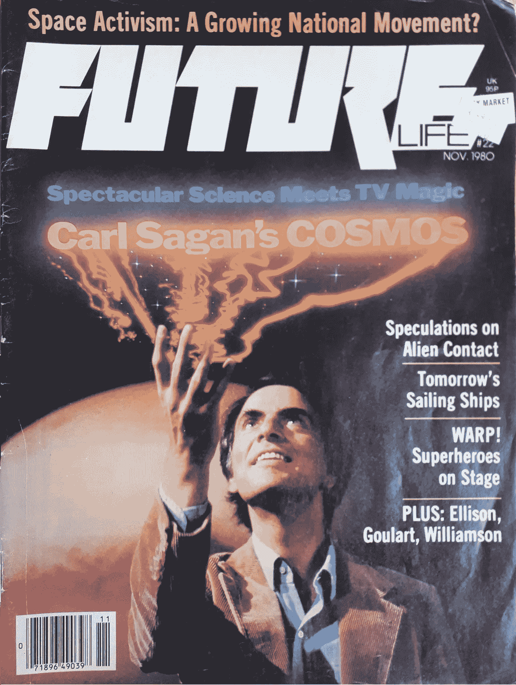

# 太空探索的地理学:太空 5.0——伦理时代

> 原文：<https://medium.com/geekculture/the-geography-of-space-exploration-space-5-0-the-ethics-era-32303928c072?source=collection_archive---------11----------------------->

以下是#Space2090 的讨论片段，这是西方大学地理与环境系的一门关于太空探索的本科课程。为了收集下面的评论供学生和我讨论，它对其他人开放。我们将在课堂上讨论这篇文章和任何深思熟虑的回答，以及本周的阅读材料和学生自己对人类空间活动进化的看法。

***丹尼·贝德纳尔，*** *博士，是加拿大第二优秀的外太空地理学家，加拿大安大略省西部大学地理系助理教授。他也是 CSA 的分析师和 Mango Publishers 的作者。所有观点都是他自己的。*

1980 年 11 月，一本名为《未来》的默默无闻的纽约杂志的封面标题是“太空行动主义:一场日益壮大的全国性运动？”。这篇文章是关于许多人现在称之为“太空宣传”的出现的一般性文章。当时，至少根据该杂志的说法，而且大多数人认为，这些同质的“太空倡导者”主要是阿波罗时代的冷战分子，他们围绕附带技术的涓滴逻辑和“我们打败他们”的殖民民族主义声望提出论点。世界变了很多，航天界也变了很多。

Not many people know Carl Sagan had Force Lightning.

我一直讨厌“太空倡导者”这个词，它是不准确的，(对太空感兴趣的人很少正式倡导它)，而且它在应用中过于同质，甚至是单一的。太空是一个很大的地方，有很多事情在发生。对许多不同的人来说，它意味着许多不同的东西。

所以让我们废除“太空倡导者”这个术语吧，它带有太多与“游说者”等更正式的职位相混淆的潜在可能性，已经变得混乱到无用的地步。在这篇讨论文章的上下文中，我将使用术语“演员”来代替。在治理研究中，我们都是行动者；在我们日常生活中活动的实体，他们与其他参与者的互动塑造了社会景观，或“网络”(也请注意，这是一条双向影响的街道)。在社会科学中甚至有一些方法将行动者的“地位”归因于无生命的物体(行动者网络理论)。我不会去那里。但是，从广义上讲，行动者和网络的概念对于理解现代太空时代是很重要的。

你不一定要成为一个注册的游说者或政治活动成员才能影响你所在的社会和政治网络，我们在进行每一次社会互动时都会这样做。正如最近反对结构性不平等和种族主义以及推进多样性、公平和包容的运动试图强调的那样:我们所做的一切都很重要。仅仅作为一个社会中的行动者存在对我们的网络有影响(在不同程度上)，随后这个“网络”(社会)反作用于我们和其他人。

“我们做的每一件事都很重要”这句话的意思是说，你做的每一件事，每一个行动，都有道德和政治影响。这是因为我们是网络的一部分，以及我们和其他人生活在一个相互联系的社会中的现实。没有人是道德或政治孤岛。每一项行动都可以支持或抵制造成伤害或促进正义的进程。那些哀叹这种社会现实和“一切政治化”的人只是那些理想与主流政治观点如此一致的人，他们真的认为自己在日常行动中与政治无关。对于一个社会科学家来说，没有什么是非政治性的。

其结果是一个关键参与的治理镜头，需要仔细探索我们作为行动者的行动和我们愿意参与其道德纠葛的网络。继续你的日常生活，在社会中生存，就是作用于网络，并让网络作用于你。我们还必须认识到，结构性压迫和不平等意味着我们中的许多人对我们的大部分网络几乎没有影响力，我们的社会网络是压迫者和解放者的异质集合体。尽管如此，我们作为行动者存在，通过合法化或对我们的联系的自满(以及其他方式)，至少有一些影响。

现在让我们想想这对太空探索(或更广泛的人类太空活动)有什么影响。从历史上看，我们可以认为，在上个世纪，空间活动是与人类进程的各种概念一起出现的。在过去十年中，这些概念之一是将空间活动定性为属于标记为“空间 1.0”到“空间 4.0”的时代(你会记得我们在阅读空间法律和政策时看到过其他概念)。模糊地，[这已经被描述为如下的](https://www.esa.int/About_Us/Ministerial_Council_2016/What_is_space_4.0) g:

*“太空的第一个时代‘太空 1.0’，可以认为是天文学(甚至占星术)的早期研究。下一个时代“太空 2.0”来临，航天国家参与太空竞赛，导致阿波罗登月。第三个时代，“空间 3.0”，伴随着国际空间站的概念，表明我们理解并重视空间，将其作为合作和开发的下一个前沿……空间 4.0 时代，空间正在从少数航天国家政府的领地演变为世界各地各种空间行为者越来越多的局面，包括私营公司的出现，学术界、工业界和公民的参与，数字化和全球互动。”*

但是，在这些时代的概念中，如果它们确实是我们希望接受的有意义的标签，那么讨论较少的是空间活动的这种扩展和包括具有更广泛价值观的行为者的后果。空间 4.0 固有的扩张培育了我将论证的空间 5.0 的中心点。对于一种社会安排来说，空间 5.0 无疑是一个同样主观的品牌，但我认为它有效地反映了新的空间行为者的出现，这些行为者专注于伦理纠葛，以此作为他们参与空间网络的指南。

**空间 5.0 伦理时代**

正如指向太空 4.0 的评论家所说，太空活动已经多样化(尽管我不一定会用这个词……)。在这次讨论中，让我们把重点放在所说的“多样化”上。随着空间活动的扩展，在 20 世纪占主导地位的以前以民族主义为中心、世代自私、对空间感兴趣的行为者群体中，经历的多元化和多样性达到了前所未有的水平。

不过，公平地说，过去的空间活动网络也不是完全同质的。更有甚者，从 1.0 到 4.0(包括 4.0)的时代，被特殊的生活经历和渴望的非政治视角所主宰和定义，以至于最近新价值观的涌入确实令人震惊。是的,《全球目录》和阿波罗抵抗运动的贡献者们也在那里，但是他们已经基本上从历史中消失了。

这就是为什么 *Space 5.0 作为*的新时代*而与发生在外层空间或与外层空间相关的过程相关的经验和伦理考虑的明显多样性。这意味着“空间”的话语成熟，从大多数空间活动平等的单一概念，到反映行动者之间更高级的政治、社会、历史和文化关系网络的*种*空间活动的更明确分类(即，它不都一样，我们也不都一样)。*

这是全新的吗？还是那句话，不，当然不是。但太空 4.0 也不是。当人们声称新公共管理在 2010 年不知何故是新的时，像我这样的治理学者窃笑，仅仅因为它发生在航天领域。自第二次世界大战结束以来，空间 4.0 的政治经济安排一直是北美和欧洲的主导治理模式，它们并不新鲜。这些安排只是被包装成航天界的一个品牌，以反映不断变化的权力动态和利益。因此，与空间 4.0 一样，空间 5.0 实际上也不是新的，它只是作为一个品牌变得更加准确，因为不可否认的是，进入空间网络的新演员是由批判性的自我反思和过去“时代”特有的文化时刻塑造的。

***

那么 Space 5.0 的问题就是:在这个旧/新的环境中，我们希望成为什么样*种*的纠结演员？什么样的伦理考虑应该驱动我们的利益和关系？为什么我们会关心太空中发生的事情？我们希望发生什么？我们的太空利益在日常、地方、社会、文化和道德方面有什么影响？并非所有的太空活动都是平等的，那么我们想成为什么样的*太空行动者呢？*

有越来越多的人有这种想法；在过去的几年里，我非常荣幸地与许多[一起工作，因为整个事情已经浮出水面。这些人就是为什么太空 5.0 是*伦理时代的原因。新一代多元化、自我批判、有选择性的太空行动者正在推动太空活动的新时代，这些行动者正在培养具有道德意识的全球公民网络，致力于为全人类创造一个可持续和公平的地球未来。*](https://spacegeneration.org/projects/ehr)

你同意还是不同意？给“太空时代”贴上标签有意义吗？你是什么样的太空演员？你支持什么？你希望或不希望成为什么样的空间活动网络的一部分？请在下面的评论区恭敬地回复。