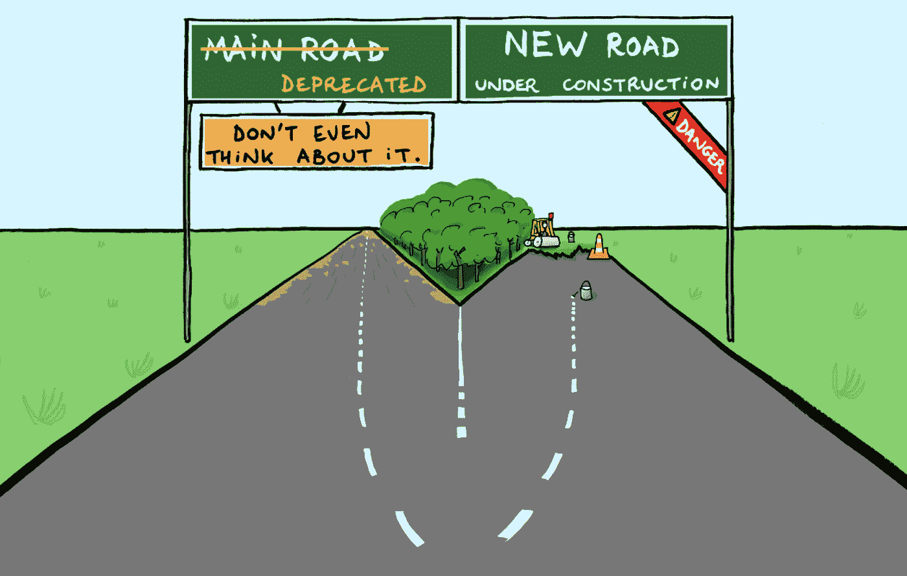

# 好的、坏的和丑陋的:看着我的代码十年来的演变

> 原文：<https://medium.com/geekculture/the-good-the-bad-and-the-ugly-watching-my-code-evolve-over-a-decade-af4ec0cce1af?source=collection_archive---------3----------------------->

## 在发展、维护和尝试淘汰我的产品中吸取的经验教训

在我在微软、亚马逊和谷歌的职业生涯中，我领导了许多新产品。自举一些东西，尤其是绿地，很酷也很刺激。你在开拓。你不可能被束缚住。你不会被别人在你之前写的一些旧的蹩脚代码困住。没有预先存在的客户，你可以用一个糟糕的推动意外打破。你写规则。很有活力。

进化旧的代码库听起来完全相反。然而我断言，当你从闪亮的对象转向更闪亮的对象时，你错过了作为软件工程师 走向成熟的 ***的一个重要部分:观察你在许多版本中编写的代码的演变。它是如何经受住时间的流逝的？几年后，你可以避免为自己做出的错误决定付出代价。新一代的初级工程师将进入团队，对你做出的每一个决定进行微观分析，并认为你是一个白痴，而不会考虑你是根据当时可用的数据做出这些选择的，有时，今天仍然有一个很好的理由认为架构是最好的。然而，我做的其他一些选择并不适合我，我不得不忍受它们很多年(并向同事们道歉)。你学会了谦逊。***

不得不*进化*一个已经存在的、成熟的软件需要一套完全不同的技能，而不是启动一个闪亮的东西。它不仅仅是“保持灯亮着”你开始看到小的选择随着时间的推移变得越来越大。您是否创建了*可扩展的*和*可持续的*流程？你可以看到技术债务是如何累积的。“软件工程”不仅仅是“写代码”接下来也是这样。

最后，如果你逗留的时间足够长，你会做一些令人心碎的事情:开始杀死你努力工作的成果。不得不抛开你的感受，客观地决定:是时候弃用这个东西了，它无法成长以适应新一代的需求。

我看着我构建的东西(TPSGenerator，[亚马逊的内部负载和性能测试平台](https://carloarg02.medium.com/how-i-grew-an-engineering-productivity-tool-to-impact-thousands-of-engineers-at-amazon-and-how-28a990091207))十年间从 100 行代码发展到 10 万行代码。它从我周末和晚上工作的一个宠物项目变成了亚马逊上千个服务每天使用的一个业务关键应用程序，并由一个实际的工程师团队维护。那次经历教会了我很多关于软件进化的知识。

# 2009 年:种子

我在亚马逊的第一个任务是测试 AWS 的两个新的热门功能:[弹性负载平衡器](https://aws.amazon.com/elasticloadbalancing/) (ELB)和 [AWS 自动伸缩](https://aws.amazon.com/autoscaling/)。您可以在负载平衡器后面创建一个 EC2 实例的自动扩展组，负载平衡器负责平均分配负载，如果负载增长超过当前容量，自动扩展将启动更多 EC2 实例。

为了测试 ELB，我将一个简单的 http 服务器部署到负载平衡器后面的一组 EC2 实例中。http 服务器将使用 EC2 实例的名称来响应请求。然后，我编写了一个测试来测试循环中的负载均衡器，记录每个 EC2 实例被 ELB 选择的次数。在测试结束时，我可以断言负载均衡器后面的所有 EC2 实例都被命中，并验证负载在实例之间的分布是否更加不公平。

但是如何测试自动缩放呢？我需要以高吞吐量运行这些代码，这样自动伸缩就会开始。而且，我需要生成各种有趣的流量峰值，以查看自动缩放将如何适应。我当时并不知道，但我正在编写一个穷人的负载生成器，很像 jMeter。

# 2012 年:种子发芽…

我在 AWS 工作了一年，然后转到了 Amazon.com 那边。我忘了那个密码。直到 3 年后，在[我因性能瓶颈导致数百万美元的停机](https://link.medium.com/gpHGJxmc3hb)后，我才想起这件事。我掸掉它的灰尘，给它一件闪亮的新外套，用它来救赎自己，在第二个高峰测试并发现瓶颈。

这让我想到:如果它对一个团队有用，那么它对许多团队有用吗？在早期，一切都是为了适应市场。还有其他产品，包括内部和外部的。我的产品能提供什么别人不能提供的东西？与众不同的“哇”的特征是什么？我在其他博客中写过这些早期的日子，所以如果你对“绿地时代”感兴趣，我会给你介绍这个故事。今天的故事更多的是关于接下来发生的事情。

# 2014 年:从地下冒出来的茎…

随着 TPSGenerator 在公司越来越出名，越来越多的人开始采用它，我意识到这是一个完全不同的概念。最初的日子是:斗志昂扬，疯狂迭代，往墙上扔东西，看看什么卡住了。坚持不懈地倾听每一位顾客。我个人在几个小时内回答了关于我产品的任何问题。

然而现在，我不得不*平衡创新和稳定*。创新是破坏性的。有时候，当你以每小时一千英里的速度前进时，你会犯错误。对于绿地来说，这是一个可以接受的折衷，但是我有依赖我的产品工作的客户。有几次，在我寻求尽快交付新功能的过程中，我将一个无脑 bug 推向了生产。但是现在赌注更高了:我让成千上万的顾客破产了。因为我的产品与[亚马逊的 CI/CD](https://aws.amazon.com/builders-library/going-faster-with-continuous-delivery/) 工具原生集成，当我的产品不工作时，团队无法将新的代码变更推向生产。这不仅仅是令人讨厌:这是一个安全风险。

所以我放慢了脚步，专注于为发布我自己的产品建立更好的入口。当我的产品不工作时，我建立了一点遥测技术来理解。我带了一会儿传呼机。我开始围绕我的产品的操作开发更多的成熟度。我写了更多的测试。

这些测试不仅仅是针对我的，也不仅仅是为了验证我刚刚编写的代码现在是否能正常工作。它们是一份保险，以防三年后一个资历较浅的工程师接触到代码，而我最初编写代码时，脑子里还没有完整的上下文。但是由于时间有限，我最终编写了比单元测试更多的集成测试，因为集成测试更快地覆盖了更多的代码。因此，我没有选择[测试金字塔](https://www.browserstack.com/guide/testing-pyramid-for-test-automation)，而是选择了[冰淇淋蛋卷图案](/@fistsOfReason/testing-is-good-pyramids-are-bad-ice-cream-cones-are-the-worst-ad94b9b2f05f)。这些集成测试花费的时间更长，更脆弱，并且在周期中发现问题太晚——大多数应该是单元测试。所有这些糟糕的选择都不是我故意做出的决定，它们只是我在匆忙交付、交付、交付和疯狂的客户指数增长中有机地倾向于做的事情。当你以每小时 100 英里的速度行驶时，你不会自然地停下来思考你要去哪里——你会花费精力计算你将如何在 10 秒内通过下一个弯道，并且你会尽可能少地在中途停留。我最终纠正了错误，但是我没有完全解决这个问题:几年后，我看到了很多新工程师诅咒我糟糕的测试实践的例子，或者一些改变这个代码或那个代码的意外副作用。这些都是软件工程中非常宝贵的经验，如果你离开了 v1 之后的产品，你就看不到了。

这感觉有点像鞋匠的孩子赤脚走路……多年来，我一直告诉其他人如何改进*他们的*测试实践……但我自己的呢？？？为了达到期望的交付速度，我走了捷径，但最终我不得不为此付出代价。我积累了技术债务。

我的客户越多，他们想要的功能就越多。所需的创新速度远远超出了我个人编写代码的能力。我只是没有足够的时间。但是客户自愿编写代码。这是我可以扩展的一种方式，所以我热情地欢迎一个又一个的贡献。我仍然对架构、代码风格和代码质量保持相当严格的控制，与潜在的贡献者一起就高层次设计进行数小时的头脑风暴，然后仔细检查并批准涉及我产品的每一个代码审查。

我当时没有意识到，但我现在可以看到，*没有免费功能*。即使那些工程师愿意“免费”给我的产品添加一个很酷的特性，我也在给代码库带来复杂性，给产品带来长期的操作负荷。我应该多考虑一下我添加了哪些功能，以及它们对我的普通客户群有多广泛的适用性。有些最终成为了小部分客户的利基市场，同时拥有巨大的运营开销。

# 2015:而且是成年树！

TPSGenerator 开始只是一个附带项目，但是很明显我需要一个真正的团队来支持它。所以我转到了亚马逊的开发者工具，这是一个集中的组织，拥有公司所有的内部源代码、构建、代码审查、测试和部署工具。当我还在零售行业(Amazon.com 业务的一部分)时，TPSGenerator 是一个附带项目，但现在它是一个适用于整个亚马逊的工具，为了它的未来，它需要存在于正确的组织中。与母公司的业务优先级不一致的产品最终会消亡。

我专注于构建 ***可扩展和可持续的*** 流程。

其中一部分是退一步，授权他人拥有产品。这是我的孩子，我被开玩笑地称为它的“仁慈的终身独裁者”，但我认真地问自己:如果我离开或被公共汽车撞了，它会怎么样？TPSGenerator 需要过独立于我的生活。在很多会议上，我都保持沉默:这是我们的*产品，不是我的*产品。我需要让新一代掌握自己的命运，即使我不同意他们选择的一些道路。

我们的客户群呈指数级增长，随之而来的是*指数级*运营负载。我们必须专注于如何随着客户指数级增长实现*线性*或*亚线性*运营负载。每一个进来的 bug 都是一个思考的机会:我们如何防止客户在未来提交类似的 bug？有时是更好的文档或更好的教育，有时是更具描述性和清晰的错误消息，有时是贬低一个低价值的混乱或错误的特性。它还创建了一个社区，在那里客户可以帮助其他客户，而不是我团队中的 oncall 是唯一的一个。

我也意识到我们给了顾客太多的自由，却没有足够的护栏。公平地说，这可能是客户采用指数增长的一个原因(该产品非常灵活，人们可以让它做他们需要的任何事情)，但它也造成了混乱。TPSGenerator 可以在 unix shell 上通过一个简单的命令每秒生成数百万个事务，所以这就像把一把上了膛的枪交给实习生或新员工一样。我开始越来越欣赏固执己见的软件的价值。然而，如果你的产品让客户做他们想做的事情已经很多年了，而且它有成千上万的客户，那么在不破坏客户的情况下，很难开始将观点、最佳实践和防护栏融入其中。

# 2019:是时候开始杀树了……

到 2019 年，建筑开始出现一些裂缝。在一个每隔几年就要重写服务的地方，代码持续了十年，这让我感到震惊。在不破坏事物的情况下做出重大改变变得越来越难。随着越来越多的公司从在 Amazon prod 网络中运行服务转移到在原生 AWS 上运行服务，我们面临着一个选择:我们是发展旧的工具(它对在 prod 网络中运行做了很多假设)来在原生 AWS 上工作，还是创建新的工具？

我讨厌贬低一件我以这样或那样的方式亲自努力了十年的事情。感觉就像是我灵魂的一部分。但我需要清晰客观地思考业务需求，以及为公司做正确的事情。

我非常清楚我在 2010 年就建筑方面所做的一些决定已经过时了。我做了一个痛苦的计算，在利用我们通过操作旧产品获得的知识的同时，计算出发展平台的成本与创造新产品的成本。我[向我的高级副总裁推销了一款新产品，并获得了资金](https://link.medium.com/kOhCaVK0tkb)。这是情绪化的，非常私人的。但是是时候了。

Credit [here](https://goomics.net/50/), while this comic is about Google it does apply to Amazon too!

TPSGenerator 现在仍然存在，而且可能还会存在很多年。完全否定它将是一项艰巨的任务。但是随着时间的推移，越来越多的公司将转向新的工具。

我希望无论是谁为 TPSGenerator 关灯，都给我发一封快速的电子邮件让我知道。我会倒一大杯 21 年的苏格兰威士忌。也许是 Laphroaig，Lagavulin 或者 Ardbeg。富含泥炭的东西，比如篝火。我会坐在办公室慢慢啜饮。反思 15 年来代码库的发展历程，微笑吧。