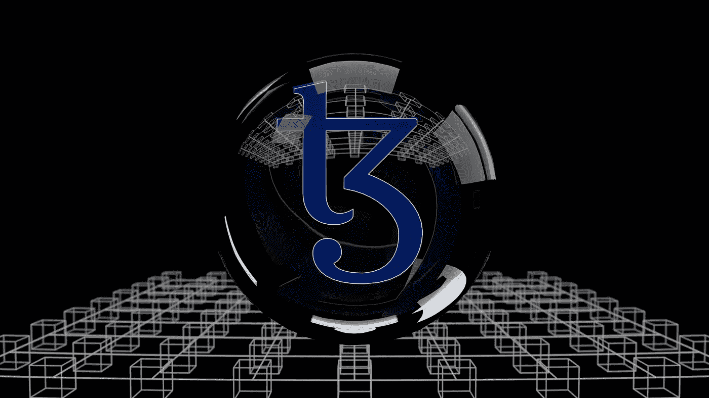

# 他们中的老爷爷:Web3

> 原文：<https://medium.com/geekculture/the-grandaddy-of-them-all-web3-9705265625b9?source=collection_archive---------19----------------------->

这一切都始于将世界各地的学院和研究所联系在一起。

Photo by [Shubham Dhage](https://unsplash.com/@theshubhamdhage?utm_source=unsplash&utm_medium=referral&utm_content=creditCopyText) on [Unsplash](https://unsplash.com/s/photos/web3?utm_source=unsplash&utm_medium=referral&utm_content=creditCopyText)

顾名思义，Web3 是第三代基本的互联网应用程序，即**万维网**。

尽管它仍被认为是处于鼎盛时期，但 **Web3** 正成为科技领域和商业领域的时髦词汇。