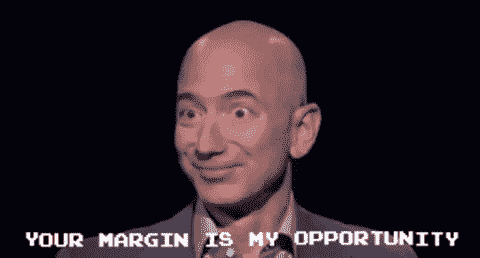
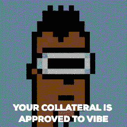
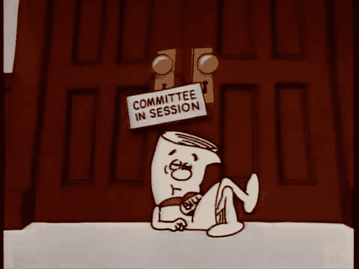

# NFTs 对房地产的影响越来越大

> 原文：<https://medium.com/geekculture/the-growing-impact-of-nfts-on-real-estate-f36aec43ee1f?source=collection_archive---------8----------------------->

交易、抵押和股权贷款以及所有权证券化中的非金融交易

*本文非法律或投资建议——*[*免责声明*](/@caleb.wursten/legal-disclaimer-c0b51554e3aa) *。*

2021 年 3 月，一位房地产投资者&区块链创业公司创始人以 25 万美元的价格买下了佛罗里达州的一套普通公寓。快进 11 个月，它的售价是 654，000 美元。[这是美国房地产作为 NFT 的第一次转让](https://www.tampabay.com/news/real-estate/2022/02/04/this-tampa-bay-home-is-being-sold-as-an-nft/)。Realtor.com 列出的价格比附近的房产价值高出 66%，溢价 26 万美元。3000 多人报名参加了拍卖，报道来自 [Coindesk](https://www.coindesk.com/business/2022/02/11/nft-linked-house-sells-for-650k-in-propys-first-us-sale/) 、 [CNN](https://www.cnn.com/style/article/digital-nft-mars-house-scli-intl/index.html) 、 [Fortune](https://fortune.com/2022/02/12/nft-florida-home-sale-ether-crypto/) 等。这笔交易将成为 NFT 进军房地产的一个分水岭。

**NFT 定义**:对于房地产来说，不可替代的代币(NFT)本质上是一个资产的标识号和定制所有权合同。“铸造”或创建 NFT 允许您在区块链中代表数字或实物资产。然后，这使资产能够获得某些区块链利益，如所有权的轻松转移、对加密资金和应用程序的访问、细分、事件的永久和公共记录等。

# 为什么房地产社区对 NFTs 感到兴奋？

让我们将问题分成三个有重大活动的领域:

*   处理
*   抵押贷款和股权贷款
*   所有权证券化

传统上，这些金融服务伴随着昂贵的官僚摩擦，让消费者倍感压力，处境更糟。糟糕的用户体验和高利润率已经积累了中断的风险，[给这个行业敲响了警钟](https://www.nytimes.com/2021/09/05/us/politics/cryptocurrency-banking-regulation.html)。

## 处理

在每笔房产交易中，交易双方预计会在交易结束时消耗掉售价的 10%。大约 80%的这一成本在当今 NFT 交易中面临冗余风险。这些费用与代理人的佣金和行项目有关，如“产权保险”、“产权搜索”、“记录费”和“成交调查”NFT 正在利用区块链使交易和财产所有权的历史无可争议。人们可以想象一个区块链平台，除了直接连接买家和卖家，还可以自动化所有权变更相关的任务。此外，随着交易的简化，Zillow 等上市平台多年来一直希望跳过代理人，这一点也有所进展。

让我们假设监管障碍被解除，创业公司开始发号施令。现在，NFTs /区块链可以在几秒钟内实现双方之间的财产转移，而不是几周。这笔交易的成本可能和区块链的汽油费一样低，在许多连锁店低于 0.01 美元，而不是房产价值的 10%。这种交易感觉就像发送一封电子邮件，只需将一个 NFT 从你的数字钱包转移到另一个加密支付的特遣队。区块链的所有权记录将是无可争议的，所有与该财产有关的未来融资和收入分配将自动按比例进行。虽然这看起来有些牵强，[瑞典已经准备好做这件事](https://www.researchgate.net/publication/329137308_Is_a_Blockchain-Based_Conveyance_System_the_Next_Step_in_the_Financialisation_of_Housing_The_Case_of_Sweden)。

## 抵押贷款和股权贷款

“区块链和 NFTs——web 3 的黄金承诺——的自然终点是，由计算机记录的人类生活的每个方面都将被抵押。”— [大西洋](https://www.theatlantic.com/technology/archive/2022/02/future-internet-blockchain-investment-banking/621480/)。众所周知，这种万物证券化的趋势正在房地产领域发生。简单的证券化推动了人们直接接受或投资资本，平台正在取代经纪人。2022 年，美国银行为储蓄账户支付的平均利率为 [0.06%](https://www.bankrate.com/banking/savings/average-savings-interest-rates/#:~:text=The%20national%20average%20interest%20rate,2022%20weekly%20survey%20of%20institutions.) 。然后，银行将这些现金以 2022 年平均 3.22%的利率贷给抵押借款人，并提前支付这些贷款的利息。正如杰夫·贝索斯对传统零售商说过的一句名言，“你的利润就是我的机会。”

LoanSnap 等 NFT 抵押贷款公司正在众包投资者，为抵押贷款融资。这是通过"[包装对房屋的留置权来完成的，同时协议接着对 NFT 进行贷款。](https://cointelegraph.com/news/bacon-protocol-offers-industry-first-nft-mortgages)“loan snap 的平台/协议正在取代券商银行。“由于区块链的效率以及所有流程和许多人的取消，Bacon 协议[LoanSnap]的用户获得了大部分回报，约为 2-3%，而如果你将这笔钱存入储蓄账户，回报率仅为 0.1%。”得益于 NFTs，这种被压缩的息差允许更多的房主进行再融资，以获得更好的结果，并为抵押贷款投资者带来更好的回报。

如果你以 20%的首付购买了一套价值 20 万美元的房产，那么在交易结束时，你将拥有 4 万美元的资产净值。随着房产升值，你支付抵押贷款，你的资产增加；房子价值中不属于银行的任何一美元都是你的资产净值。长期以来，很难获得这种价值。一种方法是通过房屋净值贷款，这需要大约一个月的时间来完成，成本在总贷款的 2-5%之间。图，一个旧金山区块链贷款公司，正在建立一个基金会，跳过银行在房屋净值提款。该公司已经[筹集了 16 亿美元](https://www.crunchbase.com/organization/figure-66e9)并定制了出处区块链以满足这一目的。Figure 的首席执行官迈克·卡格尼(Mike Cagney)简单地说，“我们在区块链发放贷款的成本要低得多。”

区块链各地都在利用非金融交易平台以资产为抵押进行高效放贷。NFT 抵押贷款平台 NFTfi 发行了一笔[140 万美元的贷款，抵押借款人的 NFT 艺术股权](https://www.theblockcrypto.com/post/123165/someone-took-out-a-1-4-million-loan-with-an-nft-as-collateral?utm_medium=rss&utm_source=rss)。贷款偿还将在 30 天内到期，年利率为 9.69%，这不是一个很好的条件，因为 NFT 艺术品有风险。在区块链的发展轨迹中，我们正处于一个奇怪的时刻，艺术品贷款超过了房地产贷款。在非区块链贷款中，房地产是最大的抵押品来源。如果这个世界仍然有意义，它最终也会在链条上占据有利位置。

## 所有权证券化

抵押贷款被证券化为非金融资产，房地产本身也是如此。人们想这么做可能有几个原因，但一个特别令人兴奋的原因是筹集资金。

筹集资金:证券监管和以股权换资本的策略是一个完整的世界。有执照的证券律师最有资格对此发表评论，但我不是😉你可以考虑在证券交易委员会(SEC)进行有限或完全注册。你通常不能公开寻求投资。这意味着不要在 LinkedIn 上发布你的重大投资机会。另一种方法是允许公开征集，可能是只接受合格的投资者参与交易。这项服务将花费数千美元，这使得你通常的康复治疗变得不划算。这就是像 [Vesta Equity](https://vestaequity.net/) 这样的公司介入的地方。Vesta 是，“使业主能够在没有贷款的情况下获得其财产的价值，并使房地产投资者有机会建立一个部分住宅房地产 NFT 的投资组合。”LoanSnap 将抵押贷款证券化为 NFT，Vesta Equity 对房产本身也是如此。同样的过程也被 tZERO 用于房地产基金的证券化(想想未来多项交易的资本，而不是现在的一项交易)，这是他们的[投资者甲板](https://www.tzero.com/tZERO_Overview_02_2021.pdf)。

# 这通向哪里

被重点提到的公司和其他公司都迫不及待地想从法律上明确什么是被允许的。我们还没有一个统一的监管框架，但我们正朝着有利的方向前进。这里是众议院金融服务委员会认真学习如何制定明智规则的四个小时(是的，我都看了)。国会议员和关键机构的议员都知道这关系到什么，尤其是美国领导的全球金融体系的地位。最近，这一系统在俄罗斯入侵乌克兰期间有效地攫取了超过 6000 亿美元的外汇储备。在一个人们选择非美元货币，或者像许多稳定货币一样与美元挂钩的世界里，这种力量正在衰退。只要有益的监管继续展开，区块链和美元的好处可以通过美元支持的稳定债券混合在一起。但如果全球转向非美元货币，比如以太坊，人们的想法是，美国也可能拥有新的工作岗位和专业知识。对立法者来说，纠正区块链监管的重要性比以往任何时候都更加明显。

然而，这不会是一条容易的道路。随着新的诉讼建立先例，区块链规则正在断断续续地变化，比如 [BlockFi 与 SEC](https://www.sec.gov/news/press-release/2022-26) 达成的 1 亿美元和解。BlockFi 的首席执行官将巨额和解描述为“为更广泛的行业和我们的客户确保监管清晰性”的胜利。大额违反证券法的行为是政府行动的焦点，但新规将有助于向更广泛的行业提供信息。从长远来看，NFT 对房地产的影响才刚刚开始。

*感谢阅读！如果房地产令牌化是你的拿手好戏，请参见*[*world Haus*](http://www.worldhaus.co)*。我们正在让拥有国际住房变得毫不费力。非金融交易被用来大幅降低交易成本。*