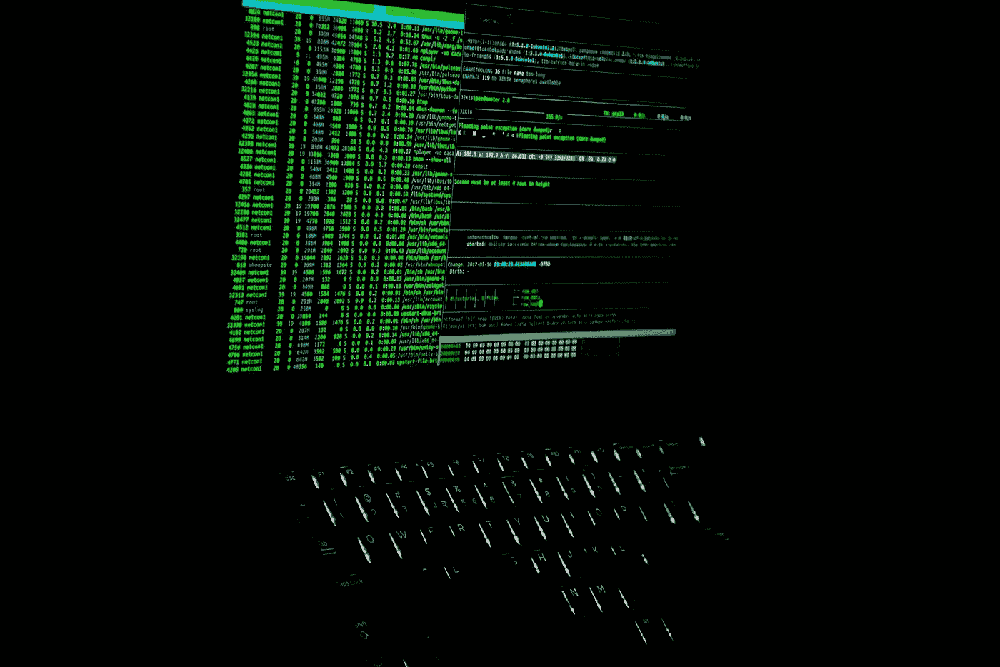
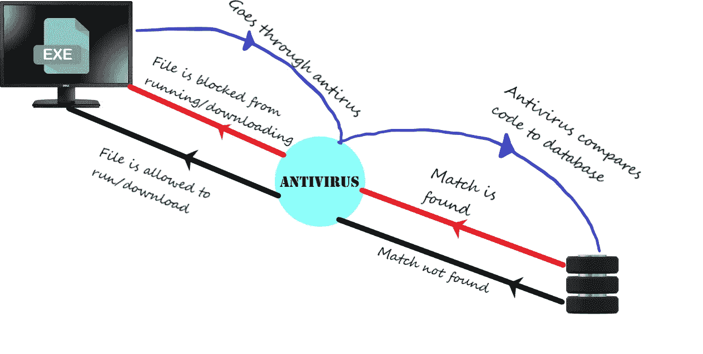
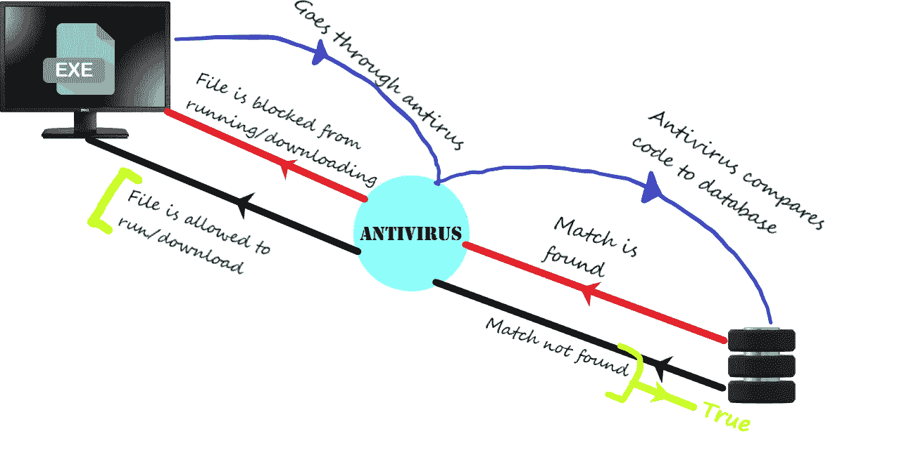

# 黑客的猫捉老鼠循环

> 原文：<https://medium.com/geekculture/the-hackers-cat-and-mouse-cycle-fffb0344198d?source=collection_archive---------16----------------------->

photograph by [Hardik Pandey](https://pixahive.com/portfolio/hardik-pandey)on [pixahive](https://pixahive.com/)

所以最近我参加了这个黑客课程，当我浏览 QnA 时，有成千上万的问题说“攻击被 Windows defender 检测到”，“你需要更新课程，攻击不起作用”，“攻击没有绕过防病毒软件”等等。起初，我也感到沮丧，因为我购买了这个课程来学习如何在没有反病毒程序检测到我的攻击的情况下进行黑客攻击，但是每次它都会检测到。

当我了解到黑客猫捉老鼠的循环时，我想弄清楚它是什么，它与这些问题有什么关系，以及它的解决方案是什么。

为了理解它是什么，首先我们必须了解抗病毒药物是如何工作的。

## 抗病毒药物是如何工作的？

抗病毒药物不使用任何机器学习或人工智能或任何复杂的代码。简而言之，他们有一个数据库，一个巨大的数据库，其中有多年来存在的所有不同的恶意软件文件。一旦下载了任何文件，它将首先将文件代码与恶意软件文件数据库进行比较，如果发现匹配，则意味着该文件是恶意软件，它将阻止该文件运行或下载。

## 这个杀毒数据库是怎么做出来的？

显然，并不是每个黑客/网络安全专家都有相同的头脑，每个人都可以编写不同的代码来进行黑客攻击。为了获得尽可能多的黑客脚本，反病毒公司从 virustotal 等不同网站获取数据。Virustotal 是一个你可以检查你的恶意软件文件是否绕过 antiviruses 的网站。该网站还会将我们交给它检查的恶意软件文件发送给不同的相关杀毒公司。通过添加这些文件来更新数据库。

这也是为什么预制的黑客脚本，比如那些来自 [Veil](https://github.com/Veil-Framework/Veil) 的脚本，大部分时间都能被检测到。这只是因为它已经存储在数据库中。

## 你如何绕过它

这个问题的一个解决方案是修改或制作新的黑客脚本。如果脚本是新的，那么该文件将不存在于防病毒数据库中，因此不会被检测到。如果一个预先制作的病毒文件被改变，那么同样的代码匹配将不会被发现。

因此，绿色括号中的情况为真，因此文件被允许运行和下载。

另一个解决方案是检查你用来获取预制黑客脚本的软件的更新。这样，文件将不会出现在防病毒数据库中，因此绿色括号中的情况也是正确的。

仅此而已。如果你的攻击不起作用，如果你使用的是预制的黑客脚本，它不起作用，记住猫和老鼠的循环。

我希望你喜欢！感谢您的阅读！