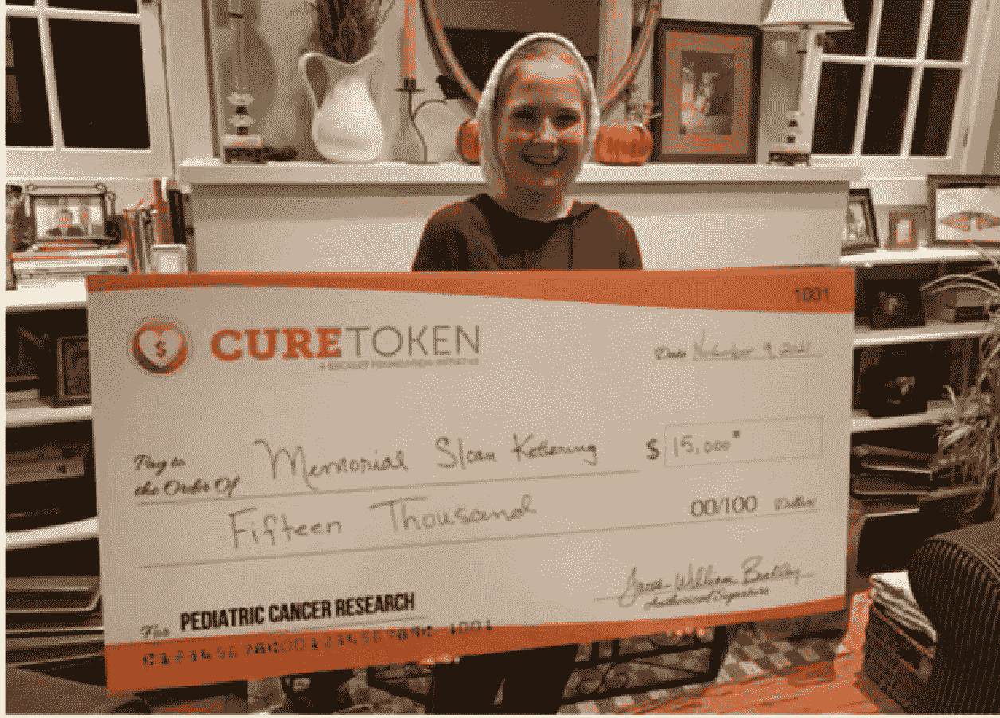

# 最艰难的回归之路:治愈聚焦专题文章

> 原文：<https://medium.com/geekculture/the-hardest-road-back-a-cure-spotlight-feature-article-e347c4e22de5?source=collection_archive---------14----------------------->

CURE 的使命是永远改变全球医疗保健。从一个人根除儿童癌症的使命开始，已经发展成为一场势不可挡的运动。在这个不可思议的旅程中，该项目一直在撰写文章，旨在阻止癌症被视为一个统计数字——展示真实的人的真实故事，并帮助强调为什么治愈如此重要。每个星期都有不同的人，但影响从未减少。这些文章中出现的所有令人惊讶的患者或临床医生都在以他们自己的方式与这种可怕的疾病作斗争，与你分享他们的故事是我们的荣幸。

本周的焦点是来自伊利诺伊州芝加哥的勇敢的 15 岁女孩凯特·德罗斯特。她的母亲丽莎坐下来，向《治愈》讲述了他们家经历的噩梦，这场噩梦始于六年前，当时凯特九岁。“我记得很清楚，”丽莎说。“那是 2015 年 11 月 13 日。那天实际上是 13 号星期五，其中的讽刺意味我们不会忘记。我当时的丈夫汤姆和我都是医生，当时我正在佛罗里达参加一个医学会议。汤姆打电话给我，说凯特在房子里摇摇晃晃，不能正常行走。他是一名外科医生，但当这是你自己的孩子时，你就不能正常思考。”惊慌失措的丽莎告诉她的丈夫直接带凯特去最近的急诊室(中央杜佩奇医院)，而她赶上了最早的航班回家。

凯特的血液检查显示出一些异常后，她立即住院了。医疗团队想做核磁共振扫描，但已经预订满了，所以 Lisa 和他们的女儿度过了一夜，在忍受机器变得自由的痛苦等待的同时，尽最大努力让她保持平静和舒适。直到大约 9 个小时后，他们才最终能够接近成像仪。“当时是凌晨两点半，”丽莎回忆道。“凯特倒下了，他们对她做了 90 分钟的扫描，这对一个小女孩来说太可怕了，尤其是一个一生中从来没有真正生病过的女孩。我坐在房间里，唱歌给她听，让她保持平静。”大约五个小时后，主治医生要求和丽莎私下谈谈。就在那一刻，他透露了一个令人心碎的消息，凯特的肿瘤一直延伸到她的脊柱，团队认为它们本质上是肿瘤。

对丽莎来说，那一刻她的整个世界都颠覆了。

"对我来说，它仍然像钟声一样清晰。"汤姆回家照看狗，补觉去了。因此，在一个周六的早上 7 点，我独自一人被告知，我们唯一的女儿患了致命的癌症。我就在走廊里崩溃了。"

最初的消息传出后，事情发生得很快。凯特被转移到市里的卢瑞儿童医院。医生非常担心，因为此时凯特已经失去了双腿的大部分功能。计划在周一进行活检，但在此之前，这是什么类型的癌症仍然是一个谜——因为它表现得不典型。普遍的共识是，这要么是某种形式的白血病，要么是一种罕见的癌症，称为神经母细胞瘤。丽莎和她的丈夫都非常清楚如果他们的女儿得了后者的后果。“我们坐在那里，祈祷她得了白血病，”丽莎解释道。“我是说，哪个父母会祈祷自己的孩子得白血病？但这正是我们所做的，因为我们知道它有更好的生存机会。”

在痛苦和情绪化的等待之后，终于对凯特做了活检。然而，后来答案仍然不清楚，所以这家人再次被迫等待，而首席肿瘤学家花了几个小时打电话给全县各地的同事，试图确定他们正在处理的癌症。11 月 18 日星期三，也就是凯特最初出现症状的五天后，答案终于出来了。肿瘤学家告诉丽莎和汤姆，他们的女儿患有非常罕见的神经母细胞瘤，存活几率为 50%。

“没有什么能让你对这种消息有所准备，”丽莎说。“凯特是独生女。汤姆和我做了十年的生育病人。我们怀了一对双胞胎，在他们能够存活前 10 天流产了。凯特后来自然地出生了，我们有了一个漂亮的孩子，我们非常高兴…然后*这个*。这是每个父母最糟糕的噩梦。”事实上，对丽莎和汤姆来说，进入医学领域本身就是一把双刃剑。一方面，他们能够理解正在发生的一切和他们被告知的事情，但另一方面，他们觉得自己对*了解得太多，这只会让一切对他们来说更加可怕。*

到周三结束时，凯特已经不能走路了。丽莎和汤姆发现自己陷入了神经外科团队和肿瘤团队之间的斗争中，神经外科团队希望立即进行手术(这可能会使凯特终身瘫痪)，而肿瘤团队希望进行化疗——而他们的女儿的病情正在恶化。在咨询了全国多位专家后，最终决定凯特第二天开始两轮化疗，随后是周六的紧急放疗，如果没有恢复，最后是周日的侵入性手术。“那是有史以来最令人紧张的时刻，”丽莎说。“我们到了周六早上，就在他们准备开始放疗之前，她的脚动了。”

化疗起作用了。

“这对我们来说非常重要。肿瘤越大，就越压迫她的脊髓。在那五天里，她经历了从跌跌撞撞，到双脚麻木，再到双腿瘫痪，最后失去了肠道和膀胱功能。她移动她的脚意味着肿瘤对化疗有反应，肿瘤正在缩小。”凯特继续做了五天的治疗，然后被允许回家，正好赶上感恩节。正是在这一点上，丽莎开始考虑如何挽救凯特的生育能力(因为化疗已被认为会导致永久性不孕)。考虑到她和丈夫在试图怀孕的十年中被迫忍受的大部分痛苦，她决心不让女儿遭受同样的命运。因此，她和汤姆同意让凯特回到她的一个卵巢被切除并冷冻的同一家医院。“希望最终他们能够重新植入它，”丽莎说。“如果我的女儿愿意的话，她以后可以生孩子。她已经经历得够多了；我不想让她也经历这些。”这种对凯特未来的预见是在一个已经很糟糕的时期，一个母亲包容一切的爱和同情的非凡证明。

在美国，神经母细胞瘤的治疗有三条主要路线。其中最标准的是儿童肿瘤小组(COG ),它拥有全国最多的机构。其他“大玩家”是纽约的斯隆·凯特林医院和北卡罗来纳州的一位神经母细胞瘤顶级肿瘤学家 Giselle Sholler。每个人都有自己的治疗儿童癌症的方法，这些方法有时相互平行，有时相互矛盾。当凯特在一家 COG 医院接受治疗时，丽莎和汤姆只是想让他们的女儿好起来，所以选择遵循最初的建议，开始沿着这条路线进行长期治疗。凯特开始了一个标准的 COG 化疗计划，包括在医院接受 5-6 轮治疗(通常同时进行 2 或 3 种不同类型的化疗)的一周，然后在家轮换三周。“当她在家和我们在一起的时候，她病得很重，”丽莎回忆道。“不断呕吐和头痛，还有你能想到的。在头两个星期，她的头发也开始脱落。所以，我们举办了一个盛大的剃发派对。我和汤姆，还有一堆朋友、家人和邻居——我们总共大约有 20 个人——我们都聚在一起，当着凯特的面剃了头发，这样她就不会感到那么孤单了。”

化疗周期持续了漫长的六个月，对这个家庭来说充满了可怕的时刻。迄今为止，凯特已经接受了 15 种不同的化疗。凯特不断发烧，这是一个严重的情况，因为她有一个端口直接连接到她的心脏，任何感染都可能杀死她。“如果她体温超过 101 华氏度，就直接进急诊室了，”丽莎说。“问题是化疗会破坏你的免疫系统和白细胞，所以接触几乎任何东西都会引发发烧。在那几个月里，我们来来回回地发烧，输血和输血小板来抵消这种情况。”

凯特的下一步有点争议——干细胞移植。研究表明，如果神经母细胞瘤癌症患者连续进行两种治疗，那么存活的几率将从 50%增加到 66%。斯隆·凯特林和肖勒博士都直言不讳地反对这种治疗，因为它有潜在的危险，但 COG(凯特的治疗者)是一个倡导者，所以丽莎和汤姆面临着遵循什么建议的危机。最终，增加他们女儿机会的想法压倒了他们其他的顾虑，所以他们选择了继续。

干细胞治疗是有创的。这个过程包括住院 3-6 周，然后杀死整个免疫系统，包括骨髓中的每一个细胞。在什么都没有留下——包括癌症——之后，临床医生恢复血细胞，以便身体可以开始再造它们。当凯特的父母开始这种治疗时，他们当然担心*任何东西*都可能杀死他们的女儿，因为她实际上根本没有免疫防御。“我从未见过像病房这样的东西，”丽莎说。“他们必须把它变成他们所说的‘干细胞清洁’。在凯特入院之前，他们有一个专家小组进去清理每一寸地方。他们真的会拆开家具，清洗每一个螺丝和配件。没有一个缝隙和裂缝未被触及——不能有一个暴露的分子。”事实上，每个进来的人都必须穿上工作服，戴上手套，每次医生进来，他们都必须使用全新的听诊器。凯特接受的一种残酷的化疗是通过皮肤和烧伤来进行的，这意味着她必须每六个小时由父母小心翼翼地为她洗澡(避开附着在她身上的化学管和线)。当这种情况发生时，护士们会在换衣服之前，把她的床剥去漂白。最后，一个危险物品处理小组会进来按照严格的标准清洗浴缸。“这整个经历简直是人间地狱，但你还是这么做了，因为这是你的孩子，我们愿意做任何事情。”

仅仅三个星期后，当凯特达到治疗成功所需的白细胞数时，这家人欣喜若狂。此时，凯特被允许离开医院，住进了麦当劳叔叔慈善之家，离医院只有五个街区远；一旦她达到了几个更具体的指标，这个家庭最终被允许在母亲节周末回家——这是黑暗时期的一个好消息。然而，即使是回家，一切都必须仔细监测和检查，并遵循严格的例行公事。“凯特甚至不允许吃新鲜蔬菜，”丽莎解释道。“以防上面有霉菌或细菌。所有的东西都必须煮熟。她也不能吃餐馆里的任何东西，她的饮料里不能加冰——因为饮料里可能有污染物。

此时，丽莎几乎完全放弃了自己的工作，这样她就可以全职照顾女儿了。当时，她和凯特的父亲一起拥有自己的私人诊所，当她和凯特在一起时，他继续工作。丽莎会连续住三个晚上，然后在第四个晚上她会和汤姆交换位置，他会接手，这样她就可以回家睡觉了。“因为当你在下面的时候，你根本不会休息。每天都有护士进进出出，检查生命体征，更换液体，当然还有机器噪音。我记得有一天晚上，从晚上 11 点到早上 7 点，光是静脉注射泵就响了 17 次*，而且声音很大*。*你也高度警惕，因为你一直处于紧张、担忧和过度警惕的状态。每次它响起的时候，我都会从床上跳起来，因为你永远不知道是不是出了什么问题。所以，当我回到家睡着的时候，会持续大约 14 个小时，因为你已经筋疲力尽了，这是无法形容的。但我知道，无论我们经历了什么，对凯特来说都要糟糕得多。”*

*凯特进行了第二次干细胞移植治疗，然后进行了 17 轮放疗，然后进行了免疫治疗，这是一种新药物的鸡尾酒疗法。下一轮治疗总共花了一年多的时间，在治疗结束时，凯特已经完全没有癌症了。考虑到丽莎的女儿不仅患有脊椎肿瘤，而且她的骨髓中 95%也是癌细胞，这是一个巨大的转变。由于持续三个月的骨髓活检和全身扫描，家人能够跟踪凯特的稳步进展和恢复，直到神圣的“完全清除”,每次改善都是一个小胜利。*

*此时，丽莎发现自己处于十字路口。“传统医学认为，到了这个时候，你就完了，回家吧。但是她父亲和我说不，我们还没有结束。我们希望确保这种情况不会重现。”因此，通过一个专门关注儿童神经母细胞瘤的脸书家长页面，Lisa 发现了美国正在进行的两项有助于防止复发的试验。原来一个在斯隆·凯特林，另一个在肖尔斯博士。在权衡他们的选择后，这对父母决定让凯特参加在纽约进行的试验。在她被接受参加试验之前，医院希望凯特参加两轮以上的靶向免疫治疗。*

*“他们的免疫疗法简直糟糕透了，”丽莎回忆道。“他们注射一种药物，这种药物附着在细胞上一种特殊类型的 GD2 受体上，这种受体恰好在成神经细胞瘤细胞上。问题是它也在神经末梢上。”不幸的是，这种药物无法区分两者，所以会同时攻击两者，导致极度的疼痛。即使在注射吗啡的时候给凯特注射吗啡也不足以减轻她被迫忍受的痛苦——她在母亲躺着抱着她的时候尖叫着进行治疗。*

*他们每周做三次，持续两周。*

*经过这段紧张的时期，凯特终于能够开始试验了。具体来说，这是医院开发的一种有助于防止复发的疫苗，他们注射了这种疫苗——凯特当时描述说，“她的皮肤下有热培根油。”“她会尖叫，然后会留下一个直径约 6 英寸的伤痕，持续两三天。但信不信由你，与这个勇敢的女孩所经历的一切相比，这实际上是相当容易的。”在一年的时间里，丽莎和凯特飞往纽约接受常规疫苗治疗，直到她们完成疗程。*

*在这一点上，凯特仍然没有癌症，所以丽莎和汤姆决定继续接受肖勒医生的治疗，以进一步防止复发(神经母细胞瘤是一种众所周知的侵袭性癌症，因缓解后复发而闻名)。这一次是口服避孕药，就症状而言，它远没有凯特从一开始就被迫忍受的任何东西那么具有侵略性。与此同时，丽莎和汤姆不断会见医生，检查他们女儿的扫描结果，检查复发情况。*

*2018 年 10 月 24 日——第二次试验进行了 6 个月，癌症复发了。*

*从凯特的《十字军战士》(Lisa 创建的脸书页面，用于向他们所有的朋友和家人分享集体更新)中提取的令人心痛的情感帖子显示了凯特和她的父母被迫再次忍受的艰难，但随之而来的纯粹的决心:*

*玛丽安娜·威廉森说所有的情感，以及由此产生的所有行为，都可以归结为爱或恐惧。你要么是出于爱，要么是出于恐惧。现在很容易陷入恐惧。它很强壮。它包围着你。但现在的焦点不能是恐惧，必须是我们对凯特的爱。这份爱给了我们力量和勇气，让我们能再次看到她。我们会的。*

**今天早上一个画面不断重复出现。打开衣柜，穿上盔甲，磨好剑。**

**凯特会活下来。她会的。**

*幸运的是，神经母细胞瘤只在凯特脊柱的一小部分复发，并没有出现在她身体的其他部位。“这是一个深呼吸的例子，又来了，”丽莎说。这一次，斯隆·凯特林医院在该地区安排了两轮化疗和放疗，其中凯特接受了 12 次治疗，随后又进行了 7 轮免疫治疗药物注射。用这种方法又治疗了一年，凯特又一次摆脱了癌症。此时，医院又继续注射了七次疫苗。*

*治疗费用也是巨大的。例如，凯特仅 2016 年的医疗账单就达 320 万美元。“这几乎就像垄断资金，”丽莎说。“当凯特做干细胞治疗时，仅治疗本身的药费就高达 48 万美元，她做了两次。我最近没有统计过，但是如果我是一个赌博的女人，我会说她可能在六百万美元左右。多到你都注册不了。”*

*那么他们是如何支付这笔费用的呢？*

*在凯特生病的第一年，德罗斯特夫妇有一个健康维护组织(HMO)的医疗保险来支付账单，但每次他们想做任何事情都需要得到初级保健医生的授权，而且非常禁止。“第二年他们放弃了我们——真令人震惊，”丽莎回忆道。随后，Drosts 夫妇被迫购买另一种保险，称为首选供应商组织(PPO)计划。这涵盖了凯特需要的一切，但伴随着极高的免赔额——在保险公司支付剩余部分之前客户应支付的金额。*

*“也总会有争吵，”丽莎回忆道。“例如，凯特因为化疗失去了听力，所以她现在不得不佩戴双侧助听器。健康保险每年只支付一次就诊费用，但有时她不得不去两三次，因为助听器有问题，或者他们出于某种原因需要调整它——而保险拒绝支付费用。他们也不想为她正在接受的药物治疗付费，这一费用每月超过 12000 美元，所以这是一场巨大的斗争。跟他们争论是一份全职工作，简直让人精疲力尽。”*

*凯特在 2020 年末完成了疫苗试验的最后阶段，谢天谢地，她仍然没有癌症。她现在每三个月扫描一次，并有针对性的药物治疗，这是一种实验性的药物，没有人知道它是否有效，但副作用非常小，所以丽莎很高兴凯特继续服用。这对夫妇仍然每三个月去一次纽约(到目前为止，丽莎和凯特已经去纽约治疗了 27 次*)。“这些是你必须考虑的其他成本。保险不支付机票、酒店或食物的费用。然而，我明白，我们能够带凯特去纽约是一种奢侈。我知道有些人别无选择，只能呆在原地，接受有限的治疗，这是这个国家的一个现实问题。”**

**治愈组织的创始人雅各布·贝克利和他的妻子拉斐拉第一次知道凯特，是在他们听丽莎在另一个名为*超级杰克*的儿童癌症慈善机构的活动上发言时(她在凯特第一次生病时捐赠了 2000 美元帮助支付费用)。三人后来面对面见了面，雅各布透露了他是如何完成划船横渡密歇根湖的任务的(他这样做是为了给儿童癌症筹集资金)。从这一点开始，三个人变得像家人一样——甚至当丽莎需要带凯特去纽约接受治疗，而他们又不能坐飞机时——雅各布和拉斐拉开着他们的房车*一路从芝加哥*返回。**

**“我非常相信 CURE 和 Jacob 正在做的事情，”Lisa 说。“他是最善良、最慷慨的人，他真诚地想要改变世界。”事实上，当该项目代表凯特向斯隆·凯特林的儿童癌症研究部门捐赠 15，000 美元时，丽莎欣喜若狂。“这真是太棒了，我们都非常高兴。我确实认为 Jacob 会实现他设定的目标，因为有拉斐拉在他身边，有 CURE 的优秀员工帮助他实现愿景，没有什么是他做不到的。”**

**那么凯特现在怎么样了，她现在是什么样的，她主要是通过治疗吗？“她非常聪明，”丽莎笑着说。“她第一次独自确诊的那一年，已经读了三百九十六本书！她甜美、固执、野蛮、爱挖苦人，是我一生中遇到的最棒的人。”**

**尽管凯特版本的神经母细胞瘤很罕见(每年 690 例),但总体而言，儿童癌症是令人沮丧的常见疾病——全球每年报告的新增病例超过 40 万例——而且政府资金严重不足。许多孩子不幸死于这种疾病，如果像凯特一样获得更有效的治疗，他们本可以得救。这就是为什么 CURE 试图做的事情如此重要，并有可能拯救更多的儿童，同时为所有人提供更多的治疗和治愈方法。**

*****既然是一项值得投资的事业。*****

**如果你想了解更多关于 CURE token 以及如何投资的信息，请访问[www.curetoken.net](https://www.curetoken.net/)或在[https://t.me/CureTokenV2](https://t.me/CureTokenV2)参加他们的电报**

***这篇文章是斯图尔特·梅塞斯写的。请注意，Stuart 不是财务顾问，本文中的任何内容都不应被视为财务建议。***