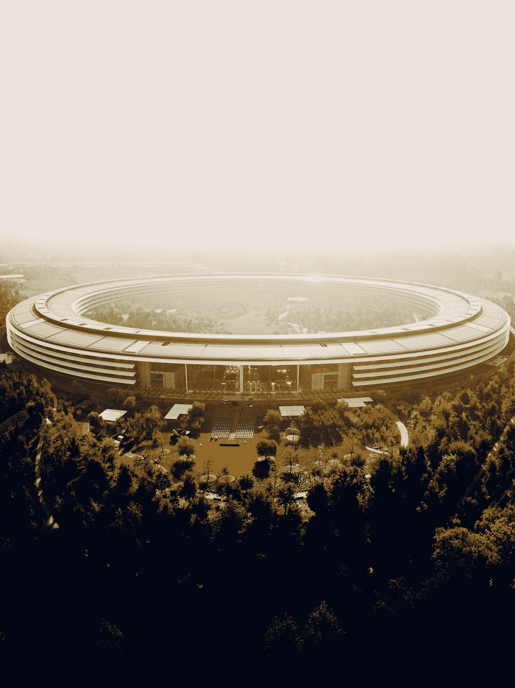

# WWDC 历史上的硬件发布

> 原文：<https://medium.com/geekculture/the-hardware-releases-in-wwdc-history-9cd41c3b3c2c?source=collection_archive---------18----------------------->

## 尽管 it 更关注软件，但硬件发布在 WWDC 已不再罕见

Photo by [Avi Richards](https://unsplash.com/@avirichards?utm_source=medium&utm_medium=referral) on [Unsplash](https://unsplash.com?utm_source=medium&utm_medium=referral)

第 33 届苹果 WWDC 主题演讲见证了第二代苹果芯片的推出。M2 芯片将在新的和现有的 MacBook Air 和略显乏味的 13 英寸 MacBook Pro 中提供。硬件发布在以下方面并不新鲜…