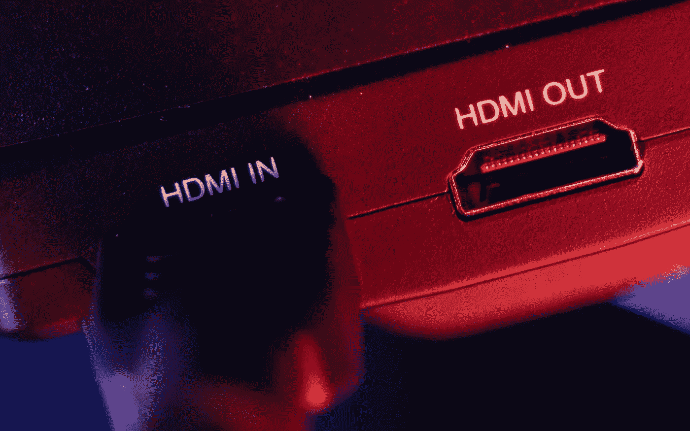

# HDMI 的情况变得比以前更加糟糕

> 原文：<https://medium.com/geekculture/the-hdmi-situation-somehow-got-even-uglier-than-before-275c32618992?source=collection_archive---------3----------------------->

## HDMI 许可管理部门将会通过误导性地认证不同规格的电视端口来迷惑更多的人

Evolving standards such as HDMI have caused a lot of confusion to countless consumers worldwide over the years, but the recent blunder made by the HDMI Licensing Administration will cause even more frustration than usual. (Image: The Registi, Unsplash)

众所周知，自从科技行业为其产品提出“不断发展的标准”的概念以来，它就打开了一个难题，给消费者带来了各种各样的…