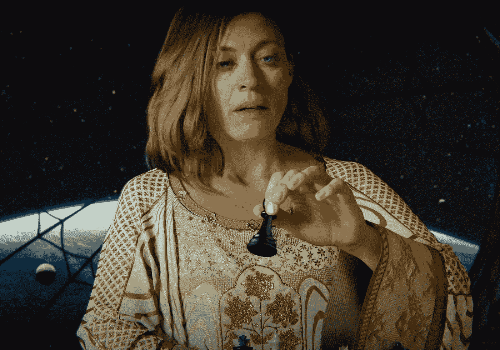
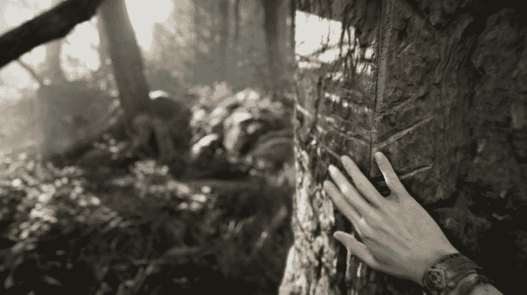
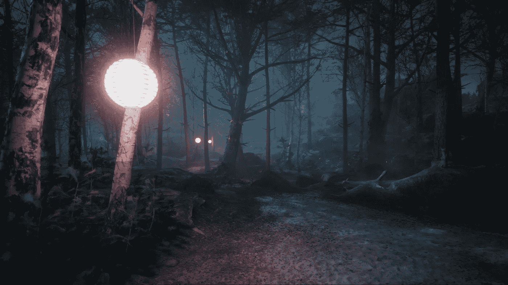
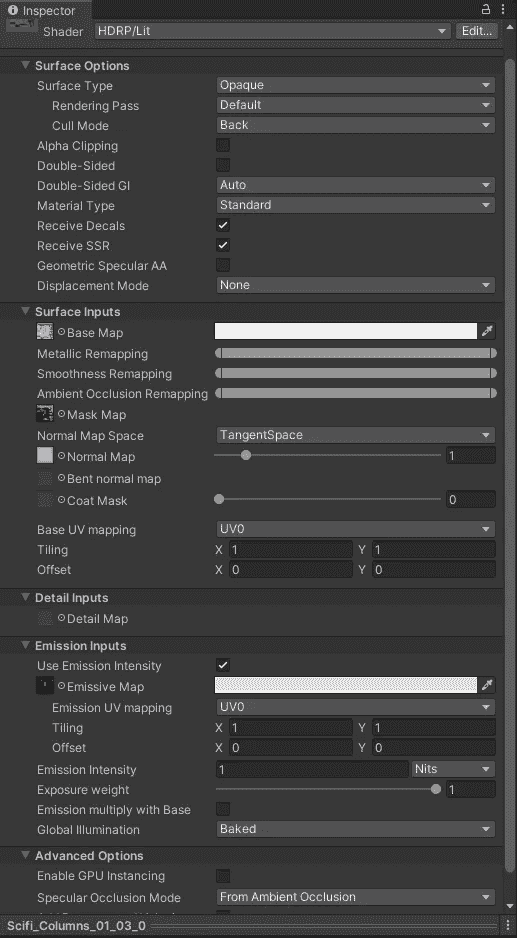
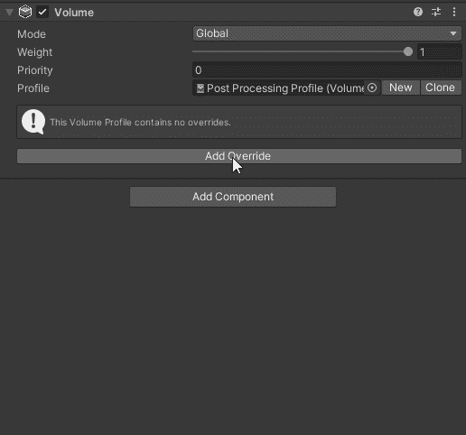
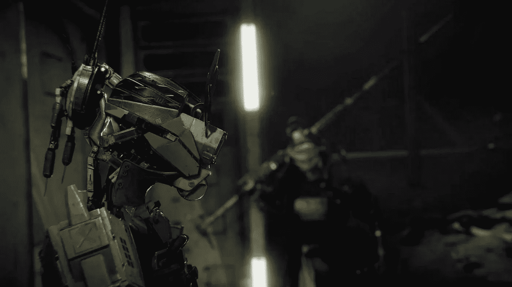

# Unity 中的高清渲染管道

> 原文：<https://medium.com/geekculture/the-high-definition-render-pipeline-in-unity-81f40667fcfa?source=collection_archive---------7----------------------->

## 高清渲染管道(HDRP)是 Unity 开发最佳视觉效果的最高质量管道。

**今天的目标:**解释什么是 HDRP，以及为什么要使用它。

# HDR 管道:

高清晰度渲染管道，也被称为 HDRP，是 Unity 的最佳管道，有能力使图形和视觉效果尽可能好。

Unity HDRP “Enemies” cinematic teaser — 2022

与其他管道选项不同，HDRP 是专门针对个人电脑、游戏机和高端平台设计的，因为它们有硬件来跟上令人印象深刻的详细图形。

Unity “Book Of The Dead” demo — 2018

手机和其他手持设备大多没有配备必要的硬件来处理这种质量，因为技术还没有达到消费者级别的效率水平。

Unity HDRP “Fontainebleau” demo

凭借其对视觉效果的关注，HDRP 允许更多的控制和定制设置，这些设置在其他管道的较低水平上已经可用。即使在标准光照着色器材质中，您现在也可以更好地访问变量来控制材质在场景中的显示方式。

与 URP 相比，后期处理量也大大扩展，有更多的覆盖选项来改变场景的外观。

通过用正确的知识和经验好好利用这些新特性，就有可能创造出在当今绝大多数视频游戏中很少见到的场景。

Unity HDRP “Adam” demo film — 2016

A HDRP creation by someone after briefly learning about HDRP — 2020

# 基本上…

*   如果你想制作一款看起来很棒的高质量游戏，并发布到 Steam 或类似网站，那就在 **HDRP** 制作吧。
*   如果你想制作一个不太关注/专注于惊人画面的游戏，或者想在移动平台上发布，请使用 **URP** 。
*   **标准**管道目前也是一种选择，但正在逐步淘汰，并由 **URP** 替代，作为“*定位*管道。