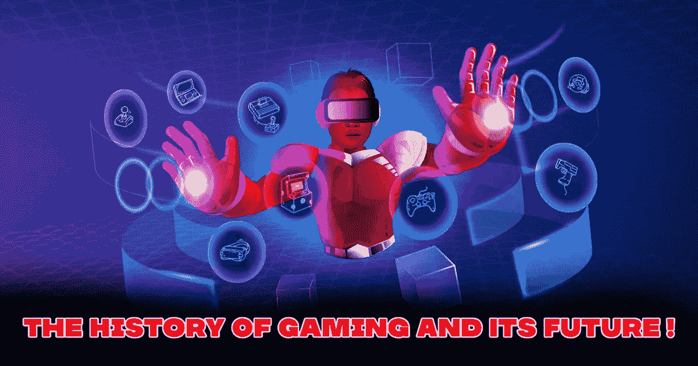
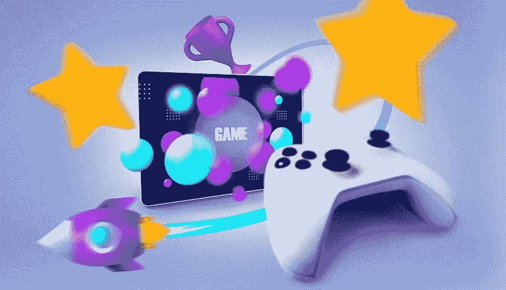
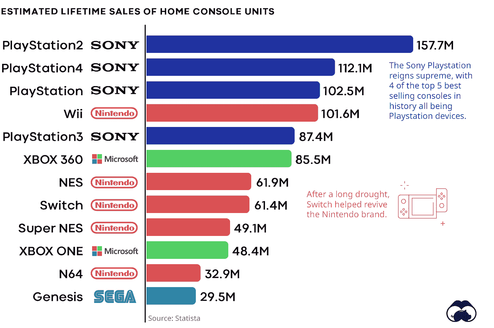

# 游戏的历史和未来！

> 原文：<https://medium.com/geekculture/the-history-of-gaming-and-its-future-2b660530a838?source=collection_archive---------20----------------------->

**The History Of Gaming And Its Future !**

游戏已经从最初的地方走了很长的路。在游戏出现之前，甚至是游戏或游戏机出现之前，身体活动就已经存在了。这些活动是我们作为普通人所期待的，因为这是我们在长时间的学校或工作后得到的放松。那时候，我们常常有几个户外游戏，我们只会呆在家里的 CRT 显示器上看一些老派电影，甚至可能是卡通片。这是直到 [**游戏世界**](https://www.jump.trade/) 让世界发生了不可思议的变化。虽然一开始游戏的重要性并没有被大肆宣传，但一旦它被很好地营销，它就成为了绝对的游戏改变者。原因很简单，人们想要新的、特别的、革命性的东西，而这正是我们想要的。

于是，我们的游戏机问世了，有趣的是，当你将第一台游戏机与最后一台游戏机进行比较时，你会注意到巨大的技术进步。从最早的任天堂到任天堂 Switch，从 PlayStation 1 到 PlayStation 5，都有大规模的升级。也就是说，这些比赛只是一个开始，因为接下来发生的事情是我们谁也没有想到的。因为游戏机游戏开始在电脑、手机甚至掌上游戏机上成为可能。这还不是全部，它不止于此。它走得更远，然后将自己引入了 NFTs 的世界。这就是我们现在所处的位置，不，这不是终点，因为有了这些新形式的游戏，一个人什么都不玩就能赚钱是不可能的，而让现实世界参与进来开辟了新的可能性。

**游戏的早期历史**

第一台游戏机是 atari，当时人们对游戏机及其使用方法知之甚少或一无所知。游戏的概念是外来的，就像 20 世纪 50 年代和 60 年代流行的东西一样，有假货和低质量的克隆产品，导致了游戏的崩溃。这是一件令人困惑的事情，因为它给所有想进入游戏领域的人提出了一个问题。当世嘉和任天堂在 1983 年相继推出自己的游戏机时，所有这些变化都得到了纠正。流行游戏《索尼克和马里奥》的创始人引领了变革的潮流，并成为游戏领域的全新竞争者。PS1。在 1994 年，这种游戏控制台推出，并迅速为第一个三维游戏系统奠定了基础，其成本非常高。尽管如此，由于几个因素，它的销售仍然超过了预期收入，其中最重要的是它的视觉质量。它所提供的质量是那段时间内任何产品都无法比拟的。

**The early history of gaming**

然后出现了其他几个版本。随着时间的推移，这些游戏开始演变，几个不同的游戏控制台也被制造出来。虽然 pc 游戏自 1961 年就出现了，但并没有那么流行，但很快也就销声匿迹了。因为随着 Xbox 的推出，微软加入游戏的其他几个功能也受到了很大的影响。随着这些游戏机的不断发展，从任天堂 ds 到 Wii，然后是 game cube，最后是任天堂 Switch 和 Xbox，最后是 Xbox X，最后是速度和功能惊人的 PS5。与最初的设计相比，所有的控制台都有了很大的提升，它们的前辈几乎无法与它们目前的能力相提并论。然而，如果没有之前的游戏机，就不会有未来，这是一个人必须理解和反思的事情。尽管如此，有一个新的玩家又一次来到了狮穴，这基本上是区块链。

**游戏史上的稳定变化**

随着区块链知识的普及和增长，以及创造可用作游戏角色和数字收藏品的数字资产的概念，游戏的风险领域成为人们追捧的对象。NFT 博彩业 复兴了高风险的赌博和以风险为导向的 P2E 博彩业，让人们有兴趣投入时间和金钱。这种差异是由非技术人员的参与造成的。除此之外，在游戏中起更大作用的是元宇宙。这个游戏领域彻底改变了整个事情。它基本上创造了一个第二世界，人们可以访问或去玩游戏，同时仍然在场。虽然访问元宇宙需要使用 oculus 等头盔，但在未来，它将成为世界上每个人不可或缺的东西。这是因为它的潜力是不受限制的，在整体环境下有更大的增长空间，当谈到游戏，也通过 P2E NFT 游戏赚钱。

所有这些都表明，游戏一直是一件昂贵且不断发展的事情。考虑到这一点，有没有一段时间，我们可以想象人们从游戏中获得可观的收入？没有对吗？游戏是为娱乐而生的，但随着时间的推移，随着几个父母的不断唠叨，是时候做出重大改变了，现在这种改变是未来的关键。

**博彩业统计明细**

**Statistical breakdown of the gaming industry**

从上面的图表来看，很明显第一批进入市场的是世嘉和任天堂，虽然雅达利是第一家，但销量并不显著。此后不久，Xbox 和 PlayStation 接管了他们的销售，并开始达到顶峰。这个条形图就是其中的一个代表。这只是游戏的开始，因此这里提到的大多数或所有设备基本上都是游戏控制台。除此之外，我们还必须考虑一个不可避免的事实，那就是更好的将会统治那些不够强大的。虽然世嘉褪色任天堂继续改变和增长，然后 PlayStation 采取了自己的立场，完全改变了事情的方式。

PlayStation 2 完全脱离了它的方式来创建外部存储携带，这是一个主要的卖点。除此之外，人们还应该考虑到特定游戏单元或控制台的功率会极大地影响其性能，因此这是其中几个游戏控制台关注的问题。与个人电脑不同，这些游戏机不能被改变，更重要的是，人们应该也注意到了 NFT 游戏市场的变化和增长。

上面的饼状图描述了人们如何开始适应 P2E 游戏和元宇宙游戏。与过去几年的结果相比，有了令人难以置信的增长。也就是说，随着时间的推移，这些游戏将随着时间的推移而增长，因为这是一个由于其提供的额外好处而很快会有几个用户转向的领域。与正在使用的常规游戏相比，它提供的好处令人难以置信。

**结论**

因此，总结和概括以下内容，上述事实和细节从游戏的历史一直到其演变都有所不同。儿子:我们必须考虑到游戏已经存在了很长时间，从 Web、Web2，到现在的 Web3。这些 [**NFT 奥运会和**](https://www.jump.trade/) 元宇宙奥运会本身基本上掌握着未来的钥匙，并且由于区块链的巨大用途，它们具有无限的潜力。这些 NFT 和元宇宙，虽然他们的存在被认为是巅峰，但总有增长的空间，这是应该理解的，就像整个游戏世界如何不断经历彻底的革命一样。游戏并没有被制作成可以帮助你赚钱的东西，而最初，它仅仅是一个娱乐和消遣的对象。

最后，我们最好都承认这样一个事实，即游戏已经从它曾经存在的地方走了很长的路。其根源是游戏控制台，现在可以从我们今天拥有的手持智能手机上操作。最好的部分是，元宇宙也可以访问。