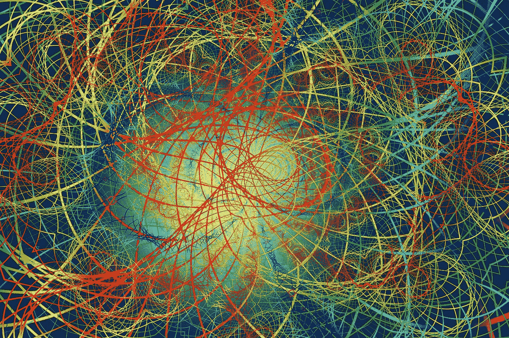

# 赫尔随机振荡器。一种新的指标出现了。

> 原文：<https://medium.com/geekculture/the-hull-stochastic-oscillator-a-new-breed-of-indicators-emerge-cfa37e331286?source=collection_archive---------3----------------------->

## 用 Python 创建、编码和回溯测试随机赫尔振荡器。

赫尔移动平均线是一个增强版本，比其他类型的移动平均线稍微滞后一点。我们想看看它是否有助于改善随机振荡器的信号。我们将介绍船体移动…