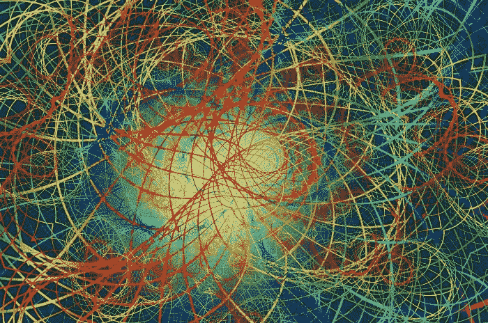

# 赫尔随机振荡器。

> 原文：<https://medium.com/geekculture/the-hull-stochastic-oscillator-d70cccd422d9?source=collection_archive---------9----------------------->

## 用 Python 创建和编码随机赫尔振荡器。

赫尔移动平均线是一个增强版本，比其他类型的移动平均线稍微滞后一点。我们想看看它是否有助于改善随机振荡器的信号。我们将分别介绍赫尔移动平均线和随机振荡器，然后看看如何将它们结合起来…