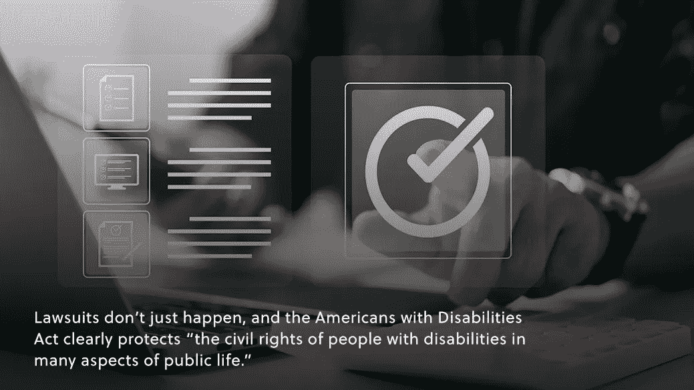
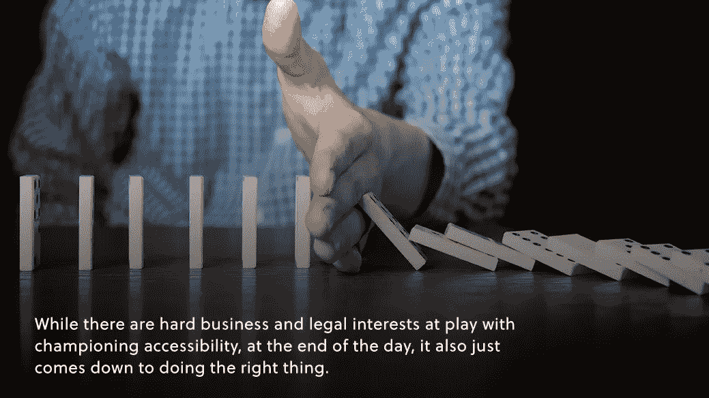

# 电子商务中的无障碍趋势

> 原文：<https://medium.com/geekculture/the-importance-of-accessibility-in-e-commerce-4592336ea62f?source=collection_archive---------19----------------------->

## **电子商务可及性**

## 易访问性在电子商务中的重要性

在过去的两年里，电子商务行业出现了前所未有的增长，无论是否有社交距离的要求，[这种增长似乎不会很快出现](https://www.amberengine.com/blog-content/trends-in-online-sales-temporary-or-here-to-stay?utm_source=blog&utm_medium=referral&utm_campaign=medium-blogs)。

随着这个虚拟市场的发展，品牌在他们的在线平台上加倍努力，品牌保持网站的完善和优化变得越来越重要。这对于更好的转化和保留、更好的参与和可访问性非常重要。

不幸的是，可访问性经常被认为是事后的想法。尽管在营销和优化工作中通常不考虑残疾人，但不这样做的后果会反映在业务、法律影响以及总体的品牌形象和声誉中。

# 大市场

如果虚拟市场在增长，那么它应该对每个人都是增长的——但事实不一定如此。随着电子商务趋势的激增，[ADA 的诉讼也是如此](https://www.jdsupra.com/legalnews/ada-title-iii-website-accessibility-7564897/)。从商业角度来看，这应该已经引发了多个危险信号。

如果你问任何一家企业，他们是否可以将大量潜在市场排除在网站优化和维护工作之外，他们可能会在解雇你之前奇怪地看着你。然而，令人震惊的是，98%的美国热门网站对残疾人存在访问障碍，而美国有四分之一的人患有残疾，绝大多数残疾人声称他们“点击离开”T10 有无障碍障碍的网站。

看看这些数字，应该很清楚，诉讼的增加是有根据的，但可及性也不应被视为事后的想法。[大量研究](https://www.air.org/search?search=/resource%20hidden%20market%20purchasing%20power%20working%20age%20adults%20disabilities)显示，残疾人市场远非微不足道。

# 法律合规

诉讼不是偶然发生的，美国残疾人法案明确保护“残疾人在公共生活许多方面的公民权利”随着虚拟世界每天变得越来越大，虚拟商业空间被纳入公共生活就不足为奇了。

也就是说，一些品牌在考虑如何优化可访问性时可能会遇到的一个问题是，ADA 没有明确规定在这些虚拟平台上应该做什么和不应该做什么，因此没有一个明确的清单来了解您的网站是否符合 ADA。有[的最佳实践指南](https://beta.ada.gov/law-and-regs/)可以遵循，使过程更容易。

确保你的网站符合 ADA 是很重要的，原因有很多。这不仅有助于为所有客户带来更好的体验，而且被 ADA 起诉可能会在财务上和品牌声誉方面造成损害——这可能是合理的。

# 积极主动

虽然支持可访问性有很大的商业和法律利益，但归根结底，这也只是做正确的事情。将任何人排除在你的平台之外(有意或无意)违背了商业和法律原则，但也违背了道德原则。

出于这个原因，积极主动地进行可访问性工作也很重要。符合 ADA 很重要，但这也只是最低要求。雇佣无障碍专家并在你的商业模式中包含专门的无障碍努力*在*你被起诉之前，这不仅是完全避免法律麻烦的最好方法，最终对每个人都有好处。