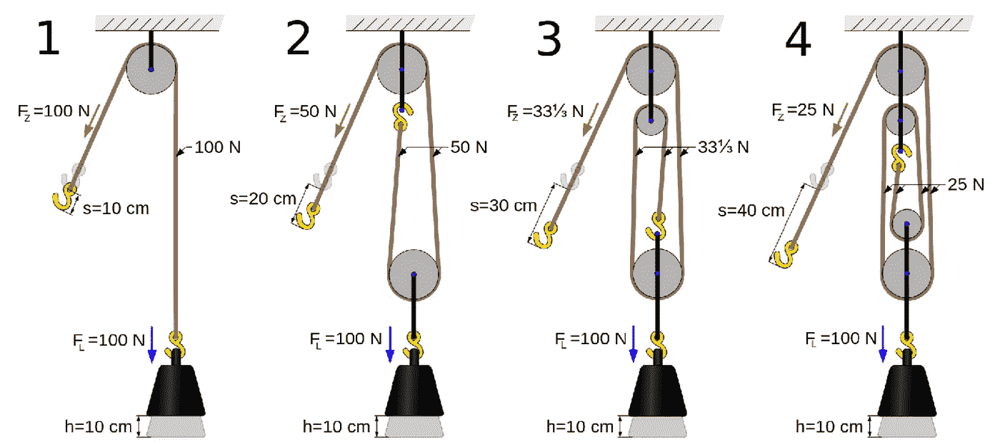
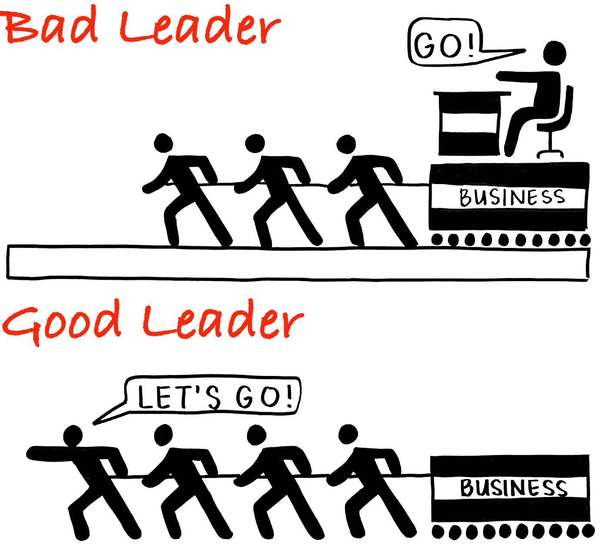

# 成为模范从业者的重要性

> 原文：<https://medium.com/geekculture/the-importance-of-being-an-exemplary-practitioner-877b07b8d05f?source=collection_archive---------2----------------------->

## 再次爱上编码

许多年前，在亚马逊[的异地](https://link.medium.com/vZvS6ogMBlb)，我们想出了**的信条**，来阐明并延续*的指导价值观和亚马逊*首席工程师(PEs)的期望。这不要与更广为人知的亚马逊领导原则混淆，后者适用于所有亚马逊人。[亚马逊主要工程原则](https://www.amazon.jobs/en/landing_pages/pe-community-tenets)适用于 PEs 并建立在标准领导原则之上。其中一位就是**模范从业者**。

> 模范实践者
> 首席工程师亲力亲为，以身作则。从设计到算法再到实现，我们交付为卓越工程设立标准的工件。只有接近细节，我们才能赢得成为有效的技术领导者所需的尊重。

作为一名 PE，这是最难坚持的原则之一，因为你会被拉向许多不同的方向。你是你主管手下的一员，在某些情况下也是你副总裁手下的一员，在那个领域有大量的会议。个人绩效评估在组织的绩效评估和晋升过程中至关重要，因为作为个人贡献者，他们带来的数据点与经理带来的数据点不同。同样，他们也是经理们制定年度路线图的重要合作伙伴(在亚马逊，" [OP1](https://academy.nobl.io/10x-thinking-and-cross-functional-goals-what-we-can-learn-from-amazons-planning-process/) "，在谷歌，" [OKRs](https://rework.withgoogle.com/guides/set-goals-with-okrs/steps/introduction) ")。但私人股本公司还肩负着更广泛、更具战略性地思考未来几年世界将会是什么样子的任务，并经常通过白皮书和与有影响力的领导人进行永无止境的思想交流来塑造世界。在 PE 做的所有事情中，编码通常是次要的。

我开始意识到我已经慢慢地、逐渐地偏离了模范实践者宗旨，而且最近我已经有意地迈出大步来再次向它致敬。这是我如何漂泊，又如何回来的故事。

# 很久以前，在一个遥远的星系，我写代码

写代码是我的一部分。我 8 岁开始[编码](https://carloarg02.medium.com/1987-the-czerweny-cz-1000-plus-65608ed51241)。当我 15 岁的时候，我[移民到美国](https://link.medium.com/pDZytGgTBib)，因为美国是计算机革命的中心。整个高中时期我几乎每天晚上都继续写代码*只是为了好玩*。在大学里，我知道我想要一个计算机科学的学位，所以我继续编程。到我 1997 年毕业的时候，[我在微软](https://link.medium.com/TqZqGyydThb)找到了一份工作，所以我继续写代码。2009 年加入亚马逊，继续编码。在那里，除了其他事情外，[我创建了负载和性能测试平台，亚马逊用它来确保它的数千个服务准备好处理峰值流量](https://carloarg02.medium.com/how-i-grew-an-engineering-productivity-tool-to-impact-thousands-of-engineers-at-amazon-and-how-28a990091207)(“TPS generator”)，大约 100，000 行 Java。2014 年，我被[提升为首席工程师](https://link.medium.com/ibz3Dcc2Nnb)(部分原因是我写的那些代码！).

但是当我晋升到高级工程师，然后是首席工程师时，我意识到的一件事是，这些角色的编码越来越少。从一级工程师晋升到二级工程师就是做你以前做的事情，但是更快、更好、更独立。这是您通常编写最多代码的级别。从二级工程师晋升到高级工程师，需要你成为一个团队的领导者，并在自己之外利用你的工作。从高级工程师晋升到 PE 完全是关于范围、影响力和对整个组织的影响，所以它需要再次转变思维。

# 杠杆的思维框架

在我成为校长后不久，我的导师和我坐了一个小时，耐心地解释了**杠杆**。他指出，在我作为一名 PE 的新生活中，我将不得不不断地做出艰难的选择，是在 X、Y 还是 Z 上工作，我需要对此深思熟虑。

为了解释**杠杆**，他使用了**滑轮**的类比。滑轮减少了举起重物所需的力。下图中，左边的滑轮需要 100N 的力，而第二个滑轮只需要 50N 的力就能以完全相同的方式抬起。这个滑轮的杠杆作用更大，因为它为你的努力提供了更多的输出。右边的滑轮更好，因为它只需要 25N 的力就可以举起同样的重量！

我认为日常生活中不同类型的工作就像不同的滑轮——有些有 2 倍的投资回报率，有些有 4 倍的投资回报率。

假设你每周工作 40 小时，你想提高产量。如果你正在做的事情*没有利用*，你将需要增加你工作的小时数，因为你的产出与你努力的小时数成线性比例。那是左边的滑轮。但是你花在工作上的时间是有限的，你最终会用完你能产生的产出。另一方面，如果你正在影响他人，并通过他人完成工作，这些是高杠杆活动(右边的滑轮)。用同样的时间投资，你可以获得高得多的产出。

*所以这就是我(不知不觉地，逐渐地)开始偏离成为一个模范实践者的地方。*

你看，在衡量*杠杆*的时候，**编码**得分并不是特别高。这在很大程度上是一项个人活动。我并不是说你写的代码不能产生巨大的影响…它可以:我知道一个工程师通过两行代码的改变为 Amazon 节省了 100 万美元(在一个非常高吞吐量的服务中，他没有在一个每秒被调用数千次的紧密循环中实例化一个昂贵的新对象，而是创建了该对象的一个线程安全的静态实例)。是的，代码是有影响力的，但不，它不是高度杠杆化的。

相比之下，**代码评审**比编码更有用。为什么？我可以花 10 个小时写我自己的代码，或者我可以用这 10 个小时向更多的初级工程师提供关于 10 次代码评审的反馈。如果我在 10 次代码评审中提供反馈，我可以影响 10 个人。我可以向整个团队灌输最佳实践，如果我只是花时间写代码，我就做不到这一点。

设计是一项杠杆作用更大的活动。我可以花这 10 个小时写一份设计文档或产品愿景文档，然后在几年内指导整个工程师团队实施它。

但是**参与设计评审**(对其他人的设计提供反馈)的作用更大，因为在 10 个小时内，你可以参与并影响 10 次设计评审，其中每一次都可能指导整个工程师团队多年。在亚马逊，[首席工程师被期望成为全公司设计评审的积极参与者](https://link.medium.com/vZvS6ogMBlb)。

我审视自己工作的另一个维度进一步促使我偏离了成为模范从业者的目标。

我开始思考:我能带来什么让我变得独一无二的有价值？在编码吗？不，不是真的。软件公司的每个人都编码。我并不特别。那不是我加了*特有的*值的地方。我从来没有真正相信天才程序员的神话，他在真空中独自编写出如此惊人的代码，没有人能写出这样的代码，好莱坞在每部关于软件公司创始人的电影中都将其浪漫化。许多工程师可以花少得多的钱写代码。但是，领导力、减少复杂领域中的模糊性、在许多团队中推动共识和协调技术方向、巩固产品愿景、引导业务和技术需求、利用我多年的经验来确保我们在做*正确的*事情、辅导、指导、培养他人，这些都是行业中不是每个工程师都能做的事情，这些都是我为我的雇主提供独特价值的领域。我知道这些听起来有点像陈词滥调，但它们确实是员工和首席工程师的核心职责。

当我思考这个问题时，很明显，尽管我热爱编码，但我需要将我的注意力转移到我更有价值的其他领域。所以我的 IDE 开始积灰。我仍然活跃在代码评审和设计评审中，在这些活动中，我可以继续从事技术工作。我确实偶尔会重新整理一下我的 IDE，到处写一些产品特性。

在一天结束的时候，我是有效的，有影响力的。作为一名校长，我获得了良好的绩效评估，并开始一步步接近高级校长。但是当我这样做的时候，我写的实际代码越来越少。我不是一个人。如果你看看任何一家大型软件公司的数据，你会发现随着工程师在阶梯上的成长，他们编写的代码越来越少。

# 转向谷歌…

2020 年，正当世界因为新冠肺炎而开始关闭的时候，我决定加入谷歌，在亚马逊工作了 11 年。

一夜之间，一些事情发生了变化。

我现在是一名高级工程师，名下没有任何技术产品。那是极其令人*迷惑的*。在亚马逊，即使我没有积极地编写代码，人们也知道我已经设计并编写了大量的 TPSGenerator 和其他产品。数万行 Java 在其 git 历史中到处都有我的指纹。我在内部会议上是一个多产的演讲者。我写了很多白皮书。有一大堆文件证明我有技术才能，这让 T4 对我的出现更加信任。十年来，我通过创造技术产品建立了这种信誉，但在我向亚马逊递交辞呈的那一刻，我失去了这种信誉。当你以职员、高级职员或首席工程师的身份加入一家新公司时，你需要花费数年时间来重建技术产品和着陆，以让你获得那样的可信度。而你需要*信誉*到*领导没有权威*。

其次，**我现在是一名高级员工工程师，对我的新公司的内部技术运作一无所知。**大型软件公司(我曾在微软、亚马逊和谷歌工作过)拥有庞大的私有内部开发人员生产力工具生态系统，这些生态系统是几十年来有机构建的。在亚马逊工作的 11 年里，我积累了大量关于亚马逊工具链的知识(自从我从事工程生产力工作以来，甚至极大地塑造了这个工具链)。因此，即使我没有积极地编写代码，我也通过多年的使用对每个工具的特性了如指掌。我知道一些模糊的事实，比如为什么某些特性存在或不存在，为什么对于特定的任务，工具 X 比工具 Y 更好，或者为什么特定的技术方法不可行，所以我可以自信地指导我周围的技术决策。再次声明:在亚马逊递交辞呈的那一刻，我就失去了这一切。我不得不从头开始重新构建这些知识，在疫情期间，我们都在家工作，我没有机会向坐在办公室我左边或右边的人询问“这是如何工作的？”或者“我能请你喝咖啡，然后你解释为什么 X 是这样工作的吗？”新冠肺炎在家工作带来的孤独加剧了一切。

我有一个直接的选择:修补我的弱点(T1)(缩小技术差距)或者 T2 加倍努力我的优势(T3)(领导能力和广阔的视野)。我选择了后者，因为这是一种快速获得影响力并在新环境中立足的方式。回想起来，我太关注短期了。我有一个很棒的经理，他给了我追求我认为正确的东西的自由，但我固执的[亚马逊爬虫类大脑](https://link.medium.com/ysp1PAxXamb)过度专注于尽快证明自己。你总是要在*学习*和*传递*之间保持微妙的平衡。

我最终决定转向。计算机科学基础的一般知识，分布式系统的一般知识，只能让我到此为止:我需要了解谷歌内部是如何工作的。做到这一点的唯一方法是我需要回到基础。卷起我的袖子，“弄脏我的手。”对我来说，成为一个可靠的技术领导者的唯一方法就是站在我将要领导的工程师的立场上。再多的关于这些事情的*阅读*也是不够的，我需要实际 ***做*** 这些事情。我面临着巨大的萎缩:我倾向于成为一个思维开阔的人，更愿意在一个有许多团队的大组织中摇摆不定，思考两年后它需要在哪里，但为了我自己的成长，我需要做完全相反的事情。我需要成为一个团队中的工程师，抓住一个常规的大块工作，今天而不是明天就开始工作，并尽快完成那些代码评审。我很幸运有一个同伴耐心地和我结对编程了一段时间，所以我可以从他那里吸取知识。我不得不坦然地问一些愚蠢而尴尬的问题。

*而且，我爱上了编码，从头再来。*

# 我今天站的地方

随着职业生涯的发展，你写的代码会越来越少。有很多方法可以让*保持技术性*。参与设计评审，坚持不懈地阅读书籍和技术博客，听播客。我做那些事情。但是编码是技术的核心 T21，无论你的水平如何，你都不应该偏离太多。

这就是为什么我喜欢“模范实践者”的表述方式。我认为员工和首席工程师继续写一些代码是必要的。这不是主要目标，也不是高杠杆活动。但是写代码让你感同身受，对你所领导的工程师面临的实际挑战有了更深的理解，并与这些工程师建立了信任的纽带。我很自豪地卷起袖子。它创造了让你可信的技术产品。通过接触我产品中的代码，我也对代码应该如何发展有了更强烈的看法。

我感谢谷歌给我这个机会，让我回到当初让我来到这里的原因。我远不是一个“模范从业者”我可能永远也不会写出和我还是初级工程师时一样多的代码。但是*模范实践者*对我来说是一个渴望的目标，是这些天每次代码审查的北极星。