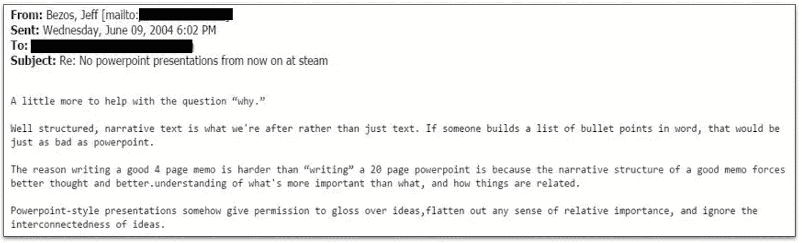
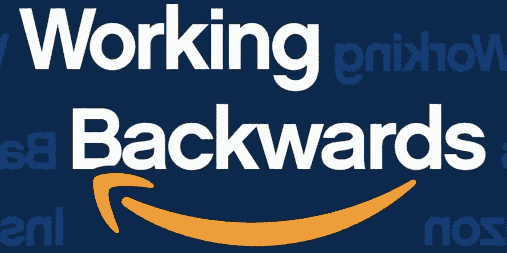
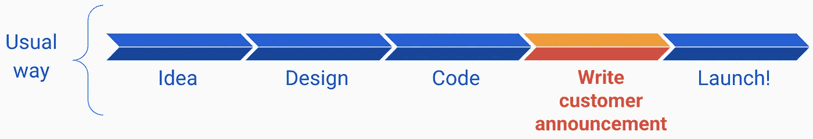
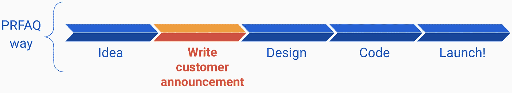

# 讲故事在软件工程中的重要性

> 原文：<https://medium.com/geekculture/the-importance-of-story-telling-in-software-engineering-99004efda25f?source=collection_archive---------1----------------------->

## 亚马逊对六页纸的崇拜:为什么叙述很重要

首先，我要告诉你一个 1994 年成立的小科技公司的故事。像 90 年代的大多数创业公司一样，有很多宣传，但它在 7 年内没有产生利润。即便如此，在 2001 年，它的每股收益也只有区区 1 美分。然而令人惊讶的是，投资者愿意留下来，忍受数百万美元的运营损失。网络泡沫来了又去，带走了大多数科技创业公司，这家小公司命悬一线。投资者又一次无视逻辑，留了下来。如今，这家公司在 2021 年拥有 2 万亿美元的市值，雇佣了 7 万名软件工程师。我说的是亚马逊。

为什么投资者愿意一次又一次地为一家根据数据和事实看来注定要失败的公司冒险？

***因为杰夫·贝索斯是个讲故事的大师。***

他写给投资者的每一封信都是杰作。他优雅而可信地描绘了他看到的未来，并激励了他周围的人。贝佐斯不像史蒂夫·乔布斯那样穿着高领毛衣，向狂热的粉丝们戏剧性地展示最新最棒的苹果产品。他有点傻，有点怪(我可以这么说，因为我也有点傻，有点怪)。所以他把重点放在了**的*叙述上*的**来弥补这一点。 ***实质重于风格。***

公司的 DNA 在很多方面反映了创始人的 DNA。Jeff 对叙事有很强的见解，他将这种见解印在了他的高级领导团队中，这反过来又印在了前端经理身上，前端经理又反过来印在了工程师身上。因此，杰夫创造了一种文化，在这种文化中，如果你想传达一个想法来影响他人，你就要写 6 页纸。 有适当的语法，清晰的句子，有数据支持的深思熟虑的观点，在一轮又一轮的评论中得到评论和改进。没有这种 powerpoint 风格的演讲废话。

> 当我加入亚马逊时，我对这种古怪的文化非常感兴趣。我是一名软件工程师。我用 Java 写了代码。为什么我还需要用英语写记叙文？？？

很久以后，我才知道，能够用精确简洁的文字表达一个愿景或观点，对影响力至关重要。如果你想晋升到职员或负责人的级别，你需要培养提出*叙述*的能力。这是为了让同事理解并认同你的思维方式，让领导为其提供资金，或者让合作伙伴和利益相关者保持一致。甚至当你试图说服别人你应该被提升的时候。*叙述很重要，即使是在软件工程中。* **我只能独自编写*代码*到此为止，但是我的*文字*可以影响整个组织未来许多年的发展道路。**

亚马逊的写作文化非常强大、古怪、独特。这里有 5 件事可以让一切运转起来…以亚马逊独特的方式。

# 1.禁止 PowerPoint 风格的演示文稿…

2004 年，杰夫·贝索斯采取了一个大胆的立场，正式禁止亚马逊高管团队使用 powerpoint 风格的演示文稿。随着时间的推移，这渗透到与副总裁和董事的所有沟通中。在亚马逊的 11 年里，我从未见过一次针对领导力的 PowerPoint 风格的演示。

Jeff’s email [banning powerpoint](https://www.businessinsider.com/jeff-bezos-email-against-powerpoint-presentations-2015-7)

乍一看，这可能对你来说很严厉，但对我来说却很有意义。时至今日，当我看到一份本应长达 6 页的 powerpoint 风格的演示文稿时，我会有一种本能的反应。

*   **流量。演示文稿只有一种信息流动方式:你是演示者选择的人质。文档为你提供了非线性导航，一种“选择你自己的冒险”,你可以跳过对你来说不重要的部分，并在重要的领域更深入地探索(例如，如果作者提供了更多背景的附录)。**
*   **自成一体。**演示需要你亲自聆听演示者，或者如果你幸运的话，幻灯片上有演示者的笔记。载玻片通常不会老化。*文档是独立的永恒工件。只需要信息(但不能参加会议)的人可以随时阅读文档。*
*   **实质重于风格。如果有一个有魅力的演示者或漂亮的幻灯片，演示会进行得很好。在陈述中含糊不清或闪烁其词要容易得多。有了文件，你就不得不进行清晰的叙述，这就创造了一个公平的竞争环境。作家不会把时间花在动画、可爱的图片或漂亮的字体上；他们把时间花在思考上。**
*   **速度。**演示文稿的交流速度与演讲者的讲话速度一致。叙事以观众阅读的速度传播。

写作需要更长的时间，但适当思考想法所花的时间没有浪费，因为从长远来看，它节省了时间。如果这引起了你的兴趣，[谷歌“亚马逊禁止 PowerPoint”](https://www.google.com/search?q=amazon+banned+powerpoint)你会找到很多好文章。

我个人真的很喜欢在公共场合演讲，并且在很多内部和外部的会议上发表过演讲，但是这是有时间和地点的。给高层领导做演示不是那个。

# 2.亚马逊对六页纸的崇拜:少即是多

亚马逊写作文化的另一个古怪之处是任何文档的正文都严格限制在 6 页以内。我有时试图通过玩弄字体、行距或页边距来作弊，但精明的领导总是会找我麻烦。

为什么是这个神奇的数字？

我偶尔会收到关于某个主题的很大的白皮书。20，30，40 页。读起来让人望而生畏。这需要投入大量的时间。我发现自己失去了兴趣，敏锐地意识到我的注意力范围的限制。*提取必要信息需要相当大的认知负荷。*我投入到连接点和提取关键信息的认知负荷越多，我留给思考 doc 的实际目标的时间就越少。

**少即是多**。对白皮书的页数进行硬性限制会迫使你在文章中对房地产进行长时间的思考，以及哪些部分是必不可少的。我会就一个主题写一篇很长的文档，然后无情地删除多余的内容。

我认为实际的页数并不像它所强加的 ***思维过程那样相关:*** 对你想要表达的观点进行优先排序，减少理解你的观点所需的认知负荷。

# 3.“坐着阅读”文化

亚马逊将对 powerpoint 风格演示的极度厌恶和对 6 页纸的狂热与一种更古怪的东西结合在一起:一种坐着阅读的文化。

*有多少次你出席了一个会议，会议要求你阅读一份文件，但你实际上并没有阅读？*我，我不得不承认好几次。也许我忘了。也许我正在做，但被打断了。有时候我会坦白承认。其他时候，我很尴尬，试图即兴发挥。

亚马逊从统计数据上假设，受邀参加文件审查的人中有一定比例的人会在没有阅读文件的情况下出现，因此它在会议中预留了阅读时间。会议主持人带来了一叠打印好的文件和一把红笔。会议的前 20-25 分钟，每个人都静静地阅读文件，强调句子，并在空白处做笔记。这深深植根于文化之中。

到 2020 年，新冠肺炎迫使我们在家工作，成为遍布许多时区的更加全球化的劳动力，协作工具变得越来越好(也称为 Quip、GoogleDocs、Office365 等)，一部分转移到离线、异步的文档审阅，通过共享文档上的电子评论。但是我仍然相信坐下来阅读然后讨论能提供更高质量的对话。

# 4.朋友不让朋友用黄鼠狼的话

亚马逊的领导们在文件审查期间发现并红圈出了*含糊其辞的话*，并以此作为一项*运动*。它深深植根于亚马逊爬行动物的大脑中。

[黄鼠狼词语](https://en.wikipedia.org/wiki/Weasel_word)是*对句子*没什么价值的词语。绒毛。这个术语的起源尚不清楚，一种解释是黄鼠狼通过一个小洞吸取鸟蛋，然后留下空壳(一个*黄鼠狼单词*基本上就是那个壳:表面上看起来很好，但里面没有实际价值)。

我记得在 2011 年，我告诉我的老板，我认为我已经准备好被提升为高级工程师了。他同意了，并让我写下我的理由。我给他寄了一份初稿。它回来了，每隔一个字圈成一个黄鼠狼字。我修改了一下，寄给他第二稿。这一次，它的红圈数量是以前的一半。随着每一次修改，红圈的数量越来越少，经过许多许多次的反复，他对医生竖起了大拇指。这次经历令人沮丧，但它教会了我很多。就事论事的语气，可量化的陈述，而不是废话。只要有可能，客观数据应该取代主观意见。作为工程师，我们应该争取*精确*的写作。

这里有一个例子。我最近在一个功能发布总结的草稿中看到这样的陈述:**“许多客户对这个新功能感到*高兴*”“许多”这个词在这里毫无意义。是十个，一百个，一千个，还是一百万个？它在你的客户群中占多大比例？“许多”是一个填充词，不提供任何价值或上下文。同样，“快乐”也是一个含糊的词。我如何知道顾客是“快乐的”？我找到了写这个的人，我们一起努力改进它。事实证明，有原始数据可用。我们将其改写为:*“在一项调查中，4200 名客户(87%)对这项新功能的满意度高于 4/5。”***

再举一个例子。我最近在谷歌这里开始了一个将机器学习应用于一个问题的推介，陈述是*“将 ML 应用于问题* ***可能*** *解决它。”当我重新阅读我的提案时，我突然意识到“可能”是一个含糊其辞的词。说它“可能”解决问题是软弱无力的，也是含糊其辞的。我需要有原则，坚持己见，并采取立场。我重写了这句话:*“将 ML 应用于问题* ***将*** *解决它。”*更大胆，但仍是主观的*意见*。我能用数据代替它吗？我做了第三次尝试:*“将 ML 应用于问题* ***会解决它吗:*** *我们做了一个实验(见附录)，我们的准确率是 98%，召回率是 97%。”附录提供了详细的方法和原始数据，对于那些对深入研究感兴趣的人来说，在我的第一页中没有占用宝贵的空间。**

# 5.PRFAQ:从客户的角度逆向工作

亚马逊使用了一种高于所有其他格式的文档格式:PRFAQ、 *新闻稿&常见问题。*一些可以多学学的好地方有[这里](/agileinsider/press-releases-for-product-managers-everything-you-need-to-know-942485961e31)、[这里](/intrico-io/strategy-tool-amazons-pr-faq-72b3e49aa167)或者[这里](https://www.allthingsdistributed.com/2006/11/working_backwards.html)。

在“传统”的做事方式中，你会有一个想法，设计它，编写代码，当你准备好发布时，你 ***编写面向客户的公告*** 。你可能已经做过很多次了。

亚马逊通过强迫你在* 之前 ***写面向客户的公告*** * ***来扭转这种局面，甚至对技术设计给予更多的考虑。***

这是一个非常简单但强大的概念，它不是额外的工作(只是改变工作发生的顺序)，但我断言它改变了 ***一切*** 。撰写公告首先要将你的思维转移到 ***从客户体验*** 开始逆向工作，让每个人都关注客户需求，以确保你打造的产品是人们真正想要的。

最近，我对 PRFAQs 如此强大的另一个关键方面有了一个顿悟。

几个月前，我读了《切换:当改变变得困难时如何改变事情》 (我在这里写了一篇更长的博客)这本书。“Switch”提出了一个简单而精彩的影响思维框架:想象一个骑手，在一条路上引导一头大象。骑手是我们大脑的*逻辑部分:它是理性的，它深思熟虑和分析，它需要被*引导*。大象是我们的*情感*:它的行为基于本能、痛苦或快乐，它需要被*激励*。我们常常无法施加影响，因为我们只对骑手或大象有吸引力。*

PRFAQs 如此有效的一个原因是它们对双方都有吸引力。一方面，公关常见问题是*有抱负的*、*雄心勃勃的*，它们引发情感和兴奋。这激励了大象，它很兴奋，感觉“我想要这个！！!"。另一方面，鉴于亚马逊对含糊其辞的话深恶痛绝，它们必须得到大量数据和事实的支持，以安抚骑手，即你大脑中不断思考“好吧，这很酷，但可行吗？”

没有 PRFAQ，亚马逊几乎什么都做不了。而 PRFAQs 则是 ***平均主义*** 。在其他公司，决定生产什么和投入多少人力的过程由经理决定，对于普通工程师来说可能是一个黑箱，而在亚马逊，任何人都可以写一份 PRFAQ，如果想法是可靠的，就可以在食物链中向上传递，以影响路线图和资金。我职业生涯中的一个亮点是[写了一个 PRFAQ 去砍](https://carloarg02.medium.com/how-i-grew-an-engineering-productivity-tool-to-impact-thousands-of-engineers-at-amazon-and-how-28a990091207)，安迪·杰西的“鲨鱼池”，并且实际上让它被批准、资助和建造。

亚马逊的首席工程师、我的好朋友瑞安(Ryan)既开玩笑又聪明地说:“当我成为一名负责人时，我从用 [Eclipse](https://www.eclipse.org/) 写作变成了用微软 Word 写作！”他是对的。

关于亚马逊独特的写作文化，我还可以说很多，但这是激发你兴趣的一个很好的介绍！

我给你们看一个来自 Llew Mason 的视频，他是亚马逊的副总裁，也是我最喜欢的前经理之一，他谈到了亚马逊的写作文化: