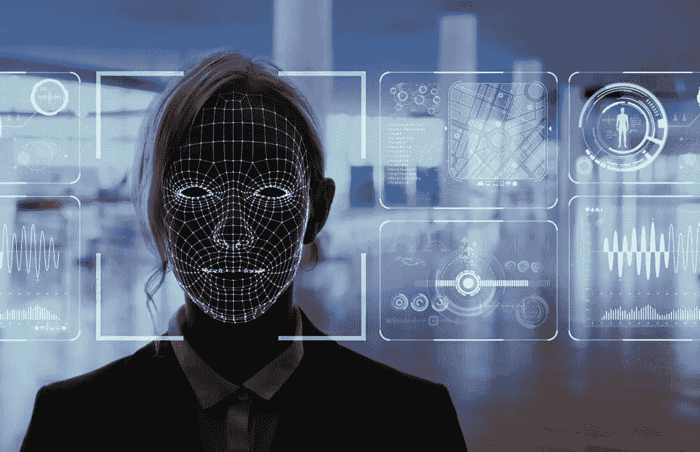

# 生物识别与人工智能的融合

> 原文：<https://medium.com/geekculture/the-integration-of-biometrics-and-ai-124d6ee1348c?source=collection_archive---------43----------------------->

由 [*尼可拉*](https://www.linkedin.com/in/nkairinos/)

我们都被科幻电影中人工智能(AI)的超现实例子所娱乐:从最轻微的危险迹象就会触发锁定的智能家居，到只允许受邀客人进入的面部安全扫描。但是这些技术不再局限于小说世界，它们正在成为消费者的现实。

人工智能和物联网(IoT)等创新正在增加人和设备之间的互联性。因此，越来越需要确保人们可以安全地使用数字平台，而不必担心他们的数据会被泄露。这就是生物识别和人工智能的用武之地。

虽然生物识别技术通过指纹和虹膜等生理特征来测量一个人的身体特征，以验证他们的身份，但人工智能在使这些安全系统更加智能方面发挥着关键作用。鉴于 AI 能够快速收集和处理大量数据，它可以建立模式，并在某些模式被破坏时检测威胁；这可能是当一个人的面部特征与给定数据库中的任何特征都不匹配时。

# 应用程序

当我们考虑人工智能驱动的生物识别技术在数字安全方面的最佳应用时，大多数人首先想到的可能是支付卡欺诈。Experian 在 2018 年进行的一项研究证实了这一点，该研究发现，近四分之三的受访企业将欺诈列为过去 12 个月中日益令人担忧的问题 [1](https://www.sciencedirect.com/science/article/pii/S0969476519300694#bib1) 。考虑到欺诈造成的巨大成本，这并不奇怪——尼尔森报告指出，到 2020 年，全球范围内信用卡欺诈造成的损失可能超过 310 亿美元。

但重要的是要记住，人工智能在生物识别中的应用不仅限于在线欺诈。事实上，人工智能解决方案已经准备好在广泛的市场中提供安全性的重大改进，更不用说时间和成本的节省了。从保护存储在智能手机中的个人信息，到识别机场等拥挤公共区域的威胁，人工智能被用于保护消费者和企业的方式有很多。

# 完美伴侣

人工智能系统的核心吸引力在于它们能够在没有人类干预的情况下工作。这些技术具有高度的自主性，并且能够根据以前的经验适应新的情况。这使得人工智能成为生物认证的完美伴侣，生物认证涉及处理海量信息，并不断应对新的安全威胁。

人工智能神经网络:这些网络为多种算法一起工作和处理数据输入提供了框架，支持人工智能解决方案，如生物识别认证中使用的解决方案。

这两个特征合在一起，意味着人工智能可以在下一代生物识别解决方案的开发中发挥核心作用。例如，人工智能可以被训练来减少不一致和克服障碍，以便根据指纹或眼睛扫描等生物数据样本进行匹配。因此，虽然过去的识别系统受到限制，如可以使用的图像类型，但人工智能正在增强这一功能，以提供更有效的扫描。

在结合生物识别和人工智能系统的最佳应用方面，面部识别脱颖而出。面部识别系统已经成为消费者经常遇到的最常见的生物认证之一，从手机制造商到机场安全团队和社交媒体平台的提供商都采用了这一技术。商业可能性是巨大的，因此面部识别市场正在以惊人的速度增长——预计到 2022 年将达到令人印象深刻的 77 亿美元，比 2017 年增长超过 30 亿美元。

与此同时，面部识别系统的性能也在不断提高。去年，NIST(美国国家标准和技术研究所)报告称，在 2010 年至 2018 年间，面部识别技术在搜索数据库以找到匹配照片方面平均提高了 20 倍:2010 年，5%的算法无法匹配给定数据库中的人脸；去年，这个数字已经下降到只有 0.2%。

智能手机保护是这项技术最明显和最实用的应用之一，苹果 iPhone X Face ID 系统为用户保护他们的设备提供了明显的好处:苹果估计，随机人脸解锁你的手机的几率约为百万分之一。三星在开发整体生物识别解决方案领域也取得了稳步进展。它的智能手机现在提供虹膜扫描安全功能，可以识别一个人虹膜中的独特图案(见 https://www.samsung.com/global/galaxy/galaxy-s8/security/)。这些模式几乎不可能复制，这使得虹膜认证成为保持手机锁定的最安全的方法之一。

# 保护家园

作为人工智能家庭安全系统的一部分，生物识别认证也越来越多地用于筛选谁进入了我们的房子。人工智能系统在识别人脸方面比人类强得多，可以立即确定门口的人是否在被允许进入的人的数据库中。

基于此，“智能门铃”市场正在增长。例如，图雅([https://en.tuya.com](https://en.tuya.com/))最近推出了新的人工智能视频门铃，它利用面部识别通过照片识别家庭的每个成员，然后允许他们进入房屋。图雅声称，智能家居平台能够对各种场景做出反应，包括检测可能潜伏在物业周围并试图进入的陌生人。聪明的是，该系统能够自动打开灯光和音乐来抵御潜在的入侵者。

谷歌也一直在玩弄人工智能家庭安全系统，并于去年在英国市场推出了人脸扫描智能门铃——Nest Hello。门铃具有集成的摄像头和扬声器系统，旨在连接到其他智能家居设备。到达时，客人将触发响应，向房主发送警报，让他们看到谁在门口。

# 网上银行

人工智能生物识别解决方案也开始在电子商务和在线银行领域激增。面对每天监管数百万笔交易的任务，银行不断寻找新的创新方法来保护客户的个人数据和财务，并广泛部署人工智能来打击欺诈和相关的网络犯罪。

以万事达卡为例。它负责监控 210 多个国家和地区的 20 多亿张信用卡，根据它自己的数据，每小时处理 1.65 亿笔交易。作为回应，万事达卡现在正在使用机器学习(ML)算法来检查每一笔交易。它的人工智能和人工智能解决方案能够提供每一次购买的关键信息，包括有问题的商品是什么以及在哪里购买的。基于以前消费模式的历史，该技术能够检测出某项交易是否可疑。

在此基础上，万事达卡现在越来越多地将人工智能解决方案与生物识别技术结合起来。指纹、虹膜和面部识别工具正在帮助银行核实持卡人的身份，并确保只处理合法交易。这是通过万事达卡识别检查来完成的，这鼓励移动购物者通过指纹扫描或向设备显示他们的脸来验证购买，这样它就可以执行面部识别检查。经核实后，资金被释放。

# 增强用户体验

最终，人工智能驱动的生物识别技术可以提供更高的安全性和便利性。识别和认证过程通常是即时的，最大限度地减少了人们依靠记忆来检索密码和 PIN 码的需要。此外，它消除了过程中的人为错误；黑客再也无法猜出一个人的密码，而密码通常是可以预测的，并且可以跨多个平台使用。这种人工智能和生物识别技术的结合还抑制了犯罪分子获取实施欺诈所需的个人身份信息:用于验证某人身份的数据不会被窃取或共享，从而确保合法持卡人有信心在线消费。

消费者对此的反应是积极的，尤其是在年轻群体中。Vocalink 的研究显示，“千禧一代”支持人工智能和生物识别认证，这证实了消费者情绪正在推动对这些技术的需求。2017 年，28%的 18-35 岁的人已经使用指纹技术来验证支付，而 35%的人认为这种形式的技术是最安全的验证方法 [6](https://www.sciencedirect.com/science/article/pii/S0969476519300694#bib6) 。我们可以预计这两个数字在未来几年将会显著增加。

# 未来发展

那么，我们可以从人工智能-生物识别协作中期待什么呢？虽然在这一领域已经取得了长足的进步，尽管生物识别技术引起了广泛的关注，但重要的是要记住，我们只是触及了这项技术的皮毛。每天，AI 和 ML 的能力都在进步。

在未来几年，我们可能会看到人工智能在生物识别中的一些更现实的应用，包括打字和书写行为生物识别。众所周知，一个人的笔迹对他们来说是独一无二的，因此可以作为一种极难伪造的身份证明。然而，如果没有复杂的手段来仔细检查信息，笔迹的细微差异可能会被忽略。AI 可以用来解决这个障碍。该技术可以考虑到时间和压力，以及不同字母的倾斜度和操作顺序；本质上，个人表现出的所有微妙的写作习惯。

这些分析技术也可以应用于击键。AI 可以学习一个人的打字习惯，并确定是否有人试图冒充他们。像打字准确度、速度、手优势和压力等识别因素都可以被分析，以创建一种将注意力吸引到已建立模式的异常的方法。同样，人工智能在生物识别方面的一个主要优势是它允许持续监控。因此，尽管一个人的打字行为可能会随着时间的推移而改变，但人工智能工具能够不断研究个人的习惯，并解释逐渐的变化，使该技术能够建立用户的广泛打字档案。这反过来允许系统验证编辑文档或填写信息请求的人是否与他们所说的一致。

这么说的话，很难预测这个领域在未来几年将会如何变化，尤其是考虑到这项技术的发展速度。但是，随着组织优先考虑客户的安全，无疑会有更复杂的人工智能驱动的生物识别安全措施出现。

Nikolas Kairinos 是世界上第一个由人工智能驱动的知识机器人 [*Soffos*](https://soffos.ai/) *的首席执行官和创始人。他也是 Fountech 的创始人兼总裁。*风险投资。

[Fountech Ventures——你的深度科技人工智能创业之家](https://www.fountech.ventures/)

 [## Fountech Ventures -深度科技人工智能初创公司的风险建设者| LinkedIn

### Fountech Ventures -深度技术人工智能初创公司的风险建设者| LinkedIn 上有 314 名追随者。我们爱房子，迅速…

www.linkedin.com](https://www.linkedin.com/company/fountech-ventures)