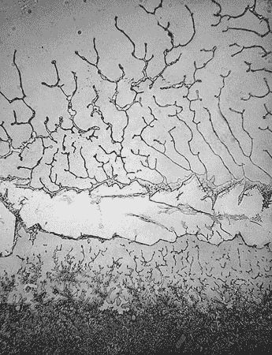
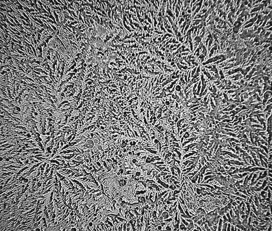
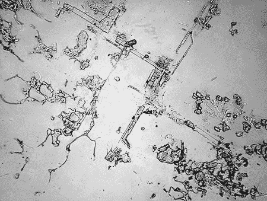
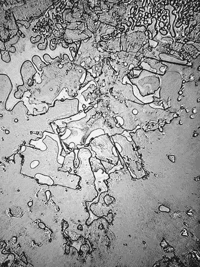
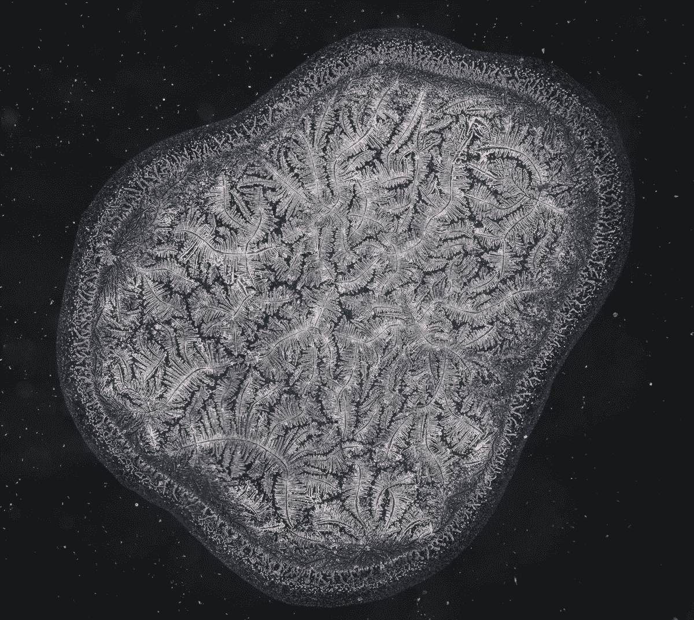
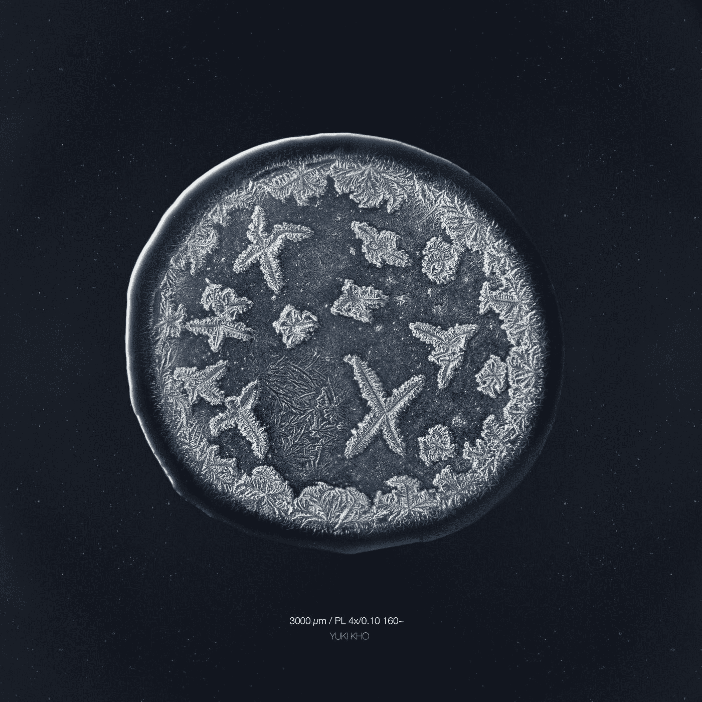
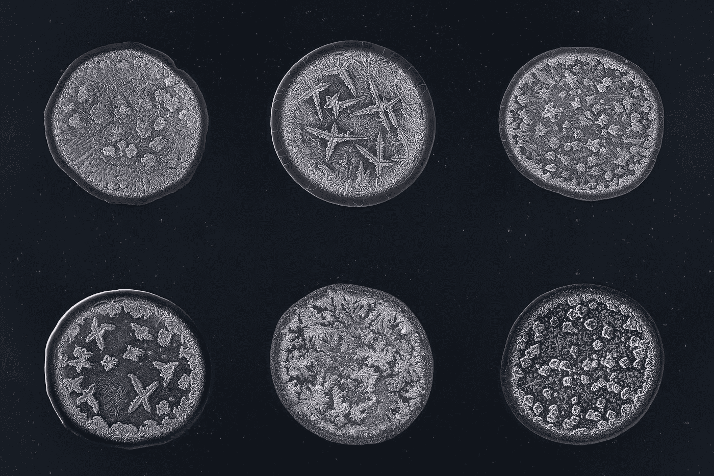

# 哭泣的内在艺术

> 原文：<https://medium.com/geekculture/the-intrinsic-art-of-crying-b7bb2fa7a01e?source=collection_archive---------7----------------------->

## 茎中的宝石:眼泪的微观结构

哭有什么大不了的？你哭了。我哭了。嗯，我想我经常哭。但这都是完全有理由的，比如当我为赶上最后期限而感到压力时，或者嘲笑抖音猫时，或者看那些返乡士兵与他们的狗团聚的视频时。当我看悲伤的电影(我确信*通往特拉比西亚的桥梁*是某个导演用来淹没地球的策略)或快乐的电影、纪录片时，我会哭，在这些电影中，我愤怒地发现并不是每种动物都从此过上了幸福的生活——每部电影都是如此。(包括*勇敢的小烤面包机*，但我要为自己辩护，闹钟为了恢复电力而做出的牺牲是我见过的最感人的事情之一。)广告也是，任何能激发灵感的东西——尤其是汽车广告。只是，到处都是眼泪*。*

**

*THE BRAVEST TOASTER ON EARTH*

*…也许我爱哭的习惯有点令人讨厌。我经常哭，那又怎样？如果有什么不同的话，那就是让我成为一个愿意以美的名义牺牲一点尊严的敬业的艺术家，这正是我告诉最后一个在电影中与我对抗哭泣的人的话…当真人版*大红狗 Clifford*预告片正在播放时(什么？Clifford 是我的童年)。然后他们厚颜无耻地发出狂笑，说哭泣并不能让我成为艺术家。因为我是一个完全被怨恨所驱使的人，所以这篇文章献给那个我再也见不到的人(因为在被证明大错特错后，他们会羞于再次露面)。*

*好了，说够了，让我们看看眼泪实际上是什么样子的*因为，完全诚实地说，它们对我来说看起来(尝起来)都一样。**

## *你能看到悲伤吗？*

*幸运的是，摄影师 Rose-Lynn Fisher 在十年前就考虑过这个问题(这意味着我不必为这篇文章购买显微镜，这正是我在这个感恩节要感谢的)。她在标准光学显微镜下看着自己的一滴眼泪，评论道，“这看起来像鸟瞰图，几乎就像我从飞机上俯视风景一样……我开始想——悲伤的眼泪和快乐的眼泪会有什么不同吗？它们和洋葱眼泪相比又如何呢？”*

*这些简单的问题导致了她广泛的摄影项目“**眼泪地形学**”，在这个项目中，费舍尔拍摄了一百多颗悲伤、欢笑、愤怒、喜悦的眼泪——这些眼泪是从她自己、其他几名志愿者(别担心，她没有强迫人们哭)那里收集来的，包括一个新生婴儿。每一滴眼泪都像是一个新世界的鸟瞰图，是一个深思熟虑和精心设计的时间凝固瞬间。费舍尔完美地描述了她的项目，他说:*

> *“虽然眼泪的经验性质是水、蛋白质、矿物质、激素、抗体和酶的化学性质，但眼泪的形貌是瞬间的风景，像梦中某人的指纹一样短暂。这个系列就像一本短暂的地图集。”*

*你流下的每一滴眼泪，就像你的指纹或雪花一样，其微观结构都是独一无二的。科学上讲，眼泪有三种类型:基础型、反射型和情绪型，它们都有不同的成分。基础眼泪全天候在你的眼睛中，以保护你的角膜并保持其湿润和健康。*

**

*“Basal Tears” — Rose-Lynn Fisher*

*反射性眼泪就像它们听起来的一样——当你的眼睛受到刺激时的含泪反应，比如当你切洋葱或使用除约翰逊婴儿洗发水之外的任何洗发水时(不再流泪)。*

**

*“Onion Tears” — Rose-Lynn Fisher*

*情感眼泪，我的专长，是让我们成为人类的眼泪。当我们经历强烈的情绪压力时，它们就会出现，从托尼·斯塔克在《T2》最后一战中的哭泣到对一个家庭印象的大笑。情绪眼泪的部分差异可以用它的三种额外成分来解释:压力荷尔蒙催乳素和促肾上腺皮质激素，以及天然止痛药亮氨酸脑啡肽。*

**

*“Tears of Grief” — Rose-Lynn Fisher*

**

*“Tears of Laughing Till I’m Crying” — Rose-Lynn Fisher*

*令人惊讶的是，或者也许并不令人惊讶的是，同类型的眼泪甚至是由相同原因引起的眼泪没有任何明显的相似性；在结晶后，他们可以分开看*世界*。这是由于大量的变量，如化学物质，粘度(“厚度”)，眼泪的蒸发率，甚至显微镜的设置！*

*所以，这些结构的美丽不仅仅是因为真正的眼泪，还因为外部变量的随机性和你的眼泪的各种成分的分布。*

*为什么流泪？*

> *在像死亡一样无情、像饥饿一样基本、像成人仪式一样复杂的时刻，耳朵是我们最原始语言的媒介。就好像我们的每一滴眼泪都承载着人类集体经历的缩影，就像海洋中的一滴水。”*
> 
> *-罗斯-林恩·费希尔*

*哇，她也应该考虑成为一名诗人——这差点让我落泪。*

*想看更多她的照片，你可以访问她的网站:[https://www.rose-lynnfisher.com/tears.html](https://www.rose-lynnfisher.com/tears.html)。*

## ***眼泪的想象图***

*说到诗人，想有一份让人流泪的工作？你可以做荷兰摄影师 Maurice Mikkers 所做的事情，而不是成为一名牙医或在万圣节鬼屋中表演:邀请陌生人到你家，让他们哭，并收集他们的眼泪。(没听起来那么可怕，保证！)*

*2015 年 1 月，Mikkers 经历了无法形容的脚趾撞在桌子上的巨大疼痛。此时，他正在研究双氯芬酸(一种治疗疼痛和关节炎症状的药物)的结晶，他突然有了灵感，用微量吸管捕捉他的眼泪，并在显微镜下观察。他尝试了几种光线技术来捕捉它的结构，从高中常用的标准明场技术到他在其他结晶照片中使用的偏振技术。虽然两者都产生了很好的结果，但他觉得缺少了一些东西。所以，他在显微镜上安装了暗场聚光镜，瞧！美女解锁。*

**

*Mikker’s first tear under the microscope — A Tear of Pain (Emotional Tear)*

*很像 Rose-Lynn Fisher 的工作(他是在看到其他人是否发现了与他相同的东西后发现的)，他想看看因踢坏你的脚趾而产生的眼泪是否不同于，比如说，对一部狗死了的电影的含泪反应。因此，他开始了他的项目，**“眼泪想象馆**”——邀请任何人和每个人分享他们的眼泪(和他们的故事)。为了收集眼泪样本，他们会带一些让他们流泪的东西到他家，比如一首诗或一部电影，或者他们可以走更痛苦的路线，切一个洋葱或拔一根鼻毛。*

**

*Maurice Mikkers: Tear After Cutting White Onions (Reflex Tear)*

*有人用微量吸管吸取眼泪，将其放入微型反应管中，然后用几滴小水滴将其分配到显微镜载玻片上。泪液需要五到三十分钟才能结晶。(这种时间上的变化来自于变量的*变化*，比如温度、湿度、眼泪的成分以及你！)*

*结晶后，它们终于可以成像了。眼泪的微观结构很大程度上是由与粘蛋白结合的结晶矿物质创造的，但鉴于每一滴眼泪的成分和粘度不同，Mikkers 实际上还没有找到两滴看起来相似的眼泪！*

**

*Maurice Mikkers: 6 tears from 6 different people*

> *“事实上，我们并不真正知道是什么导致了这种变化——可能是大气的湿度，眼泪的成分，甚至是最初让眼泪从眼睛中流出的痛苦来源——这给这个项目注入了一种神秘和探索的感觉。”*
> 
> *莫里斯·米克斯*

*事实上，还没有太多关于我们的眼泪如何结晶的研究，所以 Mikkers 把探索每一滴眼泪独特的结晶形式背后的变量作为他的新任务。*

*这个探索的一个很好的起点是眼泪的创造者。正如伦敦帝国理工学院计算和系统医学结晶小组的负责人娜奥米·查延博士所说，“首先,[结晶]将取决于眼泪来自谁。”根据 Chayen 博士的说法，我们应该利用光谱学，一种我们可以通过让 X 射线穿过晶体来测量晶体成分的方法，来调查眼泪的成分或干燥方式是否隐藏在大量的微观结构背后。*

*如果我们能够理解这一点，我们就有可能按照我们的喜好来操纵眼泪的结晶——基本上创造了一种新的艺术形式！所以，是的，我会对着红狗克利福德和其他什么东西哭。我是个艺术家，眼泪是我的艺术。你能怎么办，哭吗？*

**

*Maurice Mikkers: A Tear of Sadness (Emotional Tear)*

*你可以在这里阅读更多关于莫里斯·米克的摄影之旅:https://medium.com/@mauricemikkers！*

*下次见！如果您对此感兴趣，请务必查看下一篇专栏文章！如果您有任何问题或意见，请发邮件至 apoorvapwrites@gmail.com[给我。](mailto:apoorvapwrites@gmail.com)*

*同时，在我的专栏 [**这里**](https://apoorvapanidapu.medium.com/list/gems-in-stem-e5f24767d315) 查看其他文章！如果你有任何问题或意见，请发电子邮件到 apoorvapwrites@gmail.com 给我。*

**要成为第一个听到我所有新文章、最近事件和最新项目的人，请务必订阅我的简讯:* [**信？我几乎不认识她！**](http://apoorvapanidapu.substack.com/)*

**提醒一下:这个* [*专栏*](https://apoorvapanidapu.medium.com/list/gems-in-stem-e5f24767d315) *，STEM 中的宝石，是一个了解各种 STEM 主题的地方，我发现这些主题令人兴奋，我希望也会让你兴奋！这个专栏会一直写得相当通俗易懂，所以你不用担心没有背景知识。然而，它偶尔会在接近尾声时变得更高级。感谢阅读！**